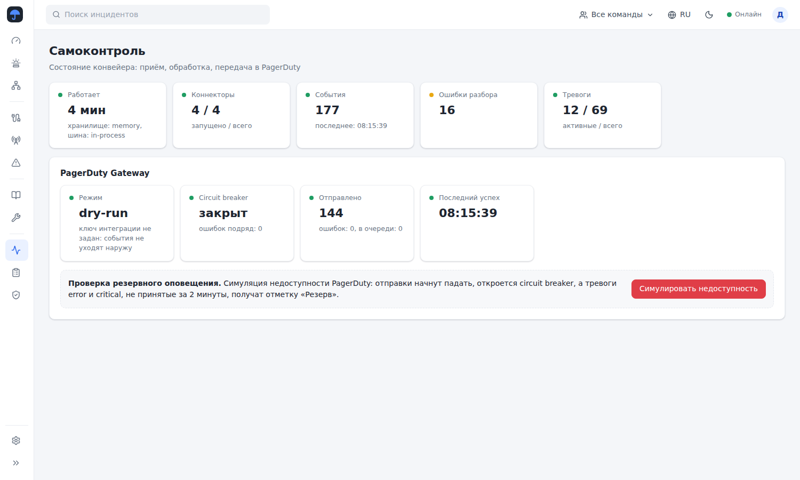
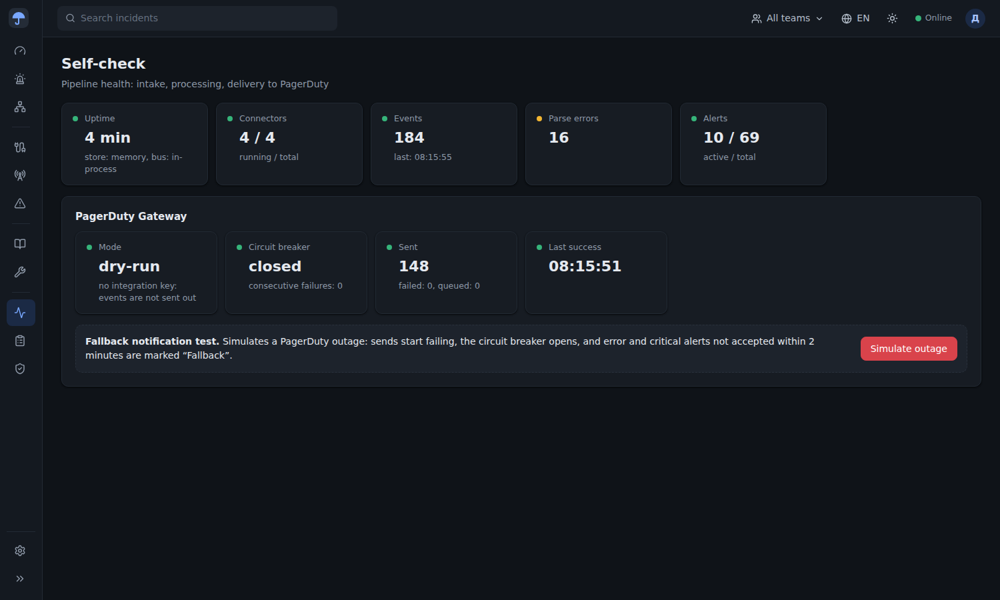

# Umbrella MVP: приложение

Первый шаг реализации MVP по архитектуре из [`mvp/docs`](../mvp/docs). Backend на Go, веб-интерфейс на React и TypeScript.

## Что уже работает

| Страница | Что умеет | Функция |
| --- | --- | --- |
| Инциденты | карты (сохранённые фильтры): открытые, закрытые, не принятые PagerDuty, резервное оповещение, RED, USE и свои представления; плитки по severity; мини-шкала новых инцидентов за 24 ч; поиск по заголовку, КЕ, сервису и тексту событий; фильтры в URL; групповые подтверждение и решение; выгрузка CSV; живое обновление по WebSocket; щелчок по заголовку открывает контекст в Grafana, строка — боковую панель с вкладками Основное, События, Хронология, PagerDuty и резерв, Комментарии | Ф-05, Ф-13, Ф-14 |
| Оперативный центр | слева список КЕ с цветом состояния, в центре плитки бизнес-услуг, граф РСМ и инциденты выбранной КЕ | Ф-07 |
| Карта CMDB | таблица КЕ с фильтрами по состоянию и типу, граф, карточка КЕ: параметры, идентификаторы (история облачных ID), связи, инциденты, обслуживание; ручное создание КЕ | Ф-04, Ф-07 |
| Коннекторы | список, запуск и остановка, адрес приёма | Ф-01, Ф-02 |
| Конструктор коннектора | палитра блоков, холст, инспектор блока; проверка dry-run на примере данных с результатом каждого блока и привязкой к КЕ; черновик и опубликованные версии | Ф-01, Ф-03, Ф-08 |
| События, Ошибки разбора | поток нормализованных событий с исходным телом; события, которые не удалось разобрать | Ф-03 |
| Правила RED/USE | правила по умолчанию (просмотр) | Ф-06 |
| Окна обслуживания | создание и удаление окон; тревоги КЕ и её сервиса не уходят в PagerDuty во время окна | Ф-10 |
| Самоконтроль | состояние конвейера и PagerDuty Gateway; симуляция недоступности PagerDuty для проверки резервного пути | Ф-11, Ф-12 |
| Журнал аудита, Роли и группы | действия пользователей; роли (просмотр) | Ф-11, Ф-15 |

Обработка в backend:

- **Приём.** `POST /api/ingest/{id}` выполняет опубликованную версию коннектора и отвечает 202 только после записи событий; при ошибке источник повторяет отправку. Pull-коннекторы (расписание + HTTP-запрос) опрашивают источник сами.
- **Блоки.** Входящий webhook, расписание, HTTP-запрос, парсинг JSON (с разбиением пачки), key=value, regex, CSV, фильтр, справочник severity, метки, шаблон источника с подстановками `${путь}`, `${поле|значение}`, `${поле|$другое}`, подтверждение получения, событие.
- **Inbox.** Повтор с тем же `external_id` и статусом от того же коннектора отбрасывается.
- **CI Resolver.** КЕ ищется по устойчивому тегу `ci`, имени и всем идентификаторам, включая старые ID облачных инстансов.
- **Схлопывание.** Ключ = КЕ + сигнал; severity тревоги = максимум по источникам; resolve, когда в норму вернулись все источники; повторное открытие в окне 10 минут.
- **RED и USE.** RED-тревога сервиса и USE-тревога его КЕ в окне 10 минут связываются как «вероятная причина».
- **PagerDuty Gateway.** Events API v2, `dedup_key = umb-<id>`, повторы с backoff, circuit breaker (5 ошибок подряд → пауза 60 с), Webhooks v3 с проверкой подписи `X-PagerDuty-Signature`. Без ключа интеграции работает в режиме dry-run.
- **Резервное оповещение.** Тревога error или critical, не принятая PagerDuty за 2 минуты, получает отметку «Резерв» и запись в хронологии. Сама отправка почты и webhook — следующий шаг (Fallback Notifier).
- **Grafana.** `/go/incidents/{id}/grafana` перенаправляет на дашборд `umb-<id>` с окном ±10 минут вокруг инцидента; без `UMBRELLA_GRAFANA_URL` показывает заглушку.

## Чего пока нет

Это первый шаг: всё работает в одном процессе, состояние хранится в памяти и теряется при перезапуске.

- PostgreSQL вместо памяти и NATS JetStream вместо внутренних вызовов (интерфейс хранилища уже отделён: `internal/store`).
- Вход через OIDC, синхронизация групп каталога и проверка прав (сейчас пользователь выбирается в меню).
- OpenBao: сейчас ссылка `openbao://путь` берётся из переменной окружения `UMB_SECRET_ПУТЬ`.
- Fallback Notifier, Context Builder, CMDB Discovery, Rule Engine на метриках, редакторы правил и шаблонов событий.

## Запуск

Нужны Go 1.24+ и Node.js 20+.

```bash
cd app
make build
make run          # http://localhost:8080
```

Режим разработки с горячей перезагрузкой интерфейса:

```bash
make dev-api      # backend на :8080
make dev-web      # интерфейс на :5173, запросы /api проксируются на :8080
```

Docker: `make image && docker run -p 8080:8080 umbrella:mvp`.

По умолчанию включён демо-режим: карта CMDB из 13 КЕ, четыре коннектора, история инцидентов за сутки и генерация новых событий каждые 4 секунды. Отключается `UMBRELLA_DEMO=false`.

### Переменные окружения

| Переменная | Назначение | По умолчанию |
| --- | --- | --- |
| `UMBRELLA_ADDR` | адрес HTTP | `:8080` |
| `UMBRELLA_WEB_DIR` | каталог собранного интерфейса | `../web/dist` |
| `UMBRELLA_DEMO` | демо-данные и генератор событий | `true` |
| `UMBRELLA_PUBLIC_URL` | внешний адрес для ссылок в PagerDuty | `http://localhost:8080` |
| `UMBRELLA_PD_ROUTING_KEY` | ключ интеграции Events API v2; пусто — dry-run | — |
| `UMBRELLA_PD_EVENTS_URL` | адрес Events API | `https://events.pagerduty.com/v2/enqueue` |
| `UMBRELLA_PD_WEBHOOK_SECRET` | секрет подписи Webhooks v3 | — |
| `UMBRELLA_GRAFANA_URL` | адрес Grafana | — |
| `UMBRELLA_WS_ORIGINS` | дополнительные Origin для WebSocket | `localhost:*,127.0.0.1:*` |

### Пример отправки события

```bash
curl -X POST localhost:8080/api/ingest/CON-4 -d '{"id":"x1","service":"Платёжный шлюз","signal":"red.errors","severity":"critical","state":"firing","title":"Доля ошибок 9%"}'
```

## Структура

```
app/
  backend/
    cmd/umbrella/          точка входа: все компоненты MVP в одном процессе
    internal/model/        модель: событие, тревога, КЕ, коннектор, окно обслуживания
    internal/pipeline/     блоки конструктора и их исполнение (live и dry-run)
    internal/connector/    Connector Runtime и Ingest Gateway, секреты, pull по расписанию
    internal/alert/        Alert Engine: CI Resolver, схлопывание, жизненный цикл, окна, RED/USE, резерв
    internal/pagerduty/    PagerDuty Gateway: Events API v2, повторы, circuit breaker, Webhooks v3
    internal/api/          Core API: REST, WebSocket, Grafana-ссылка, раздача интерфейса
    internal/store/        хранилище (в памяти; PostgreSQL — следующий шаг)
    internal/demo/         демо-данные и генератор событий
  web/src/
    components/            меню, таблица и панель инцидента, граф CMDB, карточка КЕ
    pages/                 страницы, включая «Настройки» (темы и языки)
    theme.ts               цветовые темы: светлая, тёмная, загрузка своих из JSON
    i18n.ts                локализация: t(), формы множественного числа, загрузка языков из JSON
    locales/               встроенные словари ru и en, файл на страницу или область интерфейса
```

## Интерфейс

Компоновка рассчитана на инженеров мониторинга и дежурных:
- узкая светлая панель навигации слева (иконки с подсказками, раскрывается до подписей) с группами Обзор, Сбор данных, Обработка, Администрирование и пунктом Настройки внизу;
- верхняя строка: поиск инцидентов, область видимости (команды), язык, быстрый переключатель светлой и тёмной темы, состояние связи, пользователь;
- слева от рабочей области — вторичная панель со списками и сохранёнными фильтрами;
- над таблицей — плитки-счётчики; метки важности и статусов мягкие, с цветной точкой;
- карточки объектов открываются боковой панелью с вкладками; конструктор устроен как палитра блоков, холст и инспектор.

### Темы

Встроены светлая (по умолчанию) и тёмная. Все цвета интерфейса — CSS-переменные `--<элемент>-<цвет>`, в `styles.css` нет цветовых литералов. В «Настройки → Темы» можно скачать шаблон JSON (на основе светлой или тёмной), в котором цвета сгруппированы по элементам: `app`, `accent`, `rail`, `topbar`, `sideList`, `button`, `input`, `table`, `severity`, `status`, `pagerduty`, `tag`, `graph`, `blocks`, `chart`, `overlay`, `toast`, `code`. Заполненный файл загружается там же, тема появляется в списке и применяется. Незаполненные цвета берутся из основы (`base`). Неизвестные элементы и неверные цвета отклоняются с понятной ошибкой.

### Языки

Встроены русский (по умолчанию) и английский. В «Настройки → Языки» можно скачать шаблон JSON со всеми строками, сгруппированными по страницам и элементам (`common`, `menu`, `incidents`, `ops`, `cmdb`, `connectors`, `editor`, `blocks`, `events`, `parseErrors`, `rules`, `maintenance`, `selfcheck`, `audit`, `roles`, `settings`). Подстановки `{n}` сохраняются, формы множественного числа задаются категориями `one`, `few`, `many`, `other`. Загруженный язык появляется в переключателе, показывает процент перевода, непереведённые строки берутся из английского. Файл с кодом `ru` или `en` заменяет встроенный перевод. Даты и время форматируются по `dateLocale`.

Загруженные темы и языки хранятся в браузере (localStorage). Данные с сервера (названия КЕ, тревог, правил, записи хронологии) показываются как есть.

## Скриншоты

Сняты на демо-данных (`UMBRELLA_DEMO=true`), все файлы в [docs/screens](docs/screens). Примеры файлов темы и языка лежат в [docs/examples](docs/examples).

| Светлая тема, русский | Тёмная тема, английский |
|---|---|
| Инциденты  | Incidents  |
| Карточка инцидента  | Incident drawer  |
| Оперативный центр  | Operations center  |
| Карта CMDB  | CMDB map  |
| Конструктор коннектора  | Connector builder  |
| Самоконтроль  | Self-check  |
| Настройки: темы  | Settings: languages  |
| Загруженная тема «Лес»  | Загруженный язык Deutsch (частичный перевод)  |

Ещё: [коннекторы](docs/screens/connectors-light-ru.png), [события](docs/screens/events-light-ru.png), [правила](docs/screens/rules-dark-en.png), [окна обслуживания](docs/screens/maintenance-light-ru.png).
