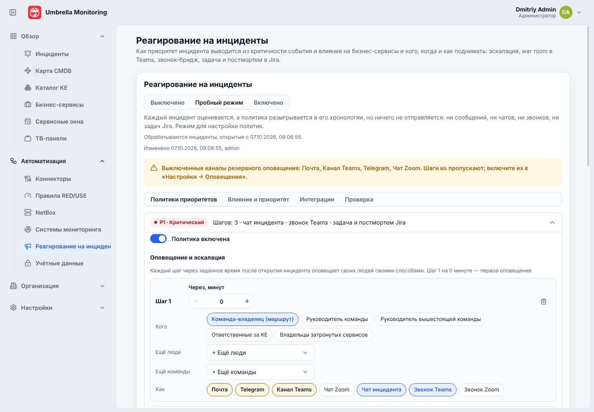
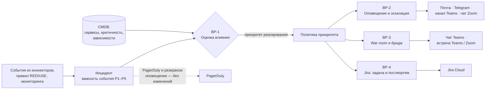
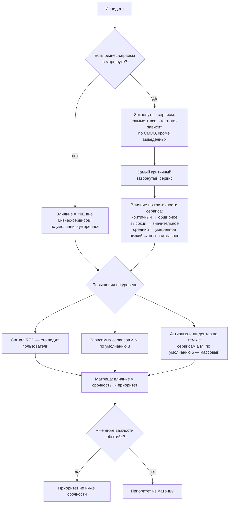
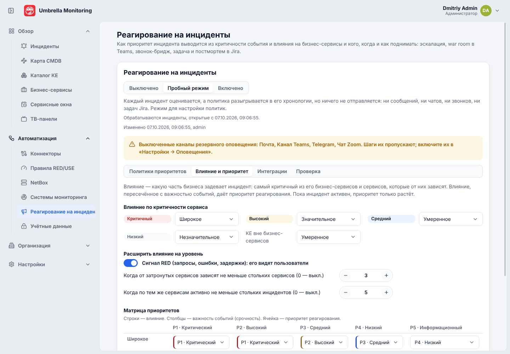
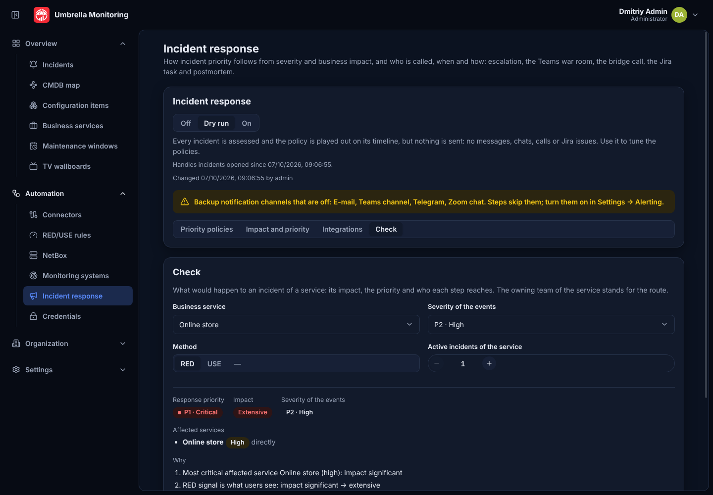
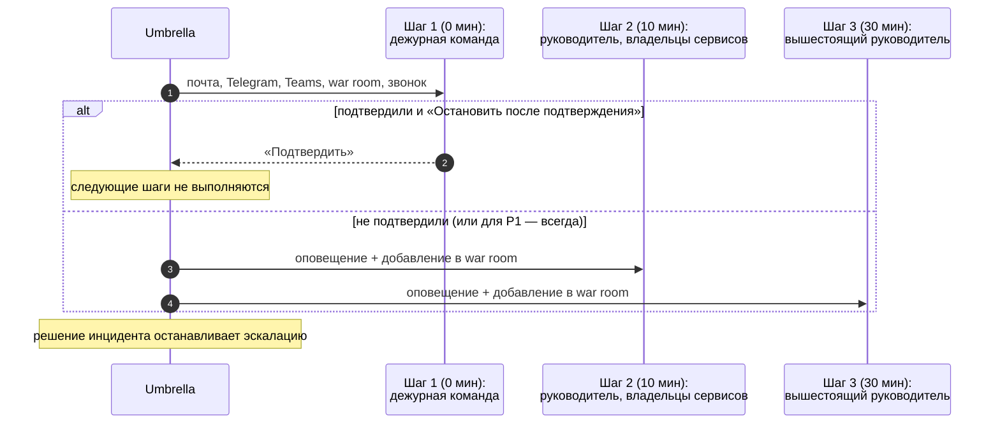
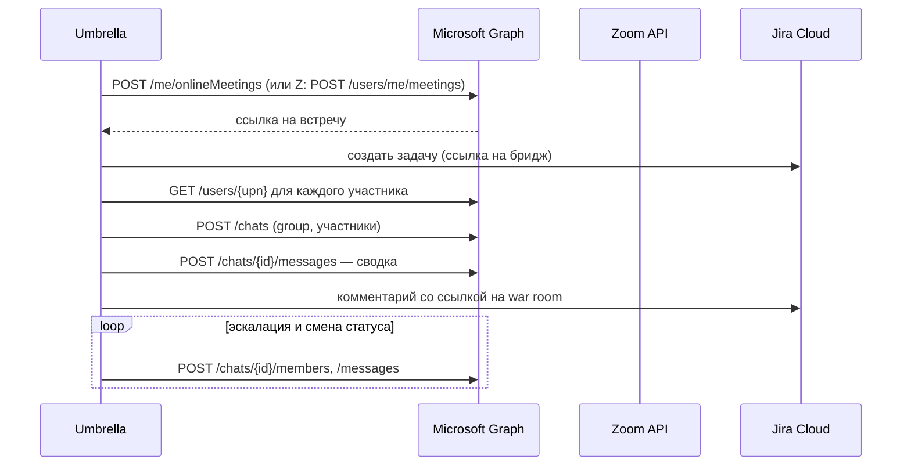
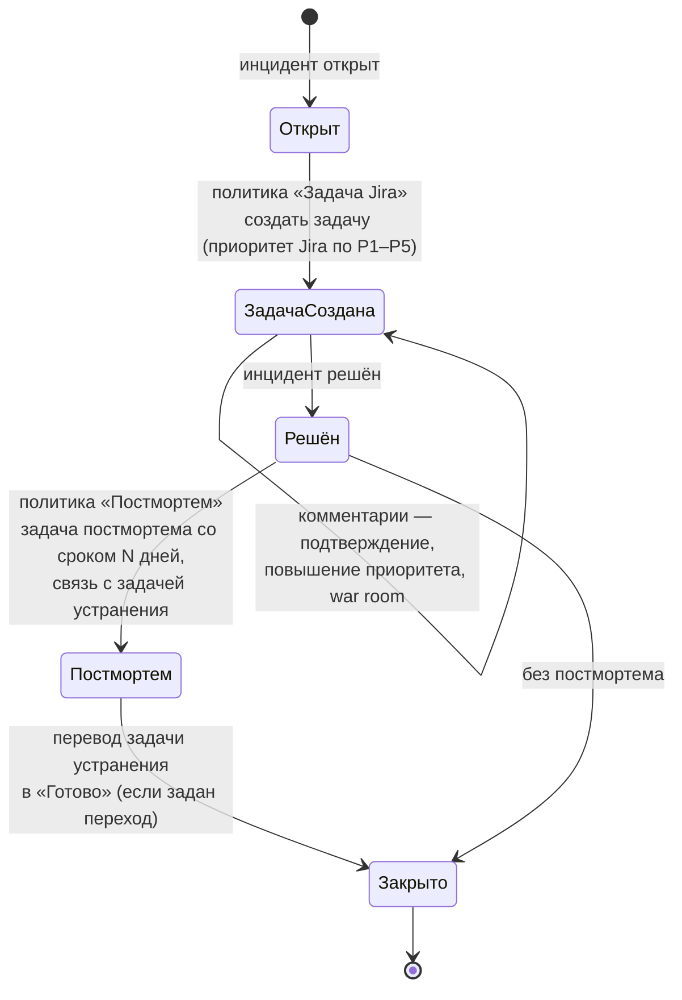
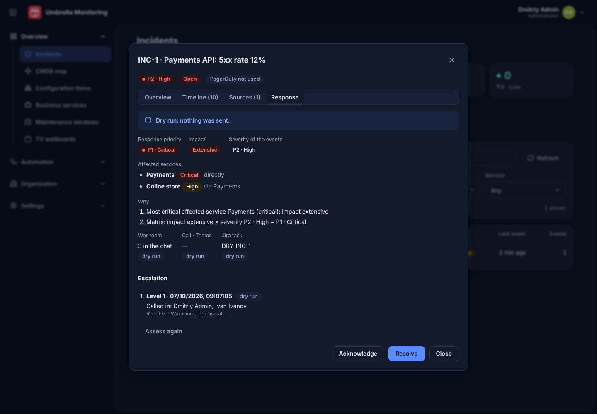

# Реагирование на инциденты

Раздел «Автоматизация → Реагирование на инциденты» (`/response`) решает, **насколько важен
инцидент для бизнеса** и **кого, когда и как поднимать**. Для каждого инцидента Umbrella:

1. оценивает влияние на бизнес-сервисы и выводит **приоритет реагирования** (BP-1);
2. по политике этого приоритета оповещает людей и эскалирует, пока инцидент не подтвердят
   или не решат (BP-2);
3. открывает **чат инцидента (war room)** в Microsoft Teams и **звонок-бридж** в Teams или
   Zoom (BP-3);
4. заводит **задачу в Jira Cloud** на устранение, после решения — **задачу на постмортем**
   и переводит задачу устранения в «Готово» (BP-4).

Всё настраивается по приоритетам P1–P5. Каждая интеграция (Jira, Microsoft Graph, Zoom) и
весь раздел целиком имеют три режима: **Выключено**, **Пробный режим** и **Включено**. В
пробном режиме всё оценивается и разыгрывается в хронологии инцидента с пометкой «пробный
режим», но ничего не отправляется и не создаётся: так политики настраиваются без учётных
данных и без риска разбудить людей. Выключенное реагирование не мешает остальному:
PagerDuty и резервное оповещение работают как раньше.

Права: `response:view` (страница и вкладка «Реагирование» в карточке инцидента),
`response:test` (проверка подключений), `response:edit` (изменение настроек). Готовые роли
«Администратор интеграций» и «Руководитель NOC» получают все три, «Дежурный инженер» —
просмотр. Действия в карточке инцидента («Открыть чат», «Начать звонок», «Создать задачу»,
«Создать постмортем», «Оценить заново») доступны тем, кто может работать с инцидентом.



## Общая схема



Оркестратор работает в фоне на одном экземпляре Umbrella (блокировка PostgreSQL), проходит
активные и недавно решённые инциденты раз в 10 секунд и хранит состояние каждого в таблице
`incident_response`. Каждое действие пишется в хронологию инцидента. Неудачное действие
(например, Jira недоступна) повторяется до 5 раз с растущей паузой (2, 4, 6, 8 минут), а
ошибка видна во вкладке «Реагирование» инцидента; остальные действия не ждут его.

Реагирование подхватывает только инциденты, открытые **после** включения (дата видна на
странице), чтобы при первом включении не поднять людей по всем старым инцидентам. Тестовые
инциденты не обрабатываются; инциденты в сервисном окне ждут его окончания.

## BP-1. Оценка критичности и влияния на бизнес-сервисы

Приоритет реагирования — это пересечение двух осей (матрица ITIL):

- **Срочность** — важность событий инцидента (P1–P5), как её прислал источник или
  назначило правило.
- **Влияние** — какую часть бизнеса задевает инцидент: незначительное, умеренное,
  значительное, обширное.



Матрица по умолчанию (строки — влияние, столбцы — важность событий):

| Влияние \ Важность | P1 | P2 | P3 | P4 | P5 |
|---|---|---|---|---|---|
| Обширное | P1 | P1 | P2 | P3 | P4 |
| Значительное | P1 | P2 | P2 | P3 | P4 |
| Умеренное | P2 | P2 | P3 | P4 | P5 |
| Незначительное | P2 | P3 | P4 | P4 | P5 |

Пример: событие P2 «5xx 12 %» на КЕ `pay-01` сервиса «Платежи» (критичный, от него зависит
«Интернет-магазин»). Влияние — обширное по критичности «Платежей», срочность P2, матрица
даёт **P1**. Объяснение («почему») сохраняется вместе с оценкой и показывается во вкладке
инцидента и в сообщениях.

Правила оценки во время инцидента:

- оценка повторяется на каждом проходе: новое событие, рост важности, новые инциденты по
  тем же сервисам могут **повысить** приоритет; пока инцидент активен, приоритет **не
  понижается** (иначе эскалация «прыгала» бы);
- при повышении берётся политика нового приоритета, уже пройденные шаги не повторяются;
- «Оценить заново» в карточке инцидента запускает оценку сразу.

Всё это настраивается на вкладке «Влияние и приоритет»; вкладка «Проверка» показывает, что
будет с инцидентом выбранного сервиса, важности и метода, и кого поднимет каждый шаг — без
создания инцидента.





## BP-2. Оповещение и эскалация по приоритету

Политика приоритета — это шаги эскалации. Шаг срабатывает через заданное число минут после
открытия инцидента и оповещает своих адресатов своими способами.

**Кого:** команда-владелец (маршрут инцидента), руководитель команды, руководитель
вышестоящей команды, ответственные за КЕ, владельцы затронутых сервисов, плюс выбранные
люди и команды.

**Как:**

| Способ | Что происходит |
|---|---|
| Почта | письмо каждому адресату (SMTP из «Настройки → Оповещения») |
| Telegram | сообщение в личный чат человека (чат указывается в профиле) или в чат команды |
| Канал Teams, чат Zoom | сообщение во входящий вебхук команды ([teams-zoom.md](teams-zoom.md)) |
| Чат инцидента | адресаты добавляются в war room Teams (BP-3) |
| Звонок Teams / Zoom | в сообщения добавляется ссылка на бридж (BP-3) |

В каждом сообщении — приоритет, влияние, затронутые сервисы, причина оценки, ссылки на
инцидент, war room, бридж и задачу Jira, а также личная ссылка **«Подтвердить»**.



Политики по умолчанию:

| Приоритет | Шаги | War room | Звонок | Jira | Стоп после подтверждения |
|---|---|---|---|---|---|
| P1 | 0 мин — команда (почта, Telegram, Teams, war room, звонок); 10 мин — руководитель и владельцы сервисов; 30 мин — вышестоящий руководитель | да | Teams | задача и постмортем (срок 5 дней) | нет |
| P2 | 0 мин — команда; 15 мин — руководитель; 60 мин — вышестоящий руководитель (почта) | да | — | задача и постмортем (10 дней) | да |
| P3 | 0 мин — команда (почта, Teams); 60 мин — руководитель (почта) | — | — | задача | да |
| P4 | 0 мин — команда (почта) | — | — | — | да |
| P5 | выключена | — | — | — | — |

Каналы оповещения — те же, что у резервного оповещения, и включаются в «Настройки →
Оповещения». Выключенный канал шаг пропускает и пишет это в хронологию; страница показывает
выключенные каналы предупреждением. Если инцидент снова открылся после решения, эскалация
начинается сначала.

## BP-3. War room в Microsoft Teams и звонок-бридж

Для приоритетов, где включён «Чат инцидента», Umbrella от имени служебной учётной записи
создаёт групповой чат Teams «P1 INC-123 · заголовок» и:

- добавляет участников по политике (команда, руководитель, владельцы сервисов) и людей
  каждого следующего шага эскалации (если включено «Добавлять эскалированных»);
- публикует сводку: приоритет и почему, затронутые сервисы, КЕ, первое событие, ссылки на
  инцидент, Grafana, бридж и задачу Jira, а также вопросы для команды — что сломано, как
  восстановить, как не допустить повторения;
- публикует обновления: повышение приоритета, подтверждение, решение, созданные задачи
  Jira (если включено «Публиковать обновления»); те же события уходят комментариями в задачу Jira.

Людей Umbrella находит в Microsoft 365 по e-mail (UPN) из своей учётной записи. Кого найти
не удалось, хронология перечисляет; им ссылка на чат приходит в оповещении.

**Звонок-бридж** — онлайн-встреча Teams (`/me/onlineMeetings`) или Zoom (Server-to-Server
OAuth), созданная при открытии инцидента. Ссылка уходит в war room, во все сообщения шагов со
способом «Звонок» и в задачу Jira.

> Telegram Bot API не умеет звонить, поэтому «звонок в Telegram» реализован как ссылка на
> бридж Teams или Zoom в сообщении Telegram. Настоящий телефонный обзвон остаётся за
> PagerDuty.



## BP-4. Задача Jira и постмортем



- **Задача на устранение** создаётся сразу (тип «Task» или свой), с приоритетом Jira по
  таблице P1–P5 → Highest … Lowest, метками (по умолчанию `umbrella`, `incident`; у постмортема ещё `postmortem`), описанием в
  ADF: что случилось, оценка влияния, затронутые сервисы, ссылки на инцидент, war room и бридж.
- **Постмортем** создаётся после решения: хронология инцидента, TTA и TTR, и
  разделы-заготовки без поиска виноватых: «Корневая причина», «Обнаружение и реакция»,
  «Меры против повторения», «Что сработало и что нет».
  Срок — через N дней (по умолчанию 5 для P1 и 10 для P2), задача связывается с задачей
  устранения (тип связи «Relates» или свой).
- Если Jira отклоняет поле (например, на экране проекта нет приоритета, срока или меток),
  Umbrella повторяет создание без этого поля.
- Задачу и постмортем можно создать вручную во вкладке «Реагирование» инцидента — например,
  для P3, где постмортем по умолчанию не создаётся.

## Настройка

### Jira Cloud

1. Заведите служебную учётную запись Atlassian (например `umbrella-bot@…`) с правом
   создавать задачи, комментировать, связывать и переводить задачи в нужном проекте.
2. Под ней создайте API-токен: id.atlassian.com → Security → **Create and manage API tokens**.
3. На вкладке «Интеграции» → Jira Cloud укажите сайт `https://<ваш>.atlassian.net`, ключ
   проекта, e-mail учётной записи и токен. Токен уходит в OpenBao и больше не показывается.
4. Проверьте типы задач, метки, тип связи, имя перехода «Готово» и соответствие приоритетов.
5. Сохраните и нажмите «Проверить» (проверяется вход и доступ к проекту), затем включите режим.

### Microsoft Teams (Microsoft Graph)

Создание групповых чатов и сообщений в них Graph разрешает только от имени пользователя,
поэтому Umbrella работает от **служебной учётной записи** с делегированными правами и
обновляемым токеном (refresh token), который сама продлевает и сохраняет в OpenBao.

1. Entra ID → App registrations → **New registration** (одна организация). В
   Authentication включите **Allow public client flows**.
2. API permissions → Microsoft Graph → **Delegated**: `Chat.Create`, `ChatMember.ReadWrite`,
   `ChatMessage.Send`, `OnlineMeetings.ReadWrite`, `User.ReadBasic.All`, `offline_access`.
   Нажмите **Grant admin consent**.
3. Certificates & secrets → New client secret (можно не создавать для публичного клиента).
4. Получите refresh token служебной учётной записи (device code flow):

   ```bash
   TENANT=contoso.onmicrosoft.com CLIENT=<application-id>
   SCOPE="https://graph.microsoft.com/.default offline_access"
   curl -s https://login.microsoftonline.com/$TENANT/oauth2/v2.0/devicecode \
     -d client_id=$CLIENT --data-urlencode scope="$SCOPE"
   # откройте verification_uri, введите user_code, войдите служебной учётной записью
   curl -s https://login.microsoftonline.com/$TENANT/oauth2/v2.0/token \
     -d grant_type=urn:ietf:params:oauth:grant-type:device_code \
     -d client_id=$CLIENT -d device_code=<device_code из первого ответа>
   ```

   Из второго ответа скопируйте `refresh_token`.
5. На вкладке «Интеграции» → Microsoft Teams укажите тенант, Application (client) ID, секрет
   (если создан), refresh token и UPN служебной учётной записи. Нажмите «Проверить»: Umbrella
   получит токен и прочитает профиль `/me`.

Служебной учётной записи нужна лицензия Teams; она становится участником каждого war room.

### Zoom (бридж)

1. Zoom App Marketplace → Develop → Build App → **Server-to-Server OAuth**.
2. Scopes: `meeting:write:meeting:admin` (или `meeting:write:admin`) и `user:read:user:admin`.
   Активируйте приложение.
3. На вкладке «Интеграции» → Zoom укажите Account ID, Client ID, Client secret и
   пользователя-организатора (`me` — владелец приложения, или e-mail пользователя Zoom).
4. «Проверить» получает токен и читает пользователя-организатора.

### Порядок включения

1. Настройте политики и влияние, оставьте раздел в **пробном режиме**.
2. Проверьте вкладкой «Проверка» несколько сервисов и посмотрите хронологию реальных
   инцидентов: каждое действие отмечено «(пробный режим)».
3. Подключите интеграции, проверьте их и переведите их в «Включено» по одной.
4. Переведите раздел в «Включено».

## Ограничения

- Telegram не умеет звонить: «звонок» — это ссылка на встречу Teams или Zoom. Телефонный
  обзвон остаётся у PagerDuty.
- В Teams люди сопоставляются по e-mail (UPN) учётной записи Umbrella; без e-mail человек не
  попадёт в war room.
- Каналы оповещения шагов (почта, Telegram, вебхуки Teams и Zoom) — те же, что у
  резервного оповещения; выключенный канал шаг пропускает.
- Приоритет не понижается, пока инцидент активен; для пересмотра решите инцидент или
  поменяйте важность в источнике.

## API

| Метод | Путь | Что делает |
|---|---|---|
| GET / PUT | `/api/response` | режим, влияние и политики |
| PUT | `/api/response/jira`, `/graph`, `/zoom` | настройки интеграций (секреты — в OpenBao) |
| POST | `/api/response/test/{jira,graph,zoom}` | проверка подключения |
| POST | `/api/response/simulate` | оценка воображаемого инцидента |
| GET | `/api/incidents/{id}/response` | состояние реагирования инцидента |
| POST | `/api/incidents/{id}/response/{room,bridge,task,postmortem,assess}` | действие вручную |


