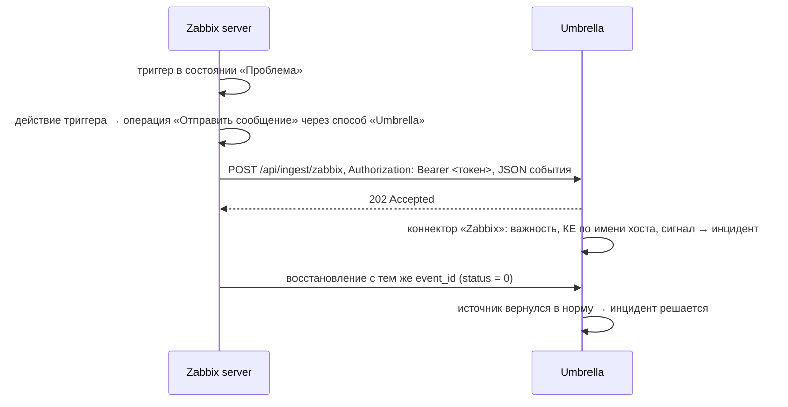

# Приём инцидентов из Zabbix

Что и как настроить, чтобы проблемы Zabbix приходили в Umbrella и открывали инциденты, а
восстановления закрывали их.

## Как это работает

Zabbix отправляет события **способом оповещения типа Webhook** (скрипт на JavaScript внутри
Zabbix). Umbrella принимает их **коннектором**, собранным из шаблона «Zabbix (тип оповещения
webhook)», и проверяет **Bearer-токен**. Umbrella сама в Zabbix не ходит за проблемами:
доставку запускает действие Zabbix.

## Что нужно заранее

| Что | Зачем |
|---|---|
| Zabbix 7.0 или новее, включая 8.0 | файл способа оповещения выгружен в формате 7.0, Zabbix 8.0 импортирует его без правок. На 6.0–6.4 способ создаётся вручную (см. «Zabbix 6.x») |
| Доступ с **Zabbix server** (или прокси, если оповещения шлёт он) до адреса Umbrella по HTTP(S) | скрипт выполняется на сервере Zabbix, а не в браузере |
| Публичный адрес Umbrella в «Настройки → Оповещения → Адрес Umbrella» | по нему Umbrella формирует адрес приёма в инструкции и файле |
| Права в Umbrella: `connectors:edit`, `connectors:publish`, `credentials:edit` (и `monitoring:edit` для подключения из «Систем мониторинга») | создать токен и коннектор |
| Права администратора в Zabbix | импорт способа оповещения, пользователь, действие |

Если Umbrella за HTTPS с самоподписанным сертификатом, Zabbix server должен доверять этому
сертификату (системное хранилище CA на сервере Zabbix), иначе отправка падает с ошибкой TLS.

## Шаг 1. Umbrella: токен и коннектор

Быстрый путь (рекомендуется):

1. **Автоматизация → Системы мониторинга** → карточка вашего Zabbix → вкладка **Приём
   алертов** → **Подключить приём алертов**. Или **Автоматизация → Коннекторы → Подключить
   источник → Zabbix**.
2. Umbrella создаст Bearer-токен «Токен приёма: …», коннектор «Zabbix» из шаблона и сразу
   опубликует его.
3. В ответе — адрес приёма (`https://umbrella.example.com/api/ingest/zabbix`), токен и файл
   **`umbrella-mediatype.yaml` с уже подставленными адресом и токеном**. Скачайте файл сразу:
   токен показывается **один раз**, дальше он хранится только в OpenBao.

Вручную (если нужен свой коннектор):

1. **Автоматизация → Учётные данные** → создать **Bearer-токен**, скопировать значение.
2. **Коннекторы** → создать коннектор из шаблона «Zabbix (тип оповещения webhook)», в узле
   webhook выбрать этот токен, **Опубликовать**. Адрес приёма — `/api/ingest/<slug>`,
   по умолчанию `/api/ingest/zabbix`.
3. Взять файл [`deploy/zabbix/umbrella-mediatype.yaml`](../../deploy/zabbix/umbrella-mediatype.yaml)
   и после импорта вписать в нём `url` и `token` (шаг 2).

## Шаг 2. Zabbix: способ оповещения «Umbrella»

1. **Оповещения → Способы оповещения → Импорт** → файл `umbrella-mediatype.yaml` → **Импорт**.
2. Откройте способ **Umbrella** и проверьте параметры:

   | Параметр | Значение | Что это |
   |---|---|---|
   | `url` | адрес приёма из шага 1 | куда отправлять |
   | `token` | токен из шага 1 | Bearer-токен; значение, начинающееся с `<`, считается не заданным |
   | `event_id` | `{EVENT.ID}` | по нему восстановление находит ту же тревогу |
   | `host` | `{HOST.HOST}` | техническое имя хоста — по нему ищется КЕ |
   | `host_group` | `{TRIGGER.HOSTGROUP.NAME}` | группы хоста, уходят меткой `host_group` |
   | `trigger` | `{EVENT.NAME}` | заголовок инцидента |
   | `item_key` | `{ITEM.KEY1}` | сигнал: по паре «КЕ + сигнал» события схлопываются в один инцидент |
   | `severity` | `{EVENT.NSEVERITY}` | важность 0–5 |
   | `status` | `{EVENT.VALUE}` | 1 — проблема, 0 — восстановление |
   | `value` | `{ITEM.LASTVALUE1}` | последнее значение элемента данных |

3. Способ должен быть **Включён**. Таймаут по умолчанию — 10 с.
4. Кнопка **Тест** в списке способов: заполните `url`, `token` и, например, `event_id=test-1`,
   `host=<имя хоста>`, `trigger=Проверка`, `severity=3`, `status=1`. Ответ `OK` — Umbrella
   приняла событие. Не забудьте закрыть его вторым тестом с `status=0` и тем же `event_id`.

## Шаг 3. Zabbix: получатель

Действие отправляет сообщение пользователю, поэтому способ «Umbrella» нужно назначить
пользователю (лучше отдельному служебному, например `umbrella`, без права входа в
интерфейс):

1. **Пользователи → Пользователи** → пользователь → вкладка **Оповещения** → **Добавить**.
2. Тип — **Umbrella**, «Отправлять на» — любое непустое значение (например `umbrella`),
   «Когда активно» — `1-7,00:00-24:00`, отметьте **все важности**. Фильтр важностей лучше
   задавать в условиях действия (шаг 4).
3. Пользователь должен иметь **право чтения на группы узлов**, события которых вы хотите
   отправлять (через группу пользователей). Иначе Zabbix не отправит ему сообщения по этим
   хостам.

## Шаг 4. Zabbix: действие триггера

**Оповещения → Действия → Действия триггеров → Создать действие**:

1. **Действие**: имя `Umbrella`. Условия (по желанию):
   - «Важность триггера» **больше или равна** «Предупреждение» — не отправлять
     информационные события;
   - «Проблема подавлена» — **нет**, если плановые работы ведёте в Zabbix. Если сервисные
     окна ведёте в Umbrella, это условие не нужно: Umbrella сама держит такие инциденты
     у себя и не отправляет их в PagerDuty;
   - «Группа узлов сети» — ограничить нужными группами.
2. **Операции → Операции**: «Отправить сообщение», пользователь (или группа) из шага 3,
   **Отправлять только через** — `Umbrella`. Шаг 1–1, длительность по умолчанию: одно
   сообщение на проблему достаточно, повторы не нужны.
3. **Операции восстановления**: «Отправить сообщение» тому же пользователю через `Umbrella`.
   **Без этой операции инциденты в Umbrella не будут закрываться сами.**
4. **Операции обновления** не нужны: подтверждения и комментарии в Zabbix Umbrella не
   использует.
5. **Добавить**, действие должно быть **Включено**.

## Как Umbrella разбирает событие

| Zabbix | Umbrella |
|---|---|
| Важность 5 «Чрезвычайная» | P1 · Критический |
| 4 «Высокая» | P2 · Высокий |
| 3 «Средняя» | P3 · Средний |
| 2 «Предупреждение» | P4 · Низкий |
| 1 «Информация», 0 «Не классифицировано» | P5 · Информационный |
| `{HOST.HOST}` | КЕ: сначала хосты с ручной привязкой в «Системах мониторинга», затем имя, короткое имя, IP и DNS КЕ |
| `{ITEM.KEY1}` (если пусто — имя триггера) | сигнал инцидента |
| `{EVENT.ID}` | внешний ID события: восстановление с тем же ID закрывает источник |
| `{TRIGGER.HOSTGROUP.NAME}` | метка `host_group`; метка `source=zabbix` |

Сопоставление важностей и полей можно поменять в редакторе коннектора (узлы `map.severity`
и `map.event`) и опубликовать новую версию — Zabbix при этом трогать не нужно.

Инцидент получает маршрут КЕ (бизнес-сервисы, команда, люди) и уходит в PagerDuty и
резервное оповещение по общим правилам. Когда все источники инцидента прислали
восстановление, он решается сам («все источники вернулись в норму»).

Чтобы хосты Zabbix точно находили свои КЕ, добавьте Zabbix в **Автоматизация → Системы
мониторинга** (адрес веб-интерфейса и API-токен Zabbix), загрузите хосты и привяжите
несопоставленные к КЕ вручную или создайте из них КЕ ([monitoring-hosts.md](monitoring-hosts.md)).
Без этого инцидент по неизвестному хосту всё равно откроется, но без КЕ и маршрута.

## Проверка

1. В Umbrella на вкладке **Приём алертов** системы (или в редакторе коннектора) —
   **Отправить тестовое событие**: проверяет коннектор и маршрут без участия Zabbix.
   Тестовый инцидент не уходит в PagerDuty и решается сам через 5 минут.
2. В Zabbix — **Тест** способа оповещения (шаг 2) или настоящий триггер: например, элемент
   данных типа «Zabbix траппер» и `zabbix_sender -z <zabbix> -s <хост> -k <ключ> -o <значение>`.
3. Результат:
   - в Umbrella: **Инциденты** — новый инцидент; в коннекторе вкладки **Запросы**,
     **События**, **Ошибки**;
   - в Zabbix: **Отчёты → Журнал действий** — статус «Отправлено» или текст ошибки.

## Если не работает

| Признак | Причина и что сделать |
|---|---|
| В журнале действий Zabbix `Umbrella answered 401` | неверный или не заданный `token`; создайте новый токен и обновите параметр |
| `Umbrella answered 404` | коннектор не опубликован или неверный slug в `url` |
| `Umbrella answered 403` | у коннектора ограничены сети приёма — добавьте адрес сервера Zabbix |
| `Umbrella answered 503` | коннектор остановлен или с ошибкой публикации, либо Umbrella не готова принимать (PostgreSQL, OpenBao) — «Настройки → Состояние системы» |
| `Umbrella answered 413` / `429` | слишком большое тело или превышен лимит частоты коннектора |
| `Couldn't connect`, `timeout`, ошибка TLS | Zabbix server не достаёт до Umbrella: DNS, firewall, прокси, сертификат |
| В журнале действий пусто | действие выключено, не совпали условия, у пользователя нет способа «Umbrella» или прав на группу узлов |
| Инцидент есть, но без КЕ | имя хоста не совпало с КЕ — привяжите хост в «Системах мониторинга» |
| Инциденты не закрываются | нет операции восстановления в действии |
| Запрос пришёл, события нет | вкладка **Ошибки** коннектора: что не так с телом; после исправления — повторная обработка |

## Zabbix 6.x

Импорт файла формата 7.0 в Zabbix 6.x не пройдёт. Создайте способ вручную:
**Администрирование → Способы оповещения → Создать**, тип **Webhook**, имя `Umbrella`,
параметры из таблицы шага 2, скрипт — содержимое поля `script` из
[`umbrella-mediatype.yaml`](../../deploy/zabbix/umbrella-mediatype.yaml), таймаут `10s`,
шаблоны сообщений для «Проблема» и «Восстановление проблемы» (любой текст). Остальные шаги
те же; в 6.0 разделы меню называются «Настройка → Действия» и «Администрирование →
Пользователи».
