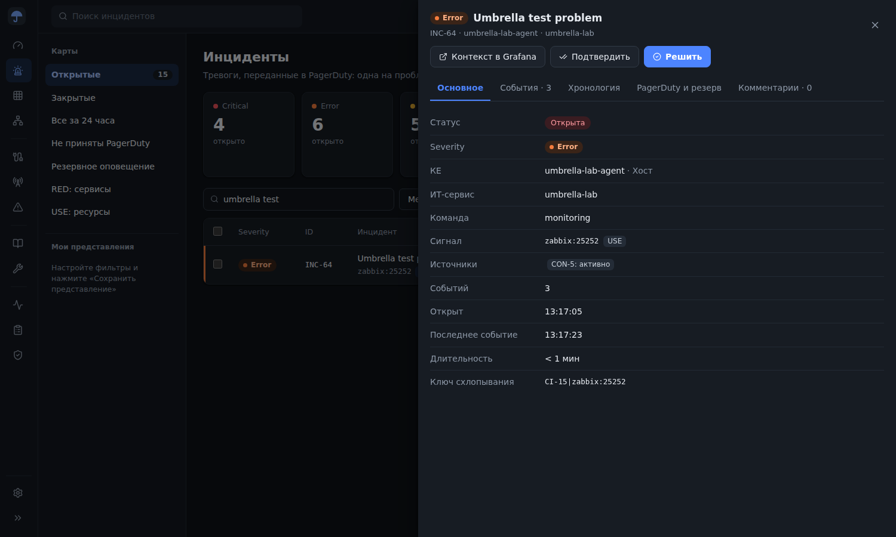
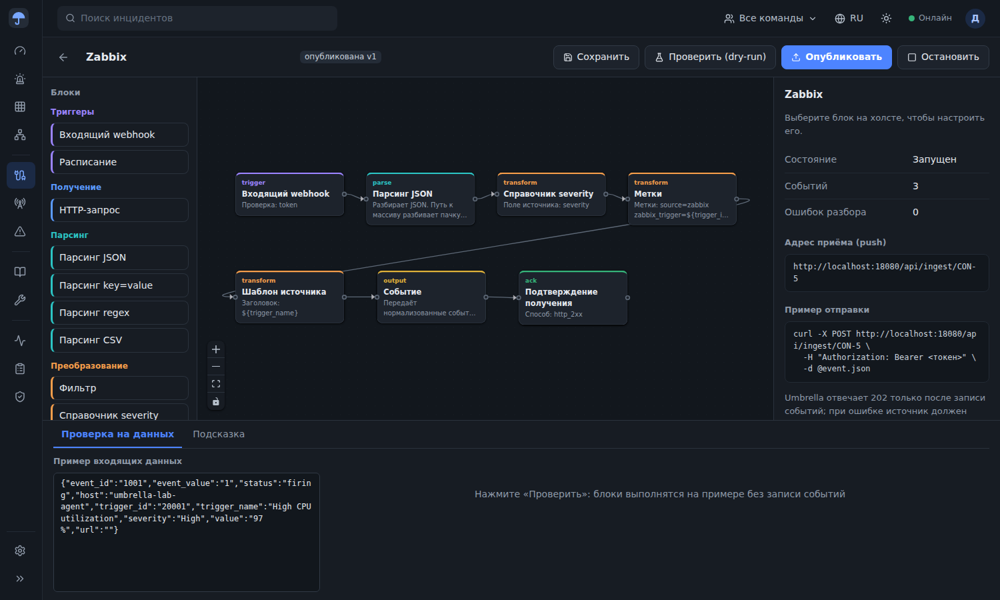
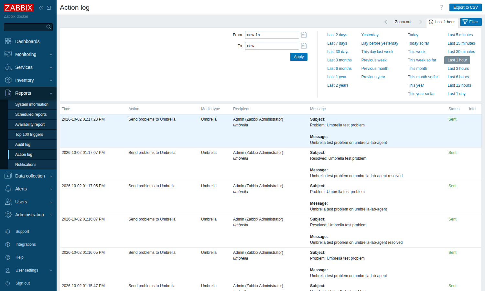

# Стенд Umbrella + Zabbix

Стенд на одном сервере поднимает Umbrella MVP, Zabbix 7.0 (сервер, веб-интерфейс, PostgreSQL) и Zabbix agent 2. Он сам связывает Zabbix с Umbrella и проверяет все функции MVP тестом.

## Установка одной командой

Подойдёт чистый сервер Debian или Ubuntu: 2 vCPU, 4 ГБ памяти, 20 ГБ диска, доступ в интернет. Команду запускают под root:

```bash
curl -fsSL https://raw.githubusercontent.com/sbrw-evc/Umbrella-Monitoring/feature/mvp-app/deploy/zabbix-lab/install.sh | bash
```

Если репозиторий закрытый, клонируйте его и запустите скрипт из клона:

```bash
git clone -b feature/mvp-app https://github.com/sbrw-evc/Umbrella-Monitoring.git /opt/umbrella-monitoring
/opt/umbrella-monitoring/deploy/zabbix-lab/install.sh
```

Что делает `install.sh`:

1. Ставит git, curl, jq и Docker Engine с плагином compose.
2. Пишет `.env` со случайными паролями и токенами. Файл доступен только root.
3. Собирает образ Umbrella и запускает пять контейнеров (`docker compose up -d --build`).
4. Запускает `configure.sh`, который настраивает связку.
5. Запускает `smoke-test.sh --zabbix` и печатает итог.

Повторный запуск обновляет код, пересобирает и перезапускает контейнеры. Пароли в `.env` при этом сохраняются.

| Что | Адрес | Вход |
| --- | --- | --- |
| Umbrella | `http://<сервер>:8080` | без входа |
| Zabbix | `http://<сервер>:8081` | `Admin`, пароль `ZABBIX_ADMIN_PASSWORD` из `.env` |

Порты задаются через `UMBRELLA_PORT` и `ZABBIX_WEB_PORT`. У API Umbrella в MVP нет входа, поэтому откройте порты только для своих адресов, например `ufw allow from <ваш IP> to any port 8080,8081 proto tcp`.

## Как устроена связка

```text
Zabbix trigger -> action "Send problems to Umbrella" -> media type "Umbrella" (webhook)
  -> POST http://umbrella:8080/api/ingest/<коннектор> с заголовком X-Umbrella-Token
  -> коннектор "Zabbix": trigger.webhook -> parse.json -> map.severity -> enrich.labels
     -> map.event -> out.event -> ack.response (2xx)
  -> инцидент Umbrella на КЕ umbrella-lab-agent -> PagerDuty (или dry-run)
```

`configure.sh` делает следующее. Повторный запуск безопасен: скрипт находит то, что создал раньше, и обновляет.

- В Umbrella создаёт ИТ-сервис `umbrella-lab` и хост `umbrella-lab-agent` в CMDB, а также коннектор «Zabbix». Коннектор публикуется и запускается.
- Маппинг важности: Disaster → critical, High → error, Average и Warning → warning, остальное → info.
- Сигнал строится как `zabbix:<id триггера>`, поэтому повторы одной проблемы схлопываются в один инцидент.
- Восстановление приходит из Zabbix как `status: resolved` и закрывает инцидент.
- В Zabbix скрипт меняет пароль `Admin` (по умолчанию `zabbix`) на пароль из `.env`.
- Там же создаёт webhook media type «Umbrella»: при ответе не из 2xx Zabbix повторяет отправку до трёх раз. Это и есть подтверждение получения источнику.
- Подключает этот способ оповещения пользователю Admin и создаёт действие для проблем и восстановлений.
- Добавляет хост `umbrella-lab-agent` (контейнер agent 2, шаблон «Linux by Zabbix agent») с trapper-элементом `umbrella.test` и триггером «Umbrella test problem» уровня High. Тест управляет триггером через `history.push`.

Umbrella MVP хранит данные в памяти. После перезапуска контейнера `umbrella` выполните `./configure.sh` ещё раз: он создаст коннектор заново и обновит адрес в Zabbix.

## Тест функций MVP

```bash
./smoke-test.sh            # только Umbrella
./smoke-test.sh --zabbix   # плюс сквозная проверка через Zabbix
```

Каждый прогон создаёт свои КЕ и сигналы, поэтому тест можно повторять. Проверяется 53 пункта:

| Раздел | Что проверяется |
| --- | --- |
| Сервис | `/healthz`, `/api/meta`, самодиагностика, палитра блоков, веб-интерфейс |
| CMDB | создание ИТ-сервиса и хостов, связи в графе |
| Конструктор | отладочный прогон графа из 7 блоков, маппинг важности и шаблоны, ошибка блока на битом JSON, отказ публикации графа без триггера, публикация и запуск |
| Приём | отказ без токена и с неверным токеном (401), приём с токеном (202), привязка к КЕ, сервису и команде, метод RED/USE |
| Дедупликация | повтор того же external_id отбрасывается, повтор сигнала складывается в один инцидент, важность повышается, второй источник попадает в тот же инцидент |
| Действия | подтверждение, повторное подтверждение (409), комментарий, события в карточке |
| Восстановление | инцидент остаётся активным, пока не восстановятся все источники; повтор в окне склейки открывает тот же инцидент; ручное решение |
| Обслуживание | событие во время окна обслуживания подавлено и не уходит в PagerDuty |
| Ошибки | инцидент без КЕ, битое сообщение в журнале ошибок разбора |
| Групповые действия | подтверждение и решение двух инцидентов разом |
| Представления | фильтры списка, тепловая карта по сервисам и командам, журнал событий, карточка КЕ, WebSocket |
| PagerDuty | имитация отказа и восстановление доставки |
| Коннектор и аудит | остановленный коннектор отклоняет события (409), записи в журнале аудита |
| Zabbix | вход в API, хост и триггер, доступность агента, проблема → инцидент (High → error), Zabbix отмечает отправку как Sent, восстановление → инцидент решён |

Тест проверен на этом стенде: 53 из 53.







## Управление

```bash
cd /opt/umbrella-monitoring/deploy/zabbix-lab
docker compose ps
docker compose logs -f umbrella
docker compose down        # остановить; данные Zabbix остаются в томе zabbix-db
docker compose down -v     # удалить вместе с базой Zabbix
```

PagerDuty: чтобы отправлять инциденты по-настоящему, укажите `UMBRELLA_PD_ROUTING_KEY` в `.env` и выполните `docker compose up -d`. Без ключа шлюз работает в режиме dry-run.
