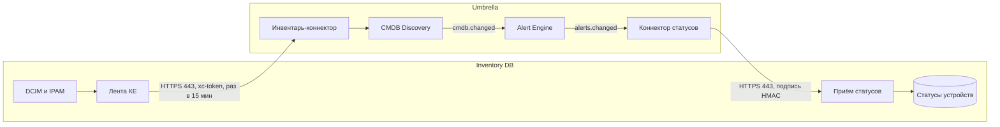

# Интеграция с Inventory DB

[Inventory DB](https://github.com/sbrw-evc/Inventory-DB) — приложение учёта инвентаря ЦОД в духе NetBox: площадки, стойки, устройства, интерфейсы, кабели, IP-адреса и VLAN. Umbrella и Inventory DB обмениваются данными в обе стороны, и описанное здесь одинаково для MVP (поток П-11) и целевой архитектуры (поток П-13). Новых контейнеров интеграция не требует: обе стороны собираются блоками low-code конструктора.

| Направление | Что передаётся | Как |
| --- | --- | --- |
| Inventory DB → Umbrella | Площадки, стойки и устройства как КЕ карты CMDB: имена, IP-адреса, DNS-имена, серийные номера, связи «находится в» (устройство → стойка → площадка) и «соединён с» (по кабелям) | Инвентарь-коннектор CMDB Discovery раз в 15 минут читает ленту КЕ `GET /api/v1/integrations/{id}/umbrella/ci` с токеном API |
| Umbrella → Inventory DB | Изменения тревог по устройствам: статус, severity, заголовок, сигнал, ссылки на инцидент и контекст в Grafana | Коннектор статусов Connector Runtime подписан на alerts.changed и отправляет `POST /api/v1/integrations/{id}/umbrella/alerts` с подписью HMAC |



Схемы draw.io в `mvp/diagrams` и `target/diagrams` эту интеграцию пока не показывают; при следующей правке генератора Inventory DB добавляется на схемы контекста, потоков и интеграций.

## Роли систем

- **Inventory DB — мастер физических КЕ.** Umbrella не ведёт учёт оборудования, IP-адресов и кабелей, а берёт их из Inventory DB как из доверенного источника: добавления применяются сразу, удаления и конфликты идут на ревью карты.
- **Umbrella — мастер состояния мониторинга.** Inventory DB не считает тревоги сама, а показывает в карточке и в списках устройств то, что прислала Umbrella.
- Логические КЕ (сервисы, поды, облачные группы) по-прежнему строятся из данных мониторинга; физическое устройство из Inventory DB и хост из системы мониторинга склеиваются по hostname, FQDN и IP.

## Настройка

1. В Inventory DB владелец интеграции создаёт её: `POST /api/v1/integrations` с телом `{"kind":"umbrella","title":"Umbrella","umbrellaUrl":"https://umbrella.corp","inventoryUrl":"https://inventory.corp"}`. Ответ содержит `integration.id` и секрет подписи `secret`; секрет показывается один раз.
2. В Inventory DB создаётся сервисный пользователь только на чтение и его токен API (`POST /api/v1/tokens`). Лента содержит то, что этот пользователь видит через API DCIM и IPAM.
3. Токен и секрет кладутся в OpenBao; в коннекторах только ссылки на них.
4. В конструкторе Umbrella собирается **инвентарь-коннектор**:
   - триггер «расписание», 15 минут;
   - HTTP REST `GET {inventoryUrl}/api/v1/integrations/{id}/umbrella/ci?offset=‹offset›&limit=1000`, авторизация «токен» в заголовке `xc-token`;
   - пагинация по `offset`, пока `next_offset` не станет null;
   - маппинг элемента `items[]` в объект инвентаря: `source_ref` → source_refs, `type`, `name`, `identities`, `logical_group`, `status`, `relations` (тип, направление, `target_ref`), `monitored` и `url` → атрибуты КЕ;
   - выход «объект инвентаря»; в правилах обнаружения источник Inventory DB помечается доверенным.
5. Собирается **коннектор статусов**:
   - триггер «подписка на очередь» alerts.changed;
   - фильтр: у КЕ тревоги есть source_ref с префиксом `inventory-db:` или КЕ типа «хост»;
   - шаблон тела по контракту ниже;
   - HTTP REST `POST {inventoryUrl}/api/v1/integrations/{id}/umbrella/alerts`, авторизация «подпись запроса HMAC»;
   - повтор с backoff на ответы 5xx и таймауты; ответ 4xx пишется в журнал коннектора без повтора.
6. Правило подавления: тревоги по КЕ с атрибутом `monitored = false` (устройства planned, offline, inventory, decommissioning) не уходят в PagerDuty и резервные каналы, но видны на дашборде инцидентов.
7. В шаблон события добавляется ссылка на карточку устройства в Inventory DB из атрибута `url`.

## Лента КЕ

`GET /api/v1/integrations/{id}/umbrella/ci?offset=0&limit=1000` возвращает полный снимок; разницу между снимками считает CMDB Discovery, поэтому курсор изменений не нужен.

```json
{
  "source": "inventory-db", "integration_id": "int_…", "generated_at": "2026-10-08T14:00:00.000Z",
  "count": 4, "offset": 0, "next_offset": null,
  "items": [{
    "source_ref": "inventory-db:dcim.device:100",
    "type": "device", "name": "App-01", "status": "active", "monitored": true,
    "identities": { "hostname": "app-01", "fqdn": ["app-01.corp.example"], "ip": ["10.0.0.5"], "serial": "SN100" },
    "logical_group": null,
    "attributes": { "role": "Server", "manufacturer": "Dell", "model": "R650", "site": "DC1", "rack": "R01", "tags": ["prod"] },
    "relations": [
      { "type": "located_in", "direction": "out", "target_ref": "inventory-db:dcim.rack:10" },
      { "type": "connected_to", "direction": "out", "target_ref": "inventory-db:dcim.device:101", "via": "cable 5" }
    ],
    "url": "https://inventory.corp/dcim/devices/100",
    "last_updated": "2026-10-01T10:00:00Z"
  }]
}
```

| Поле | Значение |
| --- | --- |
| source_ref | устойчивая ссылка `inventory-db:‹тип›:‹id›`, тип — dcim.site, dcim.rack или dcim.device |
| type | site, rack, device |
| identities | hostname (имя устройства в нижнем регистре), fqdn (DNS-имена его IP-адресов), ip (адреса интерфейсов, основной и OOB), serial, asset_tag |
| logical_group | виртуальное шасси или кластер устройства; используется для склейки, как облачная группа |
| status, monitored | статус жизненного цикла по NetBox; monitored = false для planned, offline, inventory, decommissioning |
| relations | located_in: устройство → стойка (или площадка без стойки), стойка → площадка; connected_to: устройство → устройство на другом конце кабеля |

## Статусы тревог

`POST /api/v1/integrations/{id}/umbrella/alerts`; тело — одно событие или массив до 500.

```json
{
  "alert_id": "8f1c…", "status": "open", "severity": "critical",
  "title": "Host down: app-01", "signal": "use.host.availability",
  "ci": { "source_refs": ["inventory-db:dcim.device:100"], "name": "app-01",
          "identities": { "hostname": "app-01", "fqdn": "app-01.corp.example", "ip": "10.0.0.5" } },
  "links": { "incident": "https://umbrella.corp/incidents/8f1c…", "grafana": "https://umbrella.corp/go/incidents/8f1c…/grafana" },
  "updated_at": "2026-10-08T14:00:00Z"
}
```

- `status`: open, acknowledged, resolved, closed; `severity`: critical, error, warning, info — те же значения, что у тревоги Umbrella. В целевой архитектуре `links.incident` ведёт на инцидент, в который входит тревога.
- **Подпись.** Заголовки `x-umbrella-timestamp: ‹unix-время в секундах›` и `x-umbrella-signature: v1=‹hex HMAC-SHA256(секрет, "‹timestamp›.‹тело запроса›")›`. Запросы старше 5 минут отклоняются. При ротации секрета заголовок может нести две подписи через запятую.
- **Привязка к устройству.** Сначала по source_ref `inventory-db:`; если его нет, по hostname, FQDN и его короткому имени, имени КЕ и IP без учёта регистра. Тревоги без совпадения видны владельцу интеграции в Inventory DB (`GET /api/v1/integrations/{id}/umbrella/unmatched`), чтобы поправить имена или адреса.
- **Идемпотентность.** Повтор с тем же alert_id перезаписывает состояние; обновление с более старым `updated_at`, чем сохранённое, отбрасывается, поэтому повторы и доставка не по порядку безопасны.
- **Ответы.** 202 с результатом привязки по каждому событию; 400 — тело не по контракту; 401 — неверная или устаревшая подпись, неизвестная или выключенная интеграция.

В Inventory DB статус устройства — худшая severity среди открытых и подтверждённых тревог или ok. Он показывается цветным чипом в списках и в боковой панели устройства по тем же цветам, что легенда Umbrella, со списком тревог и ссылками на инцидент и Grafana.

## Безопасность

| Риск | Мера |
| --- | --- |
| Подмена статусов | подпись HMAC с меткой времени, окно 5 минут; один ответ 401 для неизвестной, выключенной интеграции и неверной подписи |
| Утечка токена Inventory DB | токен сервисного пользователя только на чтение, в OpenBao; ротация в Inventory DB без перепубликации коннектора |
| Утечка секрета подписи | секрет в OpenBao на стороне Umbrella и зашифрован (AES-256-GCM) на стороне Inventory DB; ротация через `POST /api/v1/integrations/{id}/rotate-secret` |
| Лишние данные в Inventory DB | коннектор статусов отправляет только поля из контракта: заголовок, сигнал, severity, ссылки; сырые события и метки не передаются |

## Сетевые доступы

| Откуда | Куда | Порт / протокол |
| --- | --- | --- |
| CMDB Discovery (инвентарь-коннектор), Connector Runtime (коннектор статусов) | Inventory DB REST API (внутренняя сеть) | 443 HTTPS |
