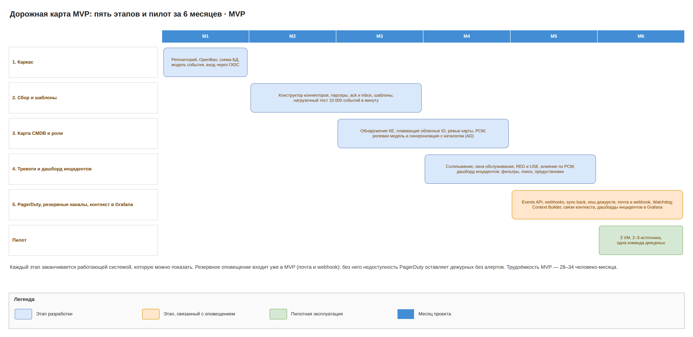

# Umbrella MVP · 1. Обзор

Umbrella MVP за 6 месяцев даёт один алерт на проблему из любых источников в PagerDuty, а если PagerDuty недоступен, дежурный получает алерт по резервному каналу (почта или webhook в мессенджер). Дежурный видит все инциденты на одном дашборде с фильтрами и поиском, одним щелчком открывает дашборд Grafana с метриками, логами и трейсами затронутых КЕ, а доступ к функциям выдаётся через группы корпоративного каталога. Это первый документ набора MVP; целевая архитектура описана отдельным набором.

## Паспорт

| Поле | Значение |
| --- | --- |
| Название | Umbrella, зонтичный мониторинг · MVP |
| Назначение | Единая точка сбора событий из любых источников, их парсинга, нормализации и схлопывания с передачей одного алерта на проблему в PagerDuty, резервным оповещением, когда PagerDuty недоступен, дашбордом инцидентов и контекстом инцидента в Grafana |
| Владелец архитектуры | Dmitriy |
| Статус | Архитектура, до начала разработки |
| Пользователи | Инженеры мониторинга (настройка), дежурные инженеры (дашборд инцидентов, контекст в Grafana, карта CMDB, подтверждение по резервному каналу), владельцы сервисов, аудиторы, администраторы ролей |
| Входящие интеграции | Любые системы мониторинга, их БД, облачные провайдеры, очереди, syslog, почта (через low-code конструктор); webhooks PagerDuty; корпоративный каталог (LDAPS или SCIM) |
| Исходящие интеграции | PagerDuty (Events API v2, Webhooks v3, REST API) как основной канал; резервные каналы: почта (SMTP) и HTTPS webhook; Grafana (HTTP API: дашборды, аннотации, команды и права папок); корпоративный IdP (OIDC); SIEM (syslog TLS); внешний heartbeat; S3-хранилище для бэкапов |
| Нагрузка | До 5000 событий в минуту (≈ 85 в секунду), нагрузочный тест на 10 000 в минуту |
| Критичность | Высокая: доступность 99,9%, задержка событие → PagerDuty p95 не более 30 с, оповещение по резервному каналу не позже 3 мин от события (предложено, требует утверждения) |
| Отказоустойчивость | Одна площадка, RPO ≤ 1 мин, RTO ≤ 1 ч; восстановление из бэкапов в S3 на другой площадке или в другом регионе |
| Стек | Go, NATS JetStream, PostgreSQL, OpenBao, React; Kubernetes, пилот на Docker Compose на трёх VM; Grafana (корпоративная или Grafana OSS) |
| Ограничения по вендорам | Платные российские продукты запрещены, open source разрешён; требований к сертификации нет |

## Резюме

Сегодня одна проблема даёт несколько алертов из разных систем, и дежурный сам сопоставляет их, ищет влияние на сервисы и собирает графики по хостам и сервисам вручную. Umbrella забирает события из любых источников, привязывает их к КЕ и сервисам и отдаёт в PagerDuty один понятный алерт с влиянием на бизнес-услуги.

Ключевые решения MVP:

- Подключение любого источника собирается в low-code конструкторе из блоков; источник получает подтверждение только после надёжной записи события, поэтому нет ни потерь, ни дублей.
- Облачные ресурсы с меняющимися ID привязываются к устойчивой КЕ по тегам и группам.
- PagerDuty остаётся основным каналом оповещения. Если PagerDuty не принял тревогу уровня error или critical за 2 минуты, Fallback Notifier сам оповещает дежурных по почте и webhook; без подтверждения за 10 минут сообщение уходит резервным контактам сервиса.
- Дашборд инцидентов в веб-интерфейсе показывает тревоги, переданные в PagerDuty, с живыми обновлениями, фильтрами, полнотекстовым поиском и групповыми действиями.
- Context Builder по щелчку на инциденте генерирует дашборд Grafana: панели метрик, логов и трейсов КЕ инцидента и связанных с ней КЕ из карты CMDB. Какие панели нужны, инженер задаёт в low-code редакторе «Связи контекста».
- Права выдаются через группы корпоративного каталога: группа привязывается к роли, области (бизнес-услуги, сервисы, команды, источники) и предустановке дашборда. Удаление сотрудника из группы отзывает доступ не позже чем через 15 минут.

Промышленный контур MVP — это Kubernetes из трёх app-узлов и трёх узлов данных плюс две VM в DMZ; пилот работает на Docker Compose на трёх VM. Все компоненты open source, все секреты только в OpenBao. Разработка занимает 28–34 человеко-месяца в пять этапов.

## Место в ландшафте

Umbrella стоит между слоем сбора телеметрии и слоем управления инцидентами и не заменяет ни один из них.

| Слой | Системы | Роль относительно Umbrella |
| --- | --- | --- |
| Сбор телеметрии | системы мониторинга, хранилища метрик, логов и трейсов, облачный мониторинг | источники событий, метрик и инвентаря; остаются как есть |
| Консолидация событий | Umbrella | парсинг, нормализация, схлопывание, карта CMDB, RED и USE, дашборд инцидентов |
| Визуализация телеметрии | Grafana (корпоративная; если её нет, Grafana OSS разворачивается в зоне приложений) | показывает дашборды инцидентов, которые генерирует Umbrella; данные берёт из существующих хранилищ метрик, логов и трейсов |
| Инциденты и оповещение | PagerDuty | основной канал: один алерт на проблему, дежурства, эскалации, доставка |
| Резервное оповещение | корпоративный почтовый релей, корпоративный мессенджер (webhook) | используются Umbrella, только когда PagerDuty не принял алерт |
| Идентификация и доступ | корпоративный IdP (OIDC), корпоративный каталог (например, AD) | вход в Umbrella и Grafana; каталог — мастер-система пользователей и групп |
| Безопасность | SIEM | получает журнал аудита Umbrella |
| Корпоративная CMDB или ITSM | если есть, уточнить | в MVP не интегрируется; обмен описан в целевой архитектуре |

Открытые вопросы: есть ли в компании корпоративная CMDB, которая должна остаться мастер-системой для КЕ; есть ли корпоративная Grafana с доступом ко всем хранилищам метрик, логов и трейсов.

## Анализ дублирования

Пересечения есть с PagerDuty, Grafana, корпоративным каталогом и корпоративной CMDB; граница проведена явно.

| Функция | Где уже есть | Решение в MVP |
| --- | --- | --- |
| Дежурства, эскалации, основная доставка | PagerDuty | В Umbrella не делаем; Umbrella только читает расписания для резервного канала |
| Доставка, когда PagerDuty недоступен | нигде | Делаем минимально: почта и webhook по кешу дежурств (Fallback Notifier) |
| Приём алертов от систем мониторинга | PagerDuty принимает напрямую | Оставляем в Umbrella: прямой приём не даёт общего ключа по КЕ, схлопывания между источниками и влияния по РСМ |
| Список инцидентов | PagerDuty (инциденты), Grafana (панели алертов) | Делаем свой дашборд инцидентов (ADR-20): нужны фильтры по РСМ и КЕ, состояние резервного оповещения, действия с источниками и права по областям; PagerDuty остаётся местом работы с дежурствами |
| Дашборды метрик, логов и трейсов | Grafana | Не рисуем графики сами. Grafana умеет показывать телеметрию, но не знает, какие КЕ затронуты инцидентом и как они связаны в карте CMDB. Umbrella генерирует дашборд Grafana под инцидент по HTTP API (ADR-21) |
| Хранение метрик, логов и трейсов | существующие хранилища | Не делаем; Grafana читает их как источники данных |
| Пользователи и группы | корпоративный каталог | Не ведём своих групп: каталог — источник истины, Umbrella только привязывает группы к ролям, областям и предустановкам (ADR-22) |
| Корреляция и шумоподавление | платные AIOps-опции PagerDuty | Только детерминированная склейка по КЕ и сигналу |
| Правила алертинга | сами системы мониторинга | Rule Engine считает RED и USE только там, где источник не алертит |
| Карта КЕ и связей | корпоративная CMDB, если есть | Umbrella строит карту из данных мониторинга |
| Готовые зонтичные продукты | коммерческие event-management платформы и open source аналоги | Рассмотрены в ADR-01: не дают конструктор с ack в источник и РСМ в одном продукте |

## Цель и границы MVP

MVP готов, когда выполняются девять условий:

1. Источники подключаются коннекторами, собранными в low-code конструкторе из блоков (API, SQL, webhook, очередь, облако); получение подтверждается источнику, дублей нет.
2. События нормализуются по шаблонам источников, текст алерта строится по шаблону события.
3. Одинаковые события из разных источников схлопываются в одну тревогу и одно событие PagerDuty.
4. Карта CMDB строится из данных источников, и у тревоги видно влияние на ИТ-сервисы и бизнес-услуги.
5. ack и resolve из PagerDuty возвращаются в Umbrella и дальше в источники.
6. Если PagerDuty не принял тревогу уровня error или critical за 2 минуты, дежурный получает её по почте или webhook и подтверждает по одноразовой подписанной ссылке после входа через IdP; без подтверждения за 10 минут оповещаются резервные контакты.
7. Дашборд инцидентов показывает тревоги, переданные в PagerDuty, с фильтрами, поиском, сохранёнными представлениями и групповыми действиями.
8. Щелчок на инциденте открывает в Grafana дашборд с панелями, собранными по правилам «Связи контекста», не дольше 2 с.
9. Доступ к функциям, областям и предустановкам дашборда выдаётся через группы корпоративного каталога и отзывается не позже чем через 15 минут после удаления из группы.

Вне MVP (в целевой архитектуре): SMS, голосовые звонки и мессенджеры с кнопкой подтверждения как резервные каналы, история событий в ClickHouse, топологическая корреляция тревог в инциденты, интеграция с корпоративной CMDB и ITSM, вторая площадка с RTO 15 минут, нагрузка 20 000 событий в минуту. Не делаем ни в MVP, ни позже: хранение метрик, логов и трейсов, собственные графики (их показывает Grafana), мультиарендность.

## Состав документации

Набор MVP состоит из девяти документов; у каждой схемы есть легенда, исходник всех схем: mvp/diagrams/umbrella-mvp.drawio.

| № | Документ | Что внутри |
| --- | --- | --- |
| 1 | Обзор | этот документ |
| 2 | [Umbrella MVP · 2. Функциональная архитектура](02-functional.md) | функции и потоки, дашборд инцидентов, контекст в Grafana, ролевая модель, конструктор, дедупликация |
| 3 | [Umbrella MVP · 3. C4 и компоненты](03-c4.md) | C4: контекст, контейнеры, компоненты каждого контейнера, макеты дашборда и Grafana, ролевая модель, шина, последовательности, модель данных |
| 4 | [Umbrella MVP · 4. Инфраструктура и технологии](04-infra.md) | развёртывание, узлы, сеть, сайзинг, отказоустойчивость, интеграции, технологии |
| 5 | [Umbrella MVP · 5. Ресурсно-сервисная модель](05-rsm.md) | ресурсно-сервисная модель, связи для контекста Grafana, области доступа |
| 6 | [Umbrella MVP · 6. Бизнес-процессы](06-bp.md) | семь бизнес-процессов, включая резервное оповещение, разбор инцидента и управление доступом |
| 7 | [Umbrella MVP · 7. Информационная безопасность](07-security.md) | ИБ, ролевая модель, модель угроз STRIDE, перечень угроз |
| 8 | [Umbrella MVP · 8. Управление архитектурой](08-governance.md) | стоимость, требования и трассировка, ADR, ответственность, проверки, риски |
| 9 | [Umbrella MVP · 9. Глоссарий](09-glossary.md) | глоссарий |

Набор целевой архитектуры начинается с обзора: [Umbrella · целевая архитектура · 1. Обзор](../../target/docs/01-overview.md).

## Дорожная карта MVP

1. **Каркас (месяц 1).** Репозиторий, Docker Compose на трёх VM, OpenBao и порядок распечатывания, схема БД, единая модель события, вход через OIDC, пустой веб-интерфейс.
2. **Сбор и шаблоны (месяцы 2–3).** Low-code конструктор коннекторов, парсеры, подтверждение источнику и inbox; шаблоны источников и событий с dry-run; нагрузочный тест на 10 000 событий в минуту.
3. **Карта CMDB и роли (месяцы 3–4).** Обнаружение КЕ, склейка с учётом плавающих облачных ID, ревью изменений, карта в UI, бизнес-услуги в РСМ; ролевая модель, области и синхронизация групп с корпоративным каталогом.
4. **Тревоги и дашборд инцидентов (месяцы 4–5).** Схлопывание между источниками, окна обслуживания, влияние по РСМ, Rule Engine с RED и USE; дашборд инцидентов с фильтрами, поиском, представлениями и предустановками групп.
5. **PagerDuty, резервные каналы и контекст в Grafana (месяцы 5–6).** Trigger и resolve, маршрутизация, webhooks обратно, ack и silence в источники, кеш дежурств, Fallback Notifier с почтой и webhook, эскалация резервным контактам, Watchdog; Context Builder, редактор «Связи контекста», команды и права папок Grafana по группам каталога.

Пилот идёт в шестом месяце: 2–3 источника и одна команда дежурных.
