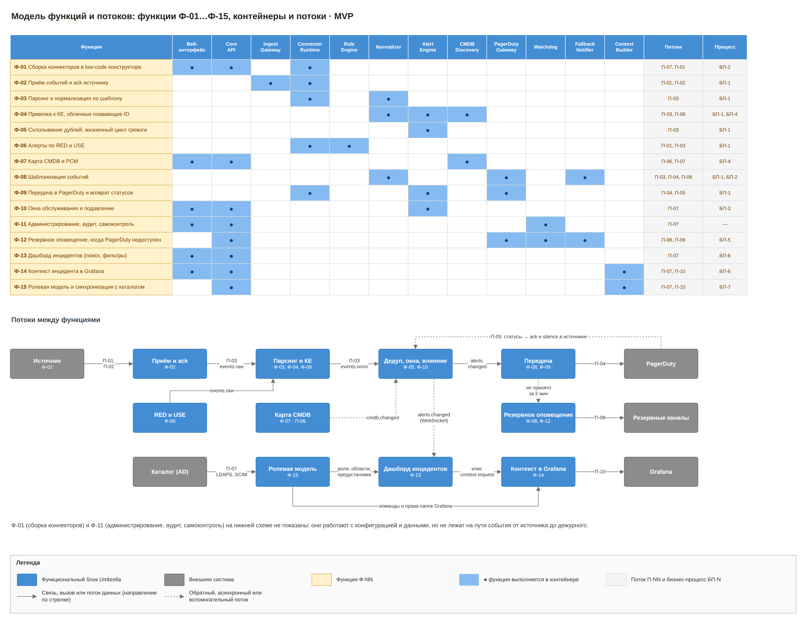
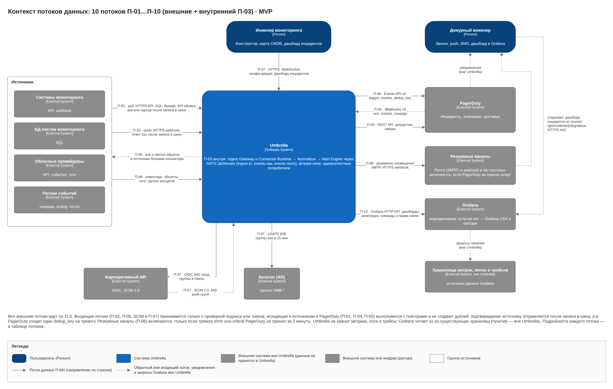
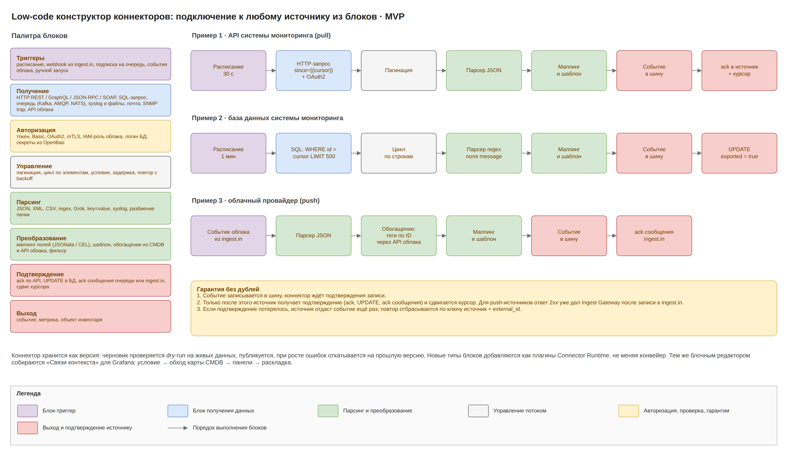
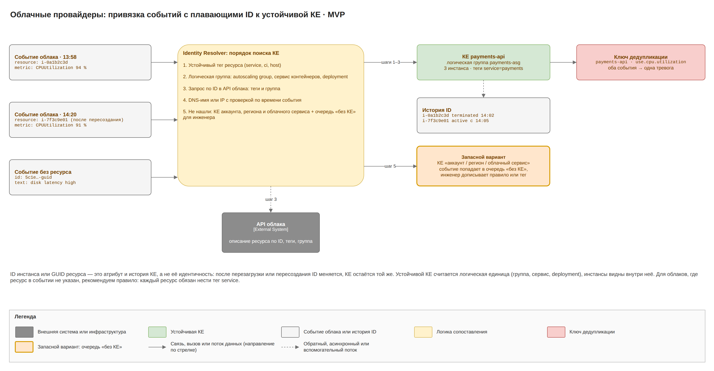
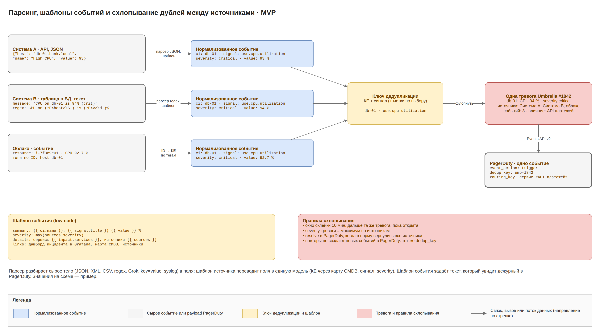
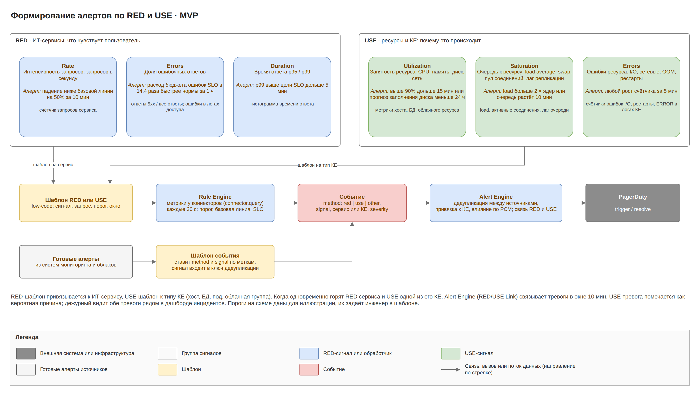

# Umbrella MVP · 2. Функциональная архитектура

Umbrella MVP выполняет 15 функций; данные идут по 11 потокам: десять внешних и внутренний конвейер П-03. Цепочка начинается со сбора событий конструктором и заканчивается передачей в PagerDuty, резервным оповещением, дашбордом инцидентов и контекстом инцидента в Grafana.

## Модель функций

| № | Функция | Контейнеры | Процесс |
| --- | --- | --- | --- |
| Ф-01 | Сборка коннекторов в low-code конструкторе | Веб-интерфейс, Core API, Connector Runtime | БП-2 |
| Ф-02 | Приём событий и подтверждение получения источнику | Connector Runtime, Ingest Gateway | БП-1 |
| Ф-03 | Парсинг и нормализация по шаблону источника | Connector Runtime, Normalizer | БП-1 |
| Ф-04 | Привязка к КЕ, включая облачные ресурсы с плавающими ID | Normalizer, Alert Engine, CMDB Discovery | БП-1, БП-4 |
| Ф-05 | Схлопывание дублей и жизненный цикл тревоги | Alert Engine | БП-1 |
| Ф-06 | Алерты по RED и USE | Rule Engine, Connector Runtime | БП-1 |
| Ф-07 | Карта CMDB и ресурсно-сервисная модель | Веб-интерфейс, Core API, CMDB Discovery | БП-4 |
| Ф-08 | Шаблонизация событий | Normalizer, PagerDuty Gateway, Fallback Notifier | БП-1, БП-2 |
| Ф-09 | Передача в PagerDuty и возврат статусов в источники | PagerDuty Gateway, Alert Engine, Connector Runtime | БП-1 |
| Ф-10 | Окна обслуживания и подавление | Веб-интерфейс, Core API, Alert Engine | БП-3 |
| Ф-11 | Администрирование, аудит, самоконтроль | Веб-интерфейс, Core API, Watchdog | — |
| Ф-12 | Резервное оповещение, когда PagerDuty недоступен | PagerDuty Gateway, Fallback Notifier, Core API, Watchdog | БП-5 |
| Ф-13 | Дашборд инцидентов (поиск, фильтры) | Веб-интерфейс, Core API | БП-6 |
| Ф-14 | Контекст инцидента в Grafana | Веб-интерфейс, Core API, Context Builder | БП-6 |
| Ф-15 | Ролевая модель и синхронизация с каталогом | Core API, Context Builder | БП-7 |

Новые функции MVP:

- **Ф-13 Дашборд инцидентов.** Отдельная страница веб-интерфейса. Инцидент в MVP — это тревога, переданная в PagerDuty (одна на проблему). Таблица или карточки инцидентов обновляются по WebSocket; есть счётчики по severity, мини-шкала инцидентов по часам, фильтры, полнотекстовый поиск, сохранённые представления и групповые действия.
- **Ф-14 Контекст инцидента в Grafana.** По щелчку на инциденте Context Builder строит дашборд Grafana с панелями метрик, логов и трейсов КЕ инцидента и связанных КЕ из карты CMDB; какие панели нужны, задают правила «Связи контекста».
- **Ф-15 Ролевая модель и синхронизация с каталогом.** Пользователи и группы приходят из корпоративного каталога; группа привязывается к роли, области и предустановке дашборда. Те же группы становятся командами Grafana с правами на папки инцидентов.

## Потоки данных

Объёмы даны для пика 5000 событий в минуту; для PagerDuty, резервных каналов и Grafana оценка после схлопывания.

| № | Откуда → куда | Протокол | Данные | Гарантия |
| --- | --- | --- | --- | --- |
| П-01 | Источник → Connector Runtime (pull) | HTTPS API, SQL, протокол брокера, API облака, IMAPS | сырые события, до 85/с | ack или курсор после записи в шину |
| П-02 | Источник, облако → Ingest Gateway (push); сетевые устройства → слушатель syslog в Connector Runtime | HTTPS webhook; syslog TLS 6514 | сырые события | ответ 2xx (выполняет Ingest Gateway) только после записи в ingest.in |
| П-03 | Connector Runtime → Normalizer → Alert Engine (внутренний) | NATS JetStream: ingest.in, events.raw, events.norm | распарсенные и нормализованные события | at-least-once, идемпотентные потребители |
| П-04 | Alert Engine → PagerDuty Gateway → PagerDuty | NATS alerts.changed, HTTPS Events API v2 | trigger, acknowledge, resolve; единицы–десятки в минуту | transactional outbox, повторы, dedup_key |
| П-05 | PagerDuty → Umbrella → источники | HTTPS Webhooks v3, NATS pd.inbound и connector.command, блоки коннектора | ack, resolve, reassign | проверка подписи, идемпотентно |
| П-06 | Источники, облака → CMDB Discovery | инвентарь-коннекторы | хосты, ресурсы, теги, группы; раз в 15 мин | полный снимок и diff |
| П-07 | Пользователь ↔ Веб-интерфейс, Core API; Core API ↔ IdP и каталог | HTTPS, WebSocket; OIDC 443; LDAPS 636 (раз в 15 мин) или SCIM 2.0 443 (push от IdP) | конфигурация, дашборд инцидентов, действия; вход, группы и их участники | TLS, RBAC, аудит; отзыв доступа не позже 15 мин |
| П-08 | Fallback Notifier → резервные каналы → дежурный | SMTP 587 STARTTLS, HTTPS webhook | текст тревоги и одноразовая ссылка подтверждения; только тревоги error и critical, не принятые PagerDuty | журнал отправок, защита от повторов, лимиты на канал |
| П-09 | PagerDuty Gateway → PagerDuty REST API | HTTPS | расписания, escalation policy, дежурные на сейчас; раз в 5 мин; сверка статусов | кеш в PostgreSQL; кеш пуст или старше 24 ч → резервные контакты |
| П-10 | Context Builder → Grafana HTTP API | HTTPS 443 | дашборды инцидентов (uid umb-‹id›), аннотации с событиями, команды и права папок | идемпотентная запись по uid, токен сервисного аккаунта только на папки Umbrella |
| П-11 | Inventory DB ↔ Umbrella | HTTPS REST: инвентарь-коннектор CMDB Discovery читает ленту КЕ с токеном API; коннектор статусов Connector Runtime отправляет изменения тревог с подписью HMAC | площадки, стойки, устройства, IP, связи раз в 15 мин; статусы тревог по устройствам по alerts.changed | полный снимок и diff; статусы идемпотентны по alert_id, устаревшие обновления отбрасываются |

Служебные соединения — выгрузка аудита в SIEM (syslog TLS 6514), heartbeat во внешний сервис и бэкапы в S3 — не нумеруются как потоки; они показаны на интеграционной схеме и в таблице сетевых доступов.

## Подключение источников: low-code конструктор

Umbrella не привязана к конкретным системам мониторинга. Подключение к любому источнику инженер собирает в конструкторе из блоков, готовый коннектор исполняет Connector Runtime.

| Категория блоков | Блоки |
| --- | --- |
| Триггеры | расписание, сообщение из ingest.in (входящий webhook), подписка на очередь, событие облака, ручной запуск |
| Получение | HTTP REST, GraphQL, JSON-RPC, SOAP; SQL-запрос к БД системы мониторинга; очередь (Kafka, AMQP, NATS); syslog и файлы; почтовый ящик; SNMP trap; API облака |
| Авторизация | токен, Basic, OAuth2, mTLS, IAM-роль облака, логин БД, подпись запроса HMAC; логины, пароли и токены только в OpenBao, в коннекторе ссылка |
| Управление | пагинация, цикл, условие, задержка, повтор с backoff |
| Парсинг | JSON, XML, CSV, regex, Grok, key=value, syslog, разбиение пачки |
| Преобразование | маппинг JSONata и CEL, шаблон, обогащение из CMDB и API облака, фильтр |
| Подтверждение | ack по API, UPDATE в БД, ack сообщения, сдвиг курсора; для push-источника ответ 2xx (выполняет Ingest Gateway) |
| Выход | событие, метрика, объект инвентаря |

Коннектор хранится как версия: черновик проверяется dry-run на живых данных, публикуется и откатывается при росте ошибок разбора (БП-2).

**Подтверждение получения.** Коннектор пишет событие в NATS JetStream и ждёт подтверждения записи; только после этого блок «Подтверждение» отвечает источнику и сдвигает курсор. Если подтверждение потерялось и источник отдал событие повторно, inbox отбрасывает его по ключу источник + external_id (ключи хранятся 7 дней). Для источников без ack роль подтверждения играет курсор в PostgreSQL.

**Push-источник.** Ingest Gateway проверяет подпись или токен, пишет тело в ingest.in и отвечает 2xx только после записи. Дальше коннектор работает так: триггер «сообщение из ingest.in» → парсинг → маппинг → событие в шину → ack сообщения ingest.in.

**Парсинг.** JSON и XML (API, webhooks), CSV (выгрузки), regex и Grok (текст, строки БД, логи), key=value и syslog RFC 3164/5424 (сетевое оборудование), разбиение пачки. Неразобранное событие уходит в events.dlq с исходным телом и видно в разделе «Ошибки разбора».

## Облачные ресурсы и плавающие ID

Облачные провайдеры подключаются тем же конструктором: алармы приходят webhook или через очередь, метрики и инвентарь забираются по API с IAM-ролью. Событие часто несёт только ID инстанса, который меняется после перезагрузки.

ID инстанса — это атрибут и история КЕ, а не её идентичность. Устойчивая КЕ — это логическая единица: autoscaling-группа, сервис контейнеров, deployment или ресурс с устойчивым тегом. Identity Resolver ищет КЕ по порядку:

1. Устойчивый тег ресурса (service, ci, host).
2. Логическая группа ресурса.
3. Запрос по ID в API облака: теги и группа; ответ кешируется.
4. DNS-имя или IP с проверкой по времени события.
5. Не нашли: КЕ уровня «аккаунт / регион / облачный сервис», событие попадает в очередь «без КЕ».

## Единая модель события и шаблоны

| Сущность | Что это | Ключевые поля |
| --- | --- | --- |
| Event | Один сигнал от источника, неизменяемый | source, external_id, ci, signal, method (red / use / other), severity, status, value, labels, raw, received_at |
| Alert (тревога) | Все события с одним ключом дедупликации | dedup_key, ci, signal, sources, severity, status (open, acknowledged, resolved, closed), count, first_seen, last_seen, pd_incident |
| Notification | Отправка по резервному каналу | alert, channel, recipient, status, ack_token, sent_at |
| КЕ и связь | Элемент карты CMDB | type, name, identities, logical_group, source_refs, status, relations (тип, направление) |

Severity приводится к четырём уровням PagerDuty: critical, error, warning, info.

- **Шаблон источника** переводит поля любого источника в единую модель: КЕ, сигнал по справочнику (например, use.cpu.utilization), severity, method. Пишется выражениями JSONata и CEL. Normalizer вычисляет кандидата КЕ и предварительный ключ дедупликации.
- **Шаблон события** задаёт, что увидит дежурный: заголовок, детали, ссылки на карту CMDB, на источник и на контекст в Grafana (`/go/incidents/{id}/grafana`). Один шаблон используется и для PagerDuty, и для резервного канала, поэтому текст совпадает.

## Схлопывание дублей

Ключ дедупликации = КЕ + сигнал, при необходимости плюс выбранные метки. Окончательную привязку к КЕ и пересчёт ключа выполняет CI Resolver в Alert Engine по актуальной карте CMDB. Окно склейки 10 минут, severity тревоги равна максимуму по источникам, в PagerDuty уходит один dedup_key вида umb-‹id тревоги›. Resolve уходит, когда в норму вернулись все источники.

## Карта CMDB и RED/USE

CMDB Discovery раз в 15 минут забирает инвентарь, по low-code правилам строит КЕ и связи, склеивает объекты разных источников и облачные инстансы с их группами. Добавления по доверенным правилам применяются сразу, удаления и конфликты идут на ревью. Бизнес-услуги задаются вручную.

**Inventory DB.** [Inventory DB](https://github.com/sbrw-evc/Inventory-DB) — доверенный источник физических КЕ: площадок, стоек и устройств с IP-адресами, DNS-именами, серийными номерами и связями «находится в» и «соединён с» по кабелям. Инвентарь-коннектор забирает её ленту КЕ раз в 15 минут (поток П-11); ссылка `inventory-db:dcim.device:‹id›` сохраняется в source_refs КЕ и по ней склеиваются события. Добавления из Inventory DB применяются сразу, удаления идут на ревью. Устройства со статусом planned, offline, inventory или decommissioning приходят с признаком monitored = false, и правило подавления не отправляет их тревоги в PagerDuty. Коннектор статусов подписан на alerts.changed и отправляет в Inventory DB изменения тревог по КЕ с этой ссылкой или с hostname и IP, поэтому в карточке устройства видно, что оно горит, со ссылками на инцидент и контекст в Grafana. Контракт и настройка описаны в документе [«Интеграция с Inventory DB»](../../integrations/inventory-db.md).

Rule Engine формирует алерты по RED для ИТ-сервисов и USE для КЕ и размечает теми же метками готовые алерты источников. В источники Rule Engine сам не ходит: метрики запрашивает через Connector Runtime по connector.query.

| Метод · сигнал | Условие по умолчанию |
| --- | --- |
| RED · Rate | падение на 50% от базовой линии за 10 мин |
| RED · Errors | расход бюджета ошибок SLO в 14,4 раза быстрее нормы за 1 ч |
| RED · Duration | p99 выше цели SLO дольше 5 мин |
| USE · Utilization | выше 90% дольше 15 мин или прогноз заполнения диска меньше 24 ч |
| USE · Saturation | load больше 2 × ядер или очередь растёт 10 мин |
| USE · Errors | любой рост счётчика ошибок за 5 мин |

RED-тревога сервиса и USE-тревога его КЕ, открытые в окне 10 мин, связываются: в карточке инцидента и в custom_details PagerDuty видна связанная тревога как вероятная причина. Объединение тревог в один инцидент относится к целевой архитектуре. Экран «Покрытие RED/USE» показывает пробелы в мониторинге.

## Оповещение: PagerDuty и резервные каналы

PagerDuty — основной канал: он ведёт инциденты, расписания, escalation policy и доставку, включая звонок сквозь беззвучный режим. Umbrella отправляет туда один алерт на тревогу (Events API v2, dedup_key umb-‹id тревоги›, в links — ссылка на контекст в Grafana) и получает статусы по Webhooks v3.

Резервное оповещение включается, когда основной канал не работает:

| Параметр | Решение в MVP |
| --- | --- |
| Условие включения | тревога error или critical не принята PagerDuty в течение 2 мин с момента открытия. Circuit breaker (5 ошибок подряд или 60 с без ответа) прекращает попытки отправки, но отсчёт 2 мин продолжается |
| Каналы | почта через корпоративный SMTP-релей; HTTPS webhook во внутренний корпоративный мессенджер напрямую или в облачный мессенджер через egress-прокси |
| Получатели | дежурные из кеша расписаний PagerDuty (обновляется каждые 5 мин); если кеш пуст или старше 24 ч, резервные контакты сервиса из РСМ |
| Подтверждение | одноразовая подписанная ссылка в сообщении ведёт в Core API (компонент Alert Actions); вход через IdP, проверка прав на сервис, кнопка «Подтвердить» → alerts.commands; ссылка живёт 1 ч |
| Эскалация | нет подтверждения 10 мин → резервным контактам сервиса |
| Шторм | больше 20 тревог за 5 мин на получателя → одна сводка |
| Возврат PagerDuty | накопленные тревоги уходят trigger с теми же dedup_key, подтверждённые отправляются как acknowledge; рассылается «PagerDuty снова принимает события» |
| Проверка канала | Watchdog раз в сутки отправляет тестовое сообщение по каждому каналу |

Предупреждения (warning) и info по резервным каналам не отправляются, они ждут PagerDuty. Процесс описан в БП-5, последовательность и компоненты — в документе «C4 и компоненты».

## Дашборд инцидентов

Дашборд инцидентов — отдельная страница веб-интерфейса для дежурных, владельцев сервисов и руководителей смен. Инцидент на дашборде — это тревога, переданная в PagerDuty.

| Возможность | Как работает |
| --- | --- |
| Представление | таблица или карточки; счётчики по severity; мини-шкала инцидентов по часам; живые обновления по WebSocket (alerts.changed, pd.delivery) |
| Фильтры | статус, severity, бизнес-услуга, ИТ-сервис, КЕ, тип КЕ, команда, источник, метод (RED/USE), состояние в PagerDuty (принят, не принят, ack), резервное оповещение (было или нет), период |
| Поиск | полнотекстовый по заголовку, КЕ, сервису и тексту событий за 30 дней; индексы PostgreSQL full-text и триграммные |
| Сортировка и группировка | по любому столбцу; группировка по сервису, команде или КЕ |
| Представления | сохранённые представления пользователя, ссылка с фильтрами в URL, выгрузка CSV |
| Действия | групповые ack и silence — только при наличии прав incident.ack и incident.silence в своей области |
| Переходы | щелчок по инциденту открывает его дашборд Grafana в новой вкладке; значок «i» открывает боковую панель Umbrella: события, хронология, статус PagerDuty, журнал резервных отправок |
| Предустановки | при входе пользователь видит предустановку своей группы: фильтры по сервисам команды, столбцы, группировку, сортировку, виджеты, автообновление |

Дашборд показывает только инциденты в области пользователя; личное представление не может расширить область роли.

## Контекст инцидента в Grafana

Umbrella не хранит метрики, логи и трейсы и не рисует графики. Для разбора инцидента она генерирует дашборд в Grafana, источниками данных которого служат существующие хранилища метрик, логов и трейсов.

1. Пользователь щёлкает по инциденту; браузер открывает `/go/incidents/{id}/grafana` в Core API.
2. Core API проверяет право dashboard.view в области инцидента и отправляет в Context Builder запрос context.request (NATS request/reply).
3. Context Builder находит подходящие правила «Связи контекста», обходит карту CMDB от КЕ инцидента, подставляет переменные в шаблоны запросов и собирает JSON дашборда.
4. Context Builder записывает дашборд через Grafana HTTP API (`POST /api/dashboards/db`, папка команды, uid umb-‹id›, повторная запись идемпотентна) и добавляет аннотации с событиями инцидента.
5. Core API возвращает перенаправление на URL дашборда с временным диапазоном.

Окно по умолчанию — от начала инцидента минус 10 минут до его решения (или текущего момента) плюс 10 минут; правило может задать своё окно. Цель — не дольше 2 с; готовый дашборд кешируется и перестраивается, когда меняется тревога или публикуется новая версия правил. Та же ссылка уходит в links события PagerDuty и в резервные сообщения. Дашборды удаляются через 30 дней после закрытия инцидента.

## Low-code настройка

Инженер настраивает всё в визуальном редакторе из узлов и связей, с выражениями CEL и JSONata. Настройка хранится как версионируемый JSON с dry-run, автором, откатом и экспортом в YAML для Git.

- Коннекторы и шаблоны источников.
- Шаблоны событий и правила схлопывания.
- Правила RED и USE.
- Правила обнаружения CMDB.
- Маршрутизация в PagerDuty, резервные контакты и каналы сервисов.
- Связи контекста для Grafana.
- Предустановки дашборда для групп каталога.

### Связи контекста

Редактор «Связи контекста» устроен так же, как конструктор коннекторов: правило собирается из блоков, проверяется dry-run на реальном инциденте, публикуется версией и откатывается.

| Блок | Что задаёт |
| --- | --- |
| Условие | тип КЕ, сигнал, ИТ-сервис или бизнес-услуга, к которым применяется правило |
| Обход карты CMDB | тип связи, направление (вверх к сервисам или вниз к ресурсам), глубина не больше 3 |
| Панель метрик | источник данных Grafana и шаблон запроса с переменными ${ci.host}, ${ci.name}, ${service} и другими |
| Панель логов | источник данных логов и шаблон запроса по сервису или хосту |
| Панель трейсов | источник данных трейсов и фильтр по сервису |
| Сводка инцидента | заголовок, severity, влияние на услуги, статус в PagerDuty |
| Раскладка | порядок и размер панелей, временное окно |

Переменные подставляются только в шаблоны из разрешённого списка с экранированием под язык запроса; свободный текст из событий в запросы не попадает. Пример правила: «служба приложения упала» → панели CPU, RAM и диска хоста, логи службы, трейсы службы и метрики связанной по карте БД, окно ±10 минут.
