# Umbrella MVP · 3. C4 и компоненты

Umbrella MVP состоит из 12 собственных контейнеров, шины NATS JetStream, PostgreSQL и хранилища секретов OpenBao; ниже каждый собственный контейнер разобран до компонентов. Цвета по соглашениям C4: тёмно-синий — человек, синий — Umbrella, серый — внешняя система; под каждой схемой легенда.

## Уровень 1. Контекст

Umbrella стоит между любыми источниками событий и PagerDuty. Основной канал оповещения — PagerDuty; резервные каналы (почта, webhook) используются, только если PagerDuty не принял тревогу error или critical за 2 минуты. Для разбора инцидента Umbrella генерирует дашборды в Grafana; пользователи и группы приходят из корпоративного каталога, журнал аудита уходит в SIEM, внешний heartbeat следит за самой Umbrella.

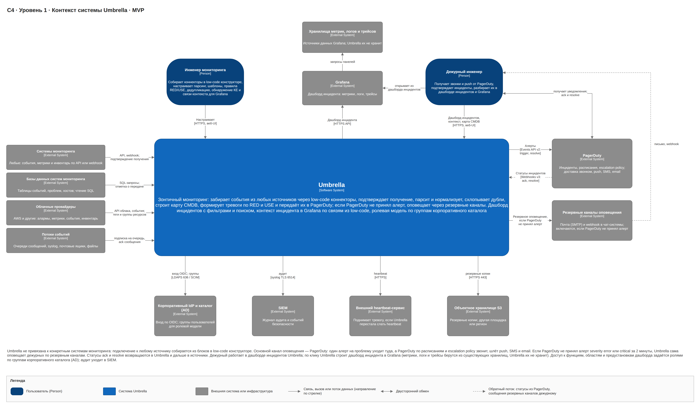

## Уровень 2. Контейнеры

Контейнеры обработки не хранят состояния и общаются через NATS JetStream, поэтому каждый масштабируется отдельно. Состояние и конфигурация живут в PostgreSQL, секреты — только в OpenBao.

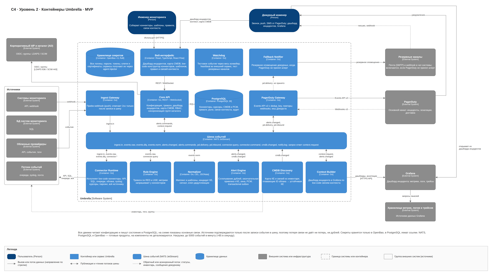

| Контейнер | Технология | Отвечает за |
| --- | --- | --- |
| Веб-интерфейс | React, TypeScript, React Flow | дашборд инцидентов, карта CMDB, low-code конструктор коннекторов, шаблонов, правил и связей контекста, администрирование ролей |
| Core API | Go, REST + WebSocket | конфигурация, тревоги и действия с ними, поиск инцидентов, карта CMDB, ролевая модель и синхронизация с каталогом, предустановки, аудит |
| Ingest Gateway | Go | приём webhook; ответ 2xx только после записи в ingest.in |
| Connector Runtime | Go | исполнение коннекторов: API, БД, очереди, syslog, облака; курсоры, парсинг, inbox, ack источнику; запросы метрик и команды в источники |
| Normalizer | Go, CEL, JSONata | шаблоны источников: поля, кандидат КЕ, сигнал, method, предварительный ключ дедупликации |
| Rule Engine | Go, CEL | алерты по RED и USE на метриках, полученных через connector.query |
| Alert Engine | Go | окончательная привязка к КЕ, схлопывание, окна обслуживания, влияние по РСМ, связь RED и USE, transactional outbox, sync-back в источники |
| CMDB Discovery | Go | карта КЕ и связей, плавающие ID облака → устойчивая КЕ |
| PagerDuty Gateway | Go | Events API v2 с dedup_key, outbox, повторы, circuit breaker, Webhooks v3, кеш дежурств |
| Fallback Notifier | Go | резервное оповещение по почте и webhook, когда PagerDuty не принял тревогу; эскалация резервным контактам |
| Watchdog | Go | сквозная проба конвейера до PagerDuty Gateway, тест резервных каналов, heartbeat наружу |
| Context Builder | Go | дашборды инцидентов в Grafana по правилам «Связи контекста», аннотации, команды и права папок Grafana |

NATS JetStream (R3), PostgreSQL 16 (primary и синхронная реплика) и OpenBao (×3, Raft) — готовые продукты; они не разбираются до компонентов, их настройки описаны в документе «Инфраструктура и технологии».

## Уровень 3. Веб-интерфейс

Веб-интерфейс не хранит данных и секретов: всё идёт через Core API с токеном пользователя. Разделы без прав скрыты, но проверка прав всегда на стороне Core API.

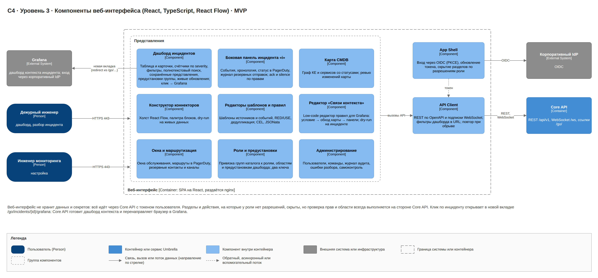

| Компонент | Что делает |
| --- | --- |
| App Shell | вход через OIDC (PKCE), обновление токена, скрытие разделов по разрешениям роли |
| API Client | REST по OpenAPI и подписки WebSocket; фильтры дашборда в URL; повтор при обрыве |
| Дашборд инцидентов | таблица и карточки, счётчики по severity, мини-шкала по часам, тепловая карта КЕ по времени и плитки состояния, фильтры, полнотекстовый поиск, сохранённые представления, предустановки группы, групповые действия, живые обновления; щелчок открывает Grafana |
| Панель инцидента «i» | события, хронология, статус в PagerDuty, журнал резервных отправок, связанная RED- или USE-тревога; ack и silence по правам |
| Карта CMDB | граф КЕ и сервисов со статусами; ревью изменений карты |
| Конструктор коннекторов | холст React Flow, палитра блоков, dry-run на живых данных |
| Редакторы шаблонов и правил | шаблоны источников и событий, RED/USE, дедупликация, правила обнаружения; CEL, JSONata |
| Связи контекста | low-code редактор правил для Grafana: условие → обход карты → панели → раскладка; dry-run на реальном инциденте |
| Окна и маршрутизация | окна обслуживания в два ключа, маршруты в PagerDuty, резервные контакты и каналы |
| Роли и предустановки | привязка групп каталога к ролям, областям и предустановкам дашборда; изменения в два ключа |
| Администрирование | пользователи, команды, журнал аудита, ошибки разбора, самоконтроль |

Макет дашборда инцидентов: панель фильтров и поиска сверху, счётчики по severity и мини-шкала по часам, таблица инцидентов со столбцами состояния PagerDuty и резервного оповещения, боковая панель по значку «i».

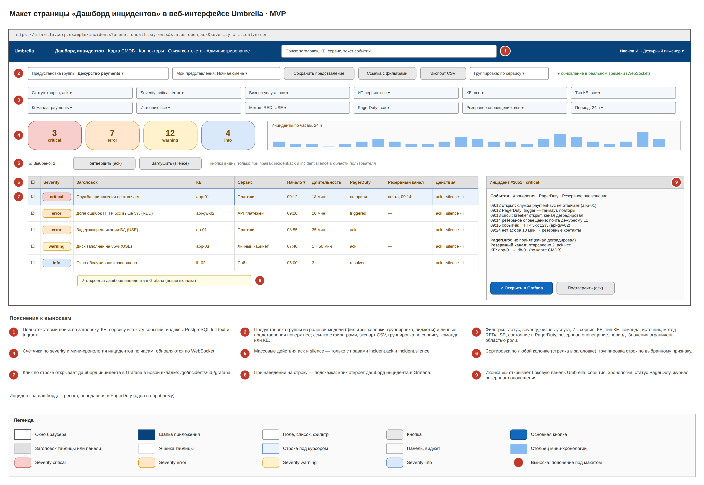

## Уровень 3. Core API

Core API пропускает каждый запрос через AuthN и RBAC Policy Engine и пишет каждое изменение в аудит до ответа. Secrets Broker сразу передаёт введённые логины и токены в OpenBao и возвращает ссылку.

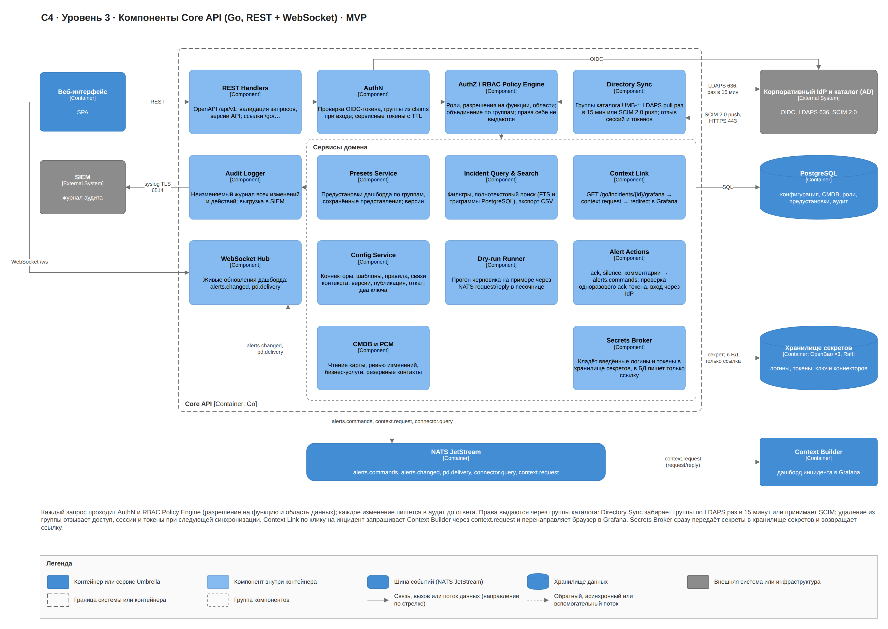

| Компонент | Что делает |
| --- | --- |
| REST Handlers | OpenAPI /api/v1, валидация, версии API; перенаправление `/go/incidents/{id}/grafana` |
| AuthN | OIDC-токен пользователя, сервисные токены с TTL, отзыв сессий и токенов |
| RBAC Policy Engine | разрешения роли и область по привязкам групп; проверка каждого запроса и каждой строки выдачи |
| Directory Sync | группы из каталога: LDAPS 636 раз в 15 мин (группы по OU или префиксу UMB-*) или SCIM 2.0 от IdP; group claims OIDC при входе |
| Presets Service | предустановки дашборда по группам, версии; личные представления поверх предустановок |
| Incident Query & Search | поиск и фильтры дашборда: PostgreSQL full-text и триграммы, сохранённые представления, выгрузка CSV |
| Context Link | запрос context.request в Context Builder и перенаправление браузера на дашборд Grafana |
| Audit Logger | неизменяемый журнал изменений и действий, выгрузка в SIEM по syslog TLS 6514 |
| WebSocket Hub | живые обновления дашборда по alerts.changed и pd.delivery |
| Config Service | версии коннекторов, шаблонов, правил и связей контекста: публикация, откат; подавление и привязки групп в два ключа |
| Dry-run Runner | прогон черновика на примере через NATS request/reply в песочнице |
| Alert Actions | ack, silence, комментарии и групповые действия → alerts.commands; обработка одноразовой подписанной ссылки из резервного сообщения после входа через IdP |
| CMDB и РСМ | карта, ревью изменений, бизнес-услуги, резервные контакты сервисов |
| Secrets Broker | секреты в OpenBao, в БД только ссылка |

Ролевая модель: пользователь входит в группу каталога, группа привязана к роли (набору разрешений), области (бизнес-услуги, ИТ-сервисы, команды, коннекторы и источники) и предустановке дашборда. Изменение привязки требует подтверждения вторым администратором ролей. Подробности и разделение обязанностей — в документе «Информационная безопасность».

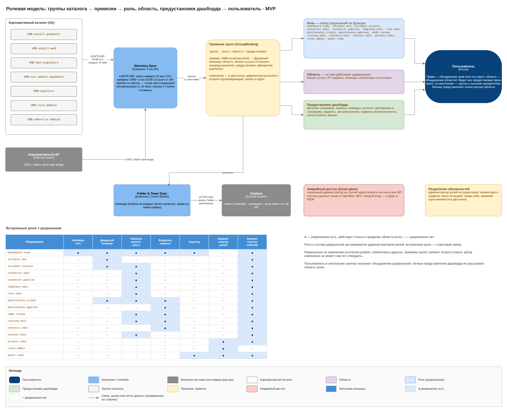

## Уровень 3. Приём событий

Ingest Gateway только проверяет подлинность запроса и надёжно пишет тело в шину; разбор выполняет Connector Runtime тем же коннектором, что и для pull-источников.

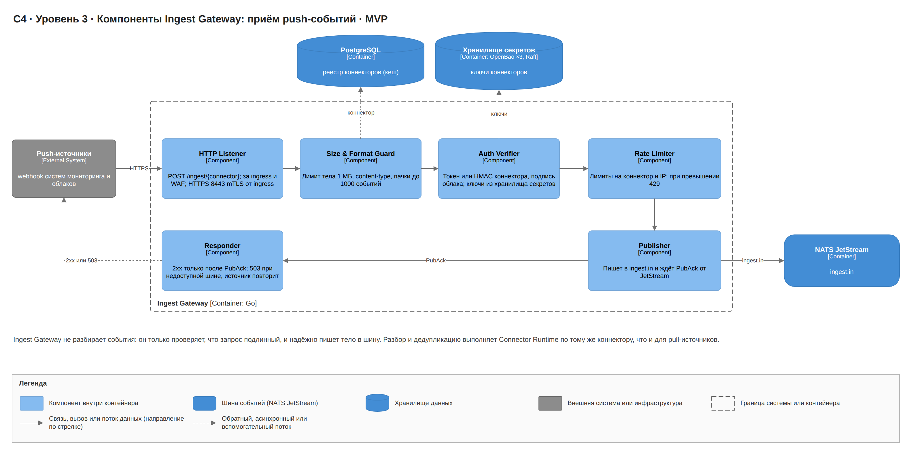

| Компонент | Что делает |
| --- | --- |
| HTTP Listener | POST /ingest/{connector}, за ingress и WAF, TLS |
| Size & Format Guard | лимит тела 1 МБ, content-type, пачки до 1000 событий |
| Auth Verifier | токен или HMAC коннектора, подпись облака; ключи из OpenBao |
| Rate Limiter | лимиты на коннектор и IP; при превышении 429 |
| Publisher | пишет в ingest.in и ждёт PubAck от JetStream |
| Responder | 2xx только после PubAck; 503 при недоступной шине, источник повторит |

Connector Runtime исполняет собранные коннекторы: ack источнику и сдвиг курсора идут строго после подтверждения записи в шину, повторы отбрасывает Inbox Dedup.

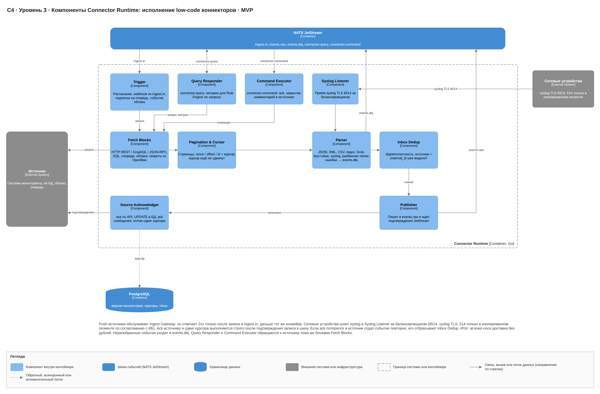

| Компонент | Что делает |
| --- | --- |
| Trigger | расписание, сообщение из ingest.in, подписка на очередь, событие облака |
| Syslog Listener | приём syslog по TLS 6514 от сетевых устройств за балансировщиком; 514 только в изолированном сегменте по согласованию с ИБ |
| Fetch Blocks | HTTP REST, GraphQL, JSON-RPC, SQL, очередь, syslog; авторизация по ссылкам на секреты OpenBao |
| Pagination & Cursor | страницы, since / offset / id > курсор; курсор сдвигается только после подтверждения |
| Parser | JSON, XML, CSV, regex, Grok, key=value, syslog, разбиение пачки; ошибки разбора → events.dlq |
| Inbox Dedup | отбрасывает повтор по ключу источник + external_id |
| Publisher | пишет в events.raw и ждёт подтверждения JetStream |
| Source Acknowledger | ack по API, UPDATE в БД, ack сообщения; затем сдвиг курсора |
| Query Responder | отвечает на connector.query от Rule Engine: запрос метрик теми же коннекторами и секретами |
| Command Executor | выполняет connector.command от Alert Engine: ack и silence в источнике |

Normalizer без состояния: реплики делят поток events.raw; неразобранное событие уходит в events.dlq.

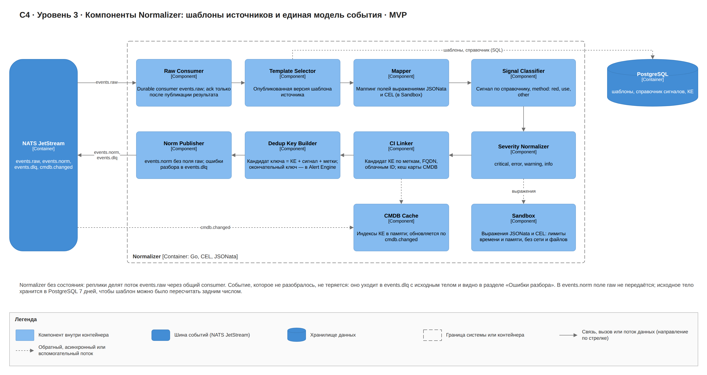

| Компонент | Что делает |
| --- | --- |
| Raw Consumer | durable consumer events.raw; ack только после публикации результата |
| Template Selector | опубликованная версия шаблона источника |
| Mapper | маппинг полей выражениями JSONata и CEL |
| Signal Classifier | сигнал по справочнику, method: red, use, other |
| Severity Normalizer | critical, error, warning, info |
| CI Linker | кандидат КЕ по меткам, FQDN, облачным ID |
| Dedup Key Builder | предварительный ключ: КЕ + сигнал + выбранные метки |
| Norm Publisher | events.norm без поля raw; ошибки разбора в events.dlq |
| Sandbox | лимиты времени и памяти выражений, без сети и файлов |
| CMDB Cache | индексы КЕ в памяти; обновляется по cmdb.changed |

Rule Engine сам не ходит в источники: метрики забирает Connector Runtime по connector.query; правило включается только там, где источник не алертит.

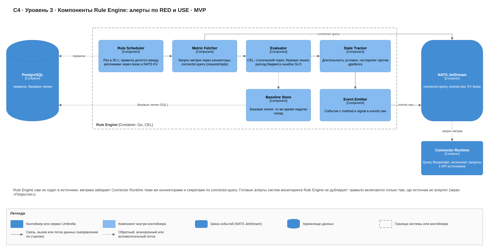

| Компонент | Что делает |
| --- | --- |
| Rule Scheduler | запуск правил раз в 30 с; правила делятся между репликами через lease в NATS KV |
| Metric Fetcher | запрос метрик через connector.query (request/reply) |
| Evaluator | CEL: статический порог, базовая линия, расход бюджета ошибок SLO |
| State Tracker | длительность условия, гистерезис против дребезга |
| Baseline Store | базовая линия: то же время неделю назад |
| Event Emitter | событие с method и signal в events.raw |

## Уровень 3. Тревоги и карта

Alert Engine хранит состояние тревог в PostgreSQL. Изменение тревоги и запись outbox идут в одной транзакции (transactional outbox), поэтому alerts.changed публикуется только после записи и не теряется. Подавленная тревога не уходит ни в PagerDuty, ни в резервные каналы.

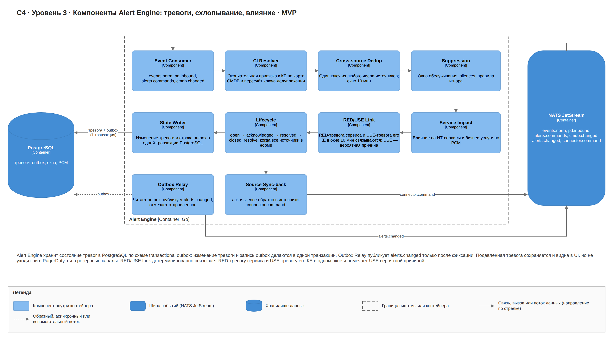

| Компонент | Что делает |
| --- | --- |
| Event Consumer | events.norm, pd.inbound, alerts.commands, cmdb.changed |
| CI Resolver | окончательная привязка к КЕ по карте CMDB и пересчёт ключа дедупликации |
| Cross-source Dedup | один ключ из любого числа источников; окно 10 мин |
| Suppression | окна обслуживания, silences, правила игнора |
| Service Impact | влияние на ИТ-сервисы и бизнес-услуги по РСМ |
| RED/USE Link | связывает RED-тревогу сервиса и USE-тревогу его КЕ в окне 10 мин |
| Lifecycle | open → acknowledged → resolved → closed; resolve, когда все источники в норме |
| State Writer | изменение тревоги и строка outbox в одной транзакции PostgreSQL |
| Outbox Relay | читает outbox, публикует alerts.changed и отмечает отправленное |
| Source Sync-back | ack и silence обратно в источники через connector.command |

CMDB Discovery строит карту КЕ из инвентаря источников и облаков и привязывает плавающие облачные ID к устойчивым КЕ. Работает в двух репликах, активна одна (выбор лидера).

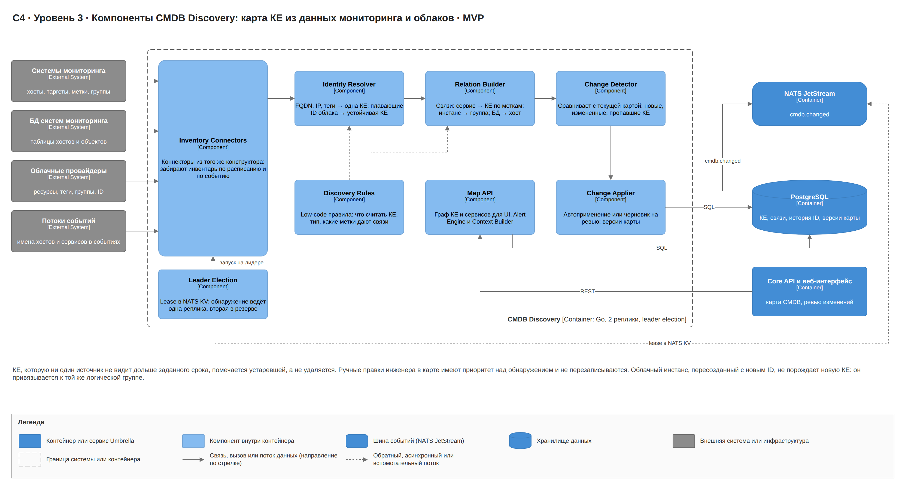

| Компонент | Что делает |
| --- | --- |
| Inventory Connectors | забирают инвентарь коннекторами из того же конструктора по расписанию и по событию |
| Identity Resolver | FQDN, IP, теги → одна КЕ; плавающие ID облака → устойчивая КЕ |
| Relation Builder | связи с типом и направлением: сервис → КЕ по меткам, инстанс → группа, БД → хост |
| Change Detector | сравнивает с текущей картой: новые, изменённые, пропавшие КЕ |
| Discovery Rules | low-code правила: что считать КЕ, тип, какие метки дают связи |
| Change Applier | автоприменение добавлений или черновик на ревью; версии карты; публикует cmdb.changed |
| Map API | граф КЕ и сервисов для Core API, Alert Engine и Context Builder |
| Leader Election | lease в NATS KV: обнаружение ведёт одна из двух реплик, вторая в резерве |

## Уровень 3. Оповещение

PagerDuty Gateway ведёт основной канал: outbox, повторы с backoff, circuit breaker (5 ошибок подряд или 60 с без ответа); Delivery Tracker сообщает в pd.delivery, принял ли PagerDuty событие. On-call Sync раз в 5 минут копирует расписания и escalation policy в кеш дежурств.

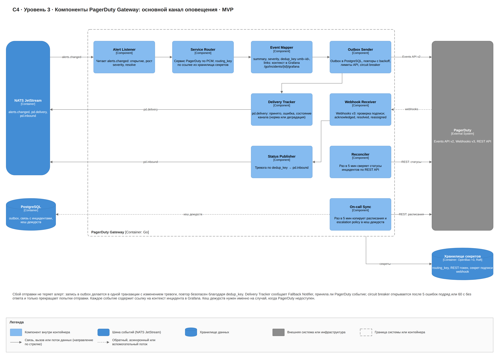

| Компонент | Что делает |
| --- | --- |
| Alert Listener | читает alerts.changed: открытие, рост severity, ack, resolve |
| Service Router | сервис PagerDuty по РСМ; routing_key по ссылке из OpenBao |
| Event Mapper | шаблон события → summary, severity, dedup_key umb-‹id тревоги›, links (включая ссылку на контекст в Grafana) |
| Outbox Sender | отправка из outbox, повторы с backoff, лимиты API, circuit breaker |
| Delivery Tracker | pd.delivery: принято, ошибка, состояние канала (норма или деградация) |
| Webhook Receiver | Webhooks v3: проверка подписи; acknowledged, resolved, reassigned |
| Status Publisher | тревога по dedup_key → pd.inbound |
| Reconciler | раз в 5 мин сверяет статусы инцидентов по REST API |
| On-call Sync | раз в 5 мин копирует расписания и escalation policy в кеш дежурств |

Fallback Notifier включается для тревог error и critical, которые PagerDuty не принял за 2 минуты с момента открытия; открытый circuit breaker не останавливает отсчёт. В MVP два адаптера: почта через корпоративный SMTP-релей и HTTPS webhook в мессенджер. Подтверждение принимает не Fallback Notifier, а Core API по одноразовой подписанной ссылке.

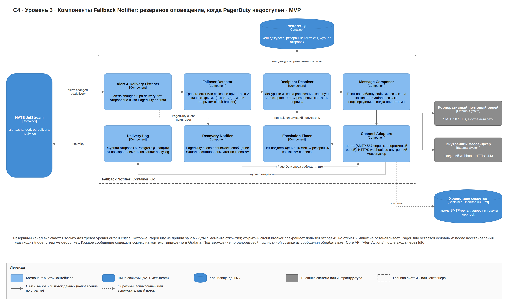

| Компонент | Что делает |
| --- | --- |
| Alert & Delivery Listener | alerts.changed и pd.delivery: что отправлено и что PagerDuty принял |
| Failover Detector | тревога error или critical не принята PagerDuty за 2 мин с момента открытия |
| Recipient Resolver | дежурные из кеша; кеш пуст или старше 24 ч → резервные контакты сервиса |
| Message Composer | текст по шаблону события, одноразовая подписанная ссылка подтверждения, ссылка на контекст в Grafana, сводка при шторме |
| Channel Adapters | SMTP 587 к корпоративному релею, HTTPS webhook (внутренний мессенджер напрямую, облачный через egress) |
| Escalation Timer | нет подтверждения 10 мин → резервные контакты сервиса |
| Delivery Log | журнал отправок, защита от повторов, лимиты на канал, notify.log |
| Recovery Notifier | «PagerDuty снова принимает события», итог по тревогам |

Watchdog раз в минуту прогоняет тестовое событие через весь конвейер до PagerDuty Gateway; проба уходит в тестовый сервис PagerDuty с низкой срочностью и автоматическим resolve. Heartbeat наружу отправляется, если проба дошла до PagerDuty Gateway, независимо от доступности PagerDuty: недоступность PagerDuty обрабатывает Fallback Notifier, а отсутствие heartbeat означает отказ самой Umbrella. Работает в двух репликах с выбором лидера.

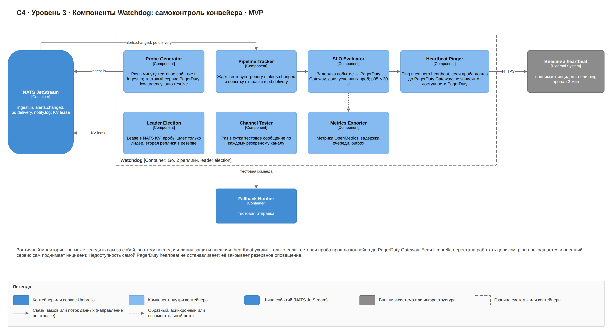

| Компонент | Что делает |
| --- | --- |
| Probe Generator | раз в минуту тестовое событие через синтетический коннектор в ingest.in |
| Pipeline Tracker | ждёт тестовую тревогу в alerts.changed и отметку о ней в pd.delivery |
| SLO Evaluator | задержка событие → PagerDuty, доля успешных проб, порог 30 с |
| Heartbeat Pinger | ping внешнего heartbeat, если проба дошла до PagerDuty Gateway |
| Channel Tester | раз в сутки тестовое сообщение по каждому резервному каналу через Fallback Notifier |
| Leader Election | lease в NATS KV: пробы шлёт только лидер, вторая реплика в резерве |
| Metrics Exporter | метрики OpenMetrics: задержки, очереди, outbox, отправки |

## Уровень 3. Context Builder

Context Builder строит дашборд инцидента в Grafana по запросу context.request от Core API. Он читает тревоги, карту CMDB и правила «Связи контекста» из PostgreSQL, в источники метрик сам не ходит: запросы панелей выполняет Grafana. Токен сервисного аккаунта Grafana хранится в OpenBao и даёт права только на папки Umbrella.

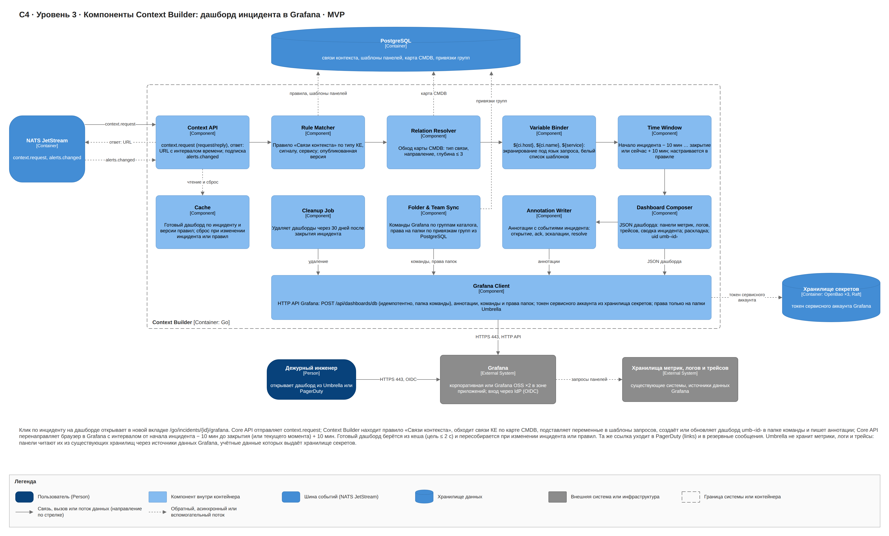

| Компонент | Что делает |
| --- | --- |
| Context API | принимает context.request (NATS request/reply), отвечает URL дашборда с временным диапазоном; подписан на alerts.changed |
| Rule Matcher | выбирает опубликованные правила «Связи контекста» по типу КЕ, сигналу и сервису |
| Relation Resolver | обходит граф КЕ из карты CMDB: тип связи, направление, глубина не больше 3 |
| Variable Binder | подставляет ${ci.host}, ${ci.name}, ${service} в шаблоны из разрешённого списка с экранированием под язык запроса; свободный текст из событий не подставляется |
| Time Window | окно от начала инцидента − 10 мин до решения или текущего момента + 10 мин, либо окно правила |
| Dashboard Composer | JSON дашборда: сводка инцидента, панели метрик, логов и трейсов, раскладка |
| Grafana Client | `POST /api/dashboards/db` в папку команды, uid umb-‹id›, идемпотентная перезапись |
| Annotation Writer | аннотации на дашборде: события инцидента, ack, резервные отправки |
| Folder & Team Sync | команды Grafana по группам каталога, права на папки по привязкам групп из PostgreSQL |
| Cleanup Job | удаляет дашборды через 30 дней после закрытия инцидента |
| Cache | готовый дашборд по инциденту и версии правил; сброс при изменении инцидента (alerts.changed) или публикации правил |

Макет дашборда инцидента в Grafana: сверху сводка инцидента и аннотации событий, ниже панели метрик КЕ (CPU, RAM, диск), логи и трейсы сервиса, метрики связанных КЕ.

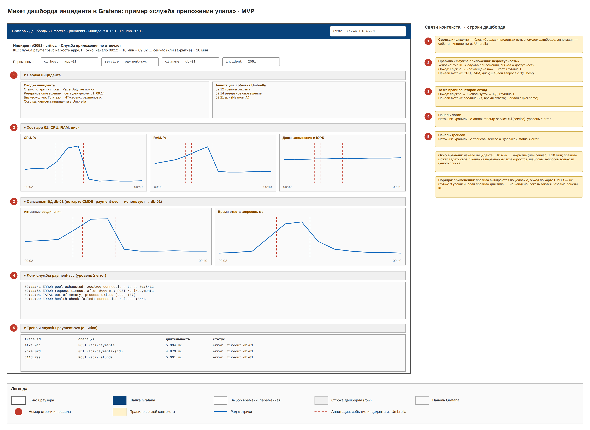

## Потоки шины

В NATS JetStream 12 потоков. ingest.in, events.raw и events.norm хранятся 24 ч (events.norm без поля raw), events.dlq — 14 дней, notify.log — 30 дней, остальные потоки — 7 дней; все с репликацией R3; connector.query работает в режиме request/reply. Кроме потоков, есть subject context.request для запросов request/reply от Core API к Context Builder; он ничего не хранит.

| Поток | Пишет | Читает |
| --- | --- | --- |
| ingest.in | Ingest Gateway, Watchdog | Connector Runtime |
| events.raw | Connector Runtime, Rule Engine | Normalizer |
| events.dlq | Connector Runtime, Normalizer | Core API (раздел «Ошибки разбора») |
| events.norm | Normalizer | Alert Engine |
| alerts.changed | Alert Engine (Outbox Relay) | PagerDuty Gateway, Fallback Notifier, Core API (WebSocket Hub), Context Builder, Watchdog |
| alerts.commands | Core API | Alert Engine |
| pd.delivery | PagerDuty Gateway | Fallback Notifier, Core API (WebSocket Hub), Watchdog |
| pd.inbound | PagerDuty Gateway | Alert Engine |
| connector.query | Rule Engine, Core API (Dry-run Runner) | Connector Runtime (Query Responder) |
| connector.command | Alert Engine | Connector Runtime (Command Executor) |
| cmdb.changed | CMDB Discovery | Normalizer, Alert Engine |
| notify.log | Fallback Notifier | Core API, Watchdog |

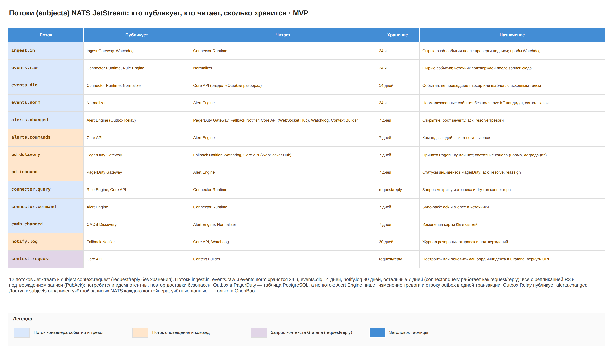

## Компоненты и интерфейсы

Каждый контейнер показан с интерфейсами, которые он предоставляет (●) и использует (○).

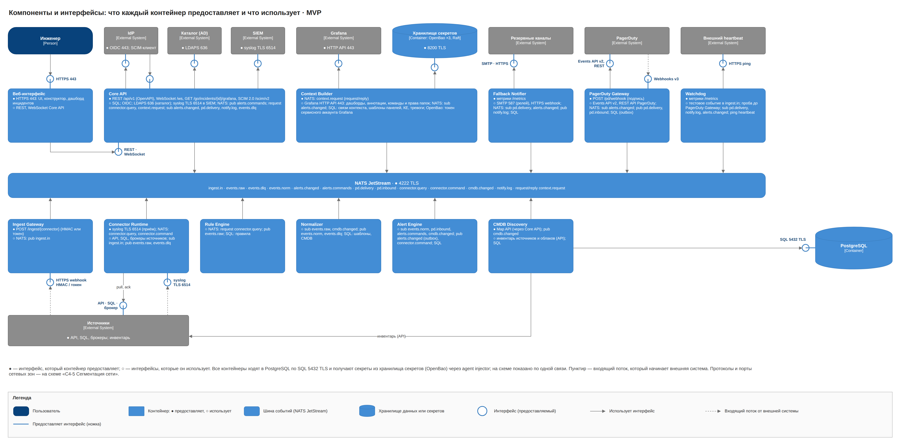

## Проведение сеанса

Последовательность одного события от pull-источника до ack и resolve; внизу разобраны сбои внутри сеанса.

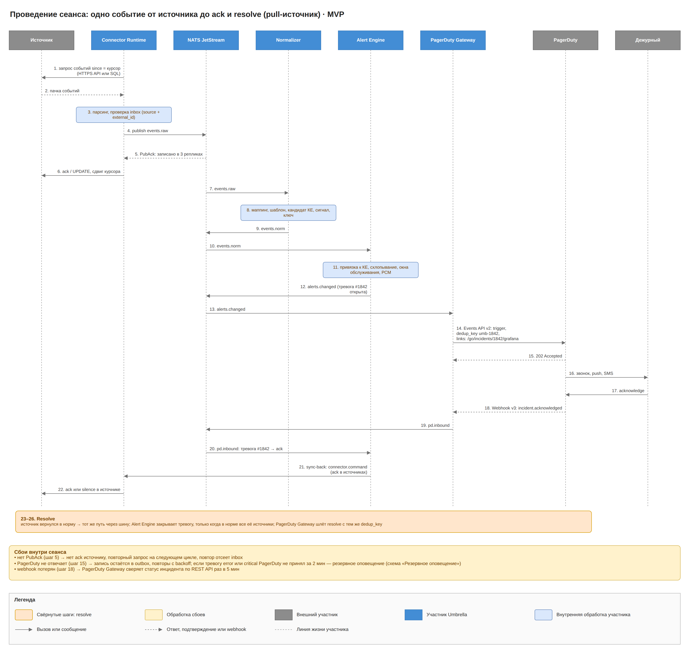

## Резервное оповещение

Последовательность, когда PagerDuty не принимает тревогу: отсчёт 2 минут, выбор дежурного из кеша, письмо или webhook, ветка эскалации резервным контактам при отсутствии ack за 10 минут, подтверждение по ссылке в Core API, затем trigger с тем же dedup_key, когда PagerDuty снова принимает события.

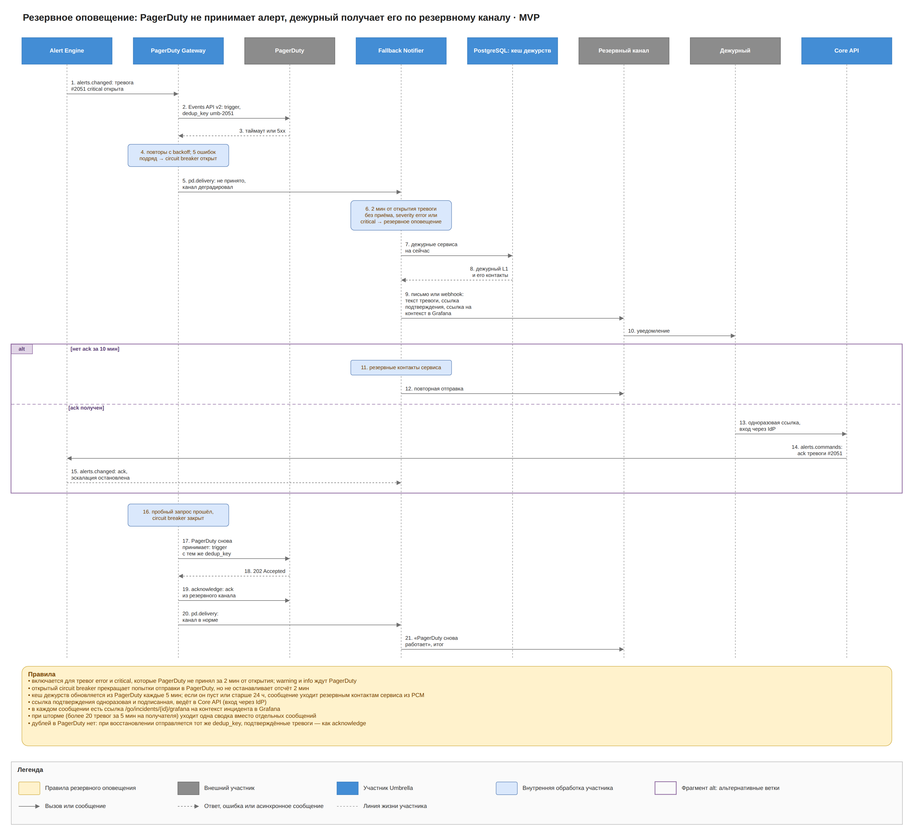

## Открытие инцидента в Grafana

Последовательность щелчка на дашборде инцидентов: проверка прав в Core API, context.request, обход карты и сборка дашборда в Context Builder, запись в Grafana по HTTP API, перенаправление браузера и вход в Grafana через тот же IdP.

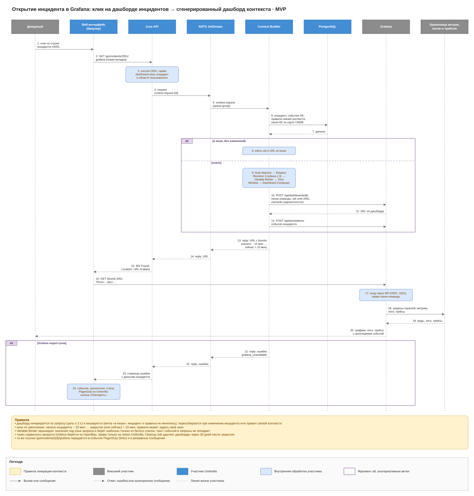

## Модель данных

Логическая модель в PostgreSQL: конфигурация (коннекторы, шаблоны, правила обнаружения DiscoveryRule, связи контекста ContextRule и PanelTemplate), операционные данные (Event, Alert со статусами open, acknowledged, resolved, closed; Outbox с действиями trigger, acknowledge, resolve; Silence), CMDB и РСМ, резервное оповещение (каналы, уведомления, кеш дежурств, BackupContact), дашборды (GrafanaDashboard, SavedView, DashboardPreset) и ролевая модель (User, DirectoryGroup, GroupBinding, Role, Permission, Scope). Секретов в БД нет, только ссылки на OpenBao.

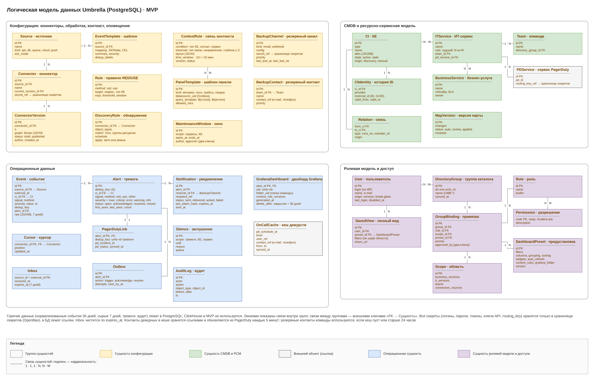

## Слои ИТ-модели

Пять слоёв: бизнес, прикладной слой Umbrella, данные, технологии, инфраструктура; нижний слой обслуживает верхний. Внешние приложения (системы мониторинга, облака, PagerDuty и резервные каналы, Grafana, IdP и каталог, SIEM) показаны боковой колонкой «интеграция».

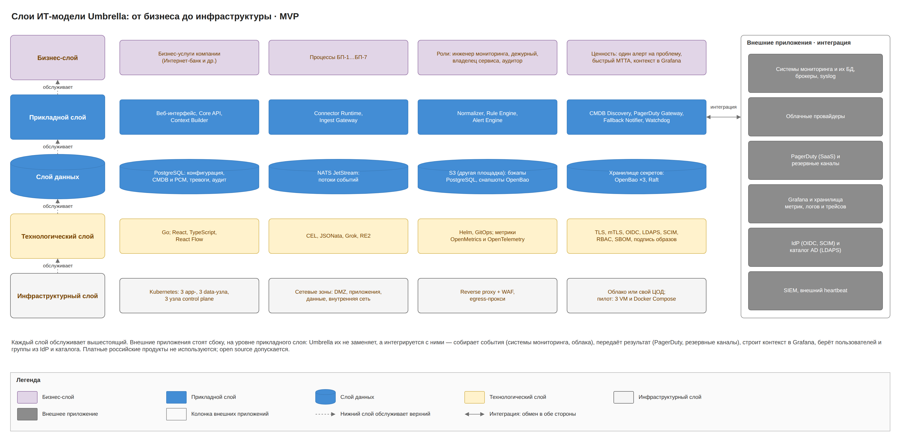
