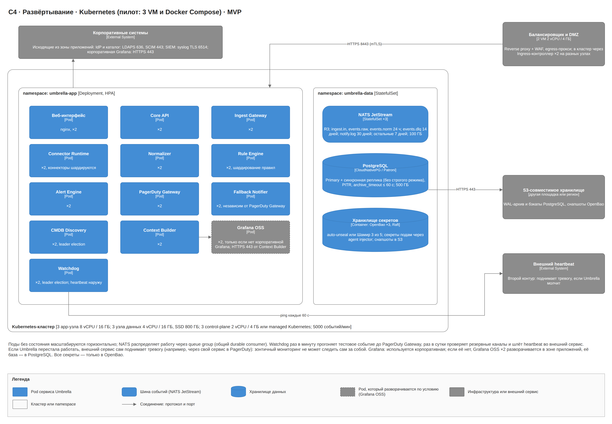
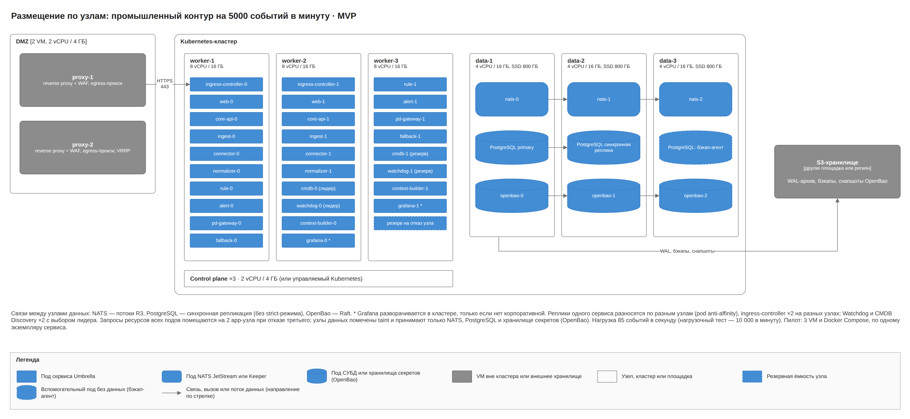
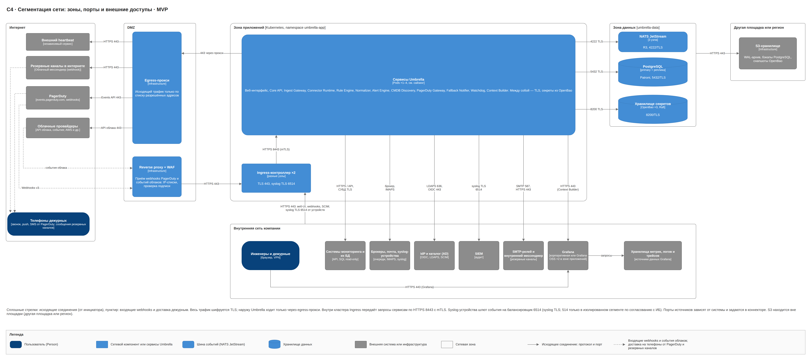
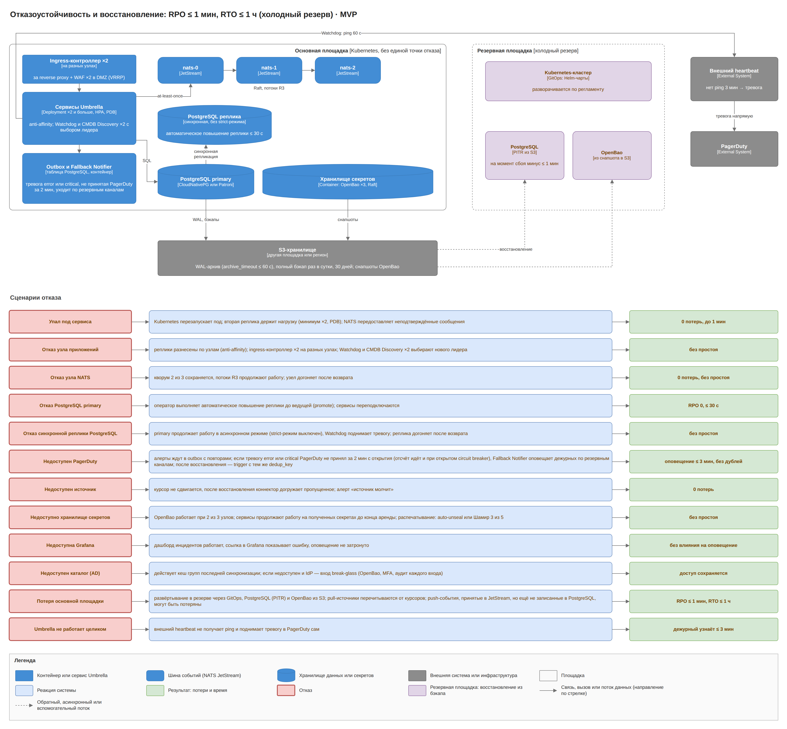
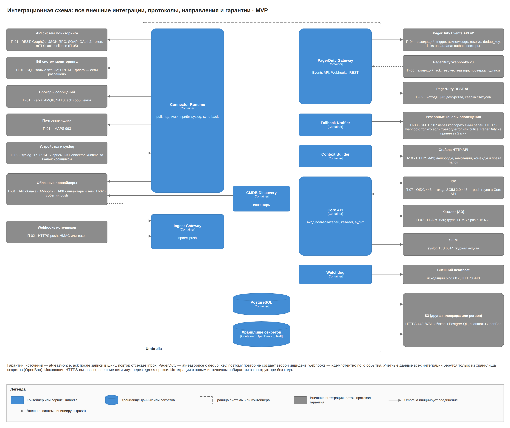

# Umbrella MVP · 4. Инфраструктура и технологии

Промышленный контур MVP — это Kubernetes из трёх app-узлов по 8 vCPU и 16 ГБ и трёх узлов данных по 4 vCPU и 16 ГБ плюс две VM в DMZ; одна площадка, доступность 99,9%, RPO ≤ 1 мин, RTO ≤ 1 ч с восстановлением из бэкапов. Пилот работает на Docker Compose на трёх VM.

## Развёртывание

Kubernetes, каждый сервис минимум в двух репликах на разных узлах; для пилота тот же набор запускается на Docker Compose на трёх VM. Реплики одного сервиса читают поток через queue group (общий durable consumer). CMDB Discovery и Watchdog работают в двух репликах с выбором лидера, ingress-контроллер — в двух репликах на разных узлах. Fallback Notifier развёрнут отдельно от PagerDuty Gateway, чтобы сбой одного не выключал другой. Если корпоративной Grafana нет, Grafana OSS разворачивается в зоне приложений в двух репликах, её база — отдельная БД в PostgreSQL Umbrella.

## Размещение по узлам

Три app-узла: реплики каждого сервиса на разных узлах, при потере одного узла оставшиеся два вмещают все запросы ресурсов. Три узла данных: NATS (R3) и OpenBao (Raft) на всех трёх, PostgreSQL primary и синхронная реплика на двух из них. Две VM в DMZ: reverse proxy с WAF и egress-прокси. Управляющий слой Kubernetes — три узла по 2 vCPU и 4 ГБ или управляемый Kubernetes.

## Сегментация сети

Четыре сетевые зоны: DMZ, зона приложений, зона данных и внутренняя сеть. Наружу Umbrella ходит только через egress-прокси (PagerDuty, облачный мессенджер, heartbeat, API облаков); снаружи принимает только webhooks PagerDuty и события облаков через reverse proxy с WAF. Внутри зоны приложений ingress передаёт запросы сервисам по HTTPS 8443 с mTLS.

| Откуда | Куда | Порт / протокол |
| --- | --- | --- |
| Пользователи, системы мониторинга с webhook (внутренняя сеть) | Ingress | 443 HTTPS |
| PagerDuty (Webhooks v3), облачные провайдеры | Reverse proxy + WAF в DMZ | 443 HTTPS |
| Reverse proxy | Ingress | 443 HTTPS |
| Ingress | сервисы Umbrella (Core API, Ingest Gateway, PagerDuty Gateway, веб-интерфейс) | 8443 HTTPS, mTLS |
| Сервисы Umbrella | NATS | 4222 TLS |
| Сервисы Umbrella, Grafana OSS (если развёрнута) | PostgreSQL | 5432 TLS |
| Сервисы Umbrella, агент OpenBao в подах Grafana | OpenBao | 8200 TLS |
| Connector Runtime, CMDB Discovery | API систем мониторинга во внутренней сети | HTTPS, порт задаётся в коннекторе |
| CMDB Discovery (инвентарь-коннектор), Connector Runtime (коннектор статусов) | Inventory DB REST API (внутренняя сеть) | 443 HTTPS |
| Connector Runtime, CMDB Discovery | БД систем мониторинга | порт СУБД, TLS |
| Connector Runtime | брокеры очередей, почтовые ящики | порт брокера с TLS, 993 IMAPS |
| Сетевые устройства | слушатель syslog Connector Runtime за балансировщиком | 6514 syslog TLS (514 только в изолированном сегменте по согласованию с ИБ) |
| Connector Runtime, CMDB Discovery | API облаков через egress-прокси | 443 HTTPS |
| Пользователи | Grafana | 443 HTTPS, вход через корпоративный IdP (OIDC) |
| Context Builder | Grafana HTTP API | 443 HTTPS (внутренняя сеть) |
| Grafana | хранилища метрик, логов и трейсов | порты хранилищ; вне контура Umbrella |
| Core API, Grafana | корпоративный IdP | 443 OIDC |
| Core API | корпоративный каталог | 636 LDAPS |
| IdP (SCIM 2.0, если выбран вместо LDAPS) | Ingress → Core API | 443 HTTPS |
| Core API | SIEM | 6514 syslog TLS |
| PagerDuty Gateway, Watchdog | events.pagerduty.com, api.pagerduty.com, внешний heartbeat через egress-прокси | 443 HTTPS |
| Fallback Notifier | корпоративный SMTP-релей (внутренняя сеть) | 587 SMTP STARTTLS |
| Fallback Notifier | внутренний корпоративный мессенджер | 443 HTTPS webhook |
| Fallback Notifier | облачный мессенджер через egress-прокси | 443 HTTPS webhook |
| PostgreSQL, OpenBao | S3-хранилище на другой площадке или в другом регионе | 443 HTTPS |

Rule Engine не открывает соединений к источникам: метрики он получает через Connector Runtime по connector.query.

## Сайзинг

Оценка для 5000 событий в минуту при среднем размере события 2 КБ: около 7,2 млн событий и 14 ГБ сырых данных в сутки. Нагрузочный тест на этапе 2 проводится на 10 000 событий в минуту и уточняет цифры.

| Компонент | Реплик | Запрос CPU / RAM на реплику | Диск |
| --- | --- | --- | --- |
| Веб-интерфейс (статические файлы) | 2 | 0,25 vCPU / 256 МБ | — |
| Core API | 2 | 0,75 vCPU / 1 ГБ | — |
| Ingest Gateway | 2 | 0,25 vCPU / 256 МБ | — |
| Connector Runtime | 2 | 1 vCPU / 1 ГБ | — |
| Normalizer | 2 | 0,75 vCPU / 512 МБ | — |
| Rule Engine | 2 | 0,5 vCPU / 512 МБ | — |
| Alert Engine | 2 | 0,75 vCPU / 1 ГБ | — |
| CMDB Discovery (выбор лидера) | 2 | 0,5 vCPU / 1 ГБ | — |
| PagerDuty Gateway | 2 | 0,25 vCPU / 256 МБ | — |
| Fallback Notifier | 2 | 0,25 vCPU / 256 МБ | — |
| Watchdog (выбор лидера) | 2 | 0,25 vCPU / 256 МБ | — |
| Context Builder | 2 | 0,5 vCPU / 512 МБ | — |
| Grafana OSS (если нет корпоративной) | 2 | 0,5 vCPU / 1 ГБ | БД в PostgreSQL |
| Ingress-контроллер | 2 | 0,25 vCPU / 512 МБ | — |
| **Итого на app-узлах** | | **13,5 vCPU / 16,5 ГБ** | |
| NATS JetStream | 3 | 1 vCPU / 2 ГБ | 100 ГБ SSD |
| PostgreSQL | 2 | 2 vCPU / 8 ГБ | 500 ГБ SSD |
| OpenBao | 3 | 0,25 vCPU / 256 МБ | 10 ГБ SSD, Raft; снапшоты в S3 |

Запросы ресурсов на app-узлах в сумме 13,5 vCPU и 16,5 ГБ. При отказе одного узла два оставшихся дают 16 vCPU и 32 ГБ, из них после системного резерва около 14 vCPU и 28 ГБ доступны подам, поэтому все реплики перезапускаются без ручного вмешательства. Лимиты выше запросов; HPA добавляет реплики Connector Runtime, Normalizer и Alert Engine по длине очередей.

PostgreSQL 500 ГБ: нормализованные события без raw за 30 дней (≈ 110 ГБ), raw за 7 дней (≈ 100 ГБ), тревоги, конфигурация, карта CMDB, inbox за 7 дней, аудит, индексы полнотекстового и триграммного поиска и WAL. NATS 100 ГБ на узел: ingest.in, events.raw и events.norm по 24 ч (events.norm без поля raw, всего около 32 ГБ), events.dlq 14 дней, notify.log 30 дней, остальные потоки 7 дней.

| Узел | Количество | Ресурсы |
| --- | --- | --- |
| Пилот (VM, Docker Compose) | 3 | 4 vCPU / 8 ГБ, SSD 200 ГБ |
| App-узел Kubernetes | 3 | 8 vCPU / 16 ГБ |
| Узел данных | 3 | 4 vCPU / 16 ГБ, SSD 800 ГБ |
| VM в DMZ (reverse proxy + WAF, egress-прокси) | 2 | 2 vCPU / 4 ГБ |
| Управляющий слой Kubernetes | 3 | 2 vCPU / 4 ГБ (или управляемый Kubernetes) |
| S3-хранилище бэкапов | — | на другой площадке или в другом регионе, хранение 30 дней |

ClickHouse в MVP нет.

## Отказоустойчивость и восстановление

| Отказ | Что происходит | Восстановление |
| --- | --- | --- |
| Узел приложений | реплики на двух других узлах продолжают работу; ingress-контроллер во второй реплике; лидер CMDB Discovery и Watchdog переизбирается | Kubernetes перезапускает поды, ресурсов двух узлов хватает |
| Узел NATS | R3 переживает потерю одного узла без потери событий | узел возвращается и догоняет поток |
| PostgreSQL primary | Patroni или CloudNativePG повышает синхронную реплику до ведущей (promote) за 30 с | бывший primary возвращается репликой |
| PostgreSQL реплика | синхронная репликация без строгого режима: primary продолжает работу в асинхронном режиме и поднимает тревогу | реплика пересоздаётся из primary |
| Узел OpenBao | Raft из трёх узлов работает при потере одного; сервисы держат полученные секреты в памяти до конца аренды | узел возвращается в кластер |
| OpenBao после перезапуска | хранилище запечатано | auto-unseal (transit второго экземпляра или KMS) либо Шамир 3 из 5 у хранителей |
| Grafana | дашборд инцидентов и оповещение работают; ссылка «Открыть в Grafana» показывает ошибку | Grafana OSS в двух репликах; корпоративная — по её регламенту |
| Каталог или IdP | Umbrella работает с последними синхронизированными группами; вход новых сессий невозможен без IdP | break-glass администратор: учётные данные в OpenBao, MFA, каждый вход в аудит |
| PagerDuty | тревоги ждут в outbox; тревоги error и critical, не принятые за 2 мин с момента открытия, Fallback Notifier отправляет по почте и webhook | после восстановления trigger с теми же dedup_key |
| Umbrella целиком | внешний heartbeat не получает ping и сам поднимает тревогу в PagerDuty не позже 3 мин | по регламенту эксплуатации |
| Площадка | развёртывание через GitOps на резервной инфраструктуре, восстановление PostgreSQL из S3 (PITR), OpenBao из снапшота | RPO ≤ 1 мин, RTO ≤ 1 ч |

- Бэкапы: WAL непрерывно с archive_timeout ≤ 60 с и полный снимок раз в сутки в S3 на другой площадке или в другом регионе, хранение 30 дней; снапшоты OpenBao там же. Доступ к S3 — по учётным данным, которые выдаёт OpenBao (движок S3) через агент-инжектор.
- RPO ≤ 1 мин: при потере площадки могут пропасть push-события, принятые в JetStream, но ещё не записанные в PostgreSQL (не больше минуты); pull-источники перечитываются с последнего курсора.
- Восстановление из бэкапа проверяется учениями раз в квартал.

## Интеграционная схема

Все внешние интеграции с протоколом, направлением и гарантией; учётные данные всех интеграций берутся только из OpenBao.

## Наблюдаемость самой Umbrella

Все сервисы отдают метрики OpenMetrics и трассировки OpenTelemetry: задержка от события до ответа PagerDuty, длина очередей и outbox, доля схлопнутых событий, события без КЕ, ошибки разбора, число отправок по резервным каналам, результат ежедневной проверки каналов, время сборки дашборда Grafana, результат последней синхронизации с каталогом. Отказ самой Umbrella ловит внешний heartbeat.

## Технологии и обоснование

| Слой | Выбор | Почему |
| --- | --- | --- |
| Бэкенд и коннекторы | Go | высокая пропускная способность, один бинарник, зрелые драйверы HTTP, SQL, Kafka, AMQP, NATS, SDK облаков и CEL |
| Шина событий | NATS JetStream | персистентные потоки с повторами и перечитыванием, request/reply для запросов к коннекторам и Context Builder, проще Kafka в эксплуатации |
| Хранилище | PostgreSQL | конфигурация, карта CMDB и РСМ, тревоги, аудит, outbox, кеш дежурств, полнотекстовый и триграммный поиск для дашборда |
| Фронтенд | React, TypeScript, React Flow | готовый холст для low-code редакторов и карты CMDB |
| Выражения | CEL, JSONata, RE2 | безопасно исполняются на сервере |
| Основное оповещение | PagerDuty | доставка, расписания и эскалации уже готовы, включая обход беззвучного режима |
| Резервное оповещение | SMTP, HTTPS webhook | есть в любой компании, не зависят от PagerDuty |
| Визуализация контекста | Grafana (корпоративная или Grafana OSS) | уже читает хранилища метрик, логов и трейсов; HTTP API позволяет генерировать дашборды и аннотации |
| Секреты | OpenBao ×3, Raft | единое место для всех логинов, паролей, токенов, ключей и сертификатов; динамические учётные данные, PKI для mTLS, ротация и аудит |
| Вход | OIDC через корпоративный IdP | единый вход в Umbrella и Grafana, MFA на стороне IdP |
| Синхронизация групп | LDAPS 636 или SCIM 2.0 | каталог остаётся мастер-системой групп; отзыв доступа не позже 15 мин |
| Поставка | Docker Compose на трёх VM для пилота, затем Helm и GitOps | быстрый старт пилота, Kubernetes для промышленного контура |

Платных российских продуктов в стеке нет, российский open source допустим.

| Слой | Альтернатива | Почему нет |
| --- | --- | --- |
| Шина | Apache Kafka | при 85 событиях в секунду избыточна |
| Шина | RabbitMQ | Streams дают перечитывание, но это вторая модель рядом с очередями; NATS проще в эксплуатации и уже нужен для request/reply |
| Движок конструктора | Node-RED, Apache NiFi | нет семантики ack источнику после записи и inbox; второй рантайм рядом с Go |
| Хранилище | MongoDB | карта CMDB и РСМ реляционные, нужны транзакции outbox и inbox |
| Поиск по инцидентам | полнотекстовые поисковые движки | для 30 дней событий хватает индексов PostgreSQL; отдельный кластер не нужен |
| Графики инцидента | собственные графики в Umbrella | пришлось бы хранить или проксировать метрики; Grafana уже это умеет (ADR-21) |
| Секреты | Kubernetes Secrets | нет ротации, динамических учётных данных и аудита доступа; все секреты только в OpenBao (ADR-12, ADR-23) |
| Резервный канал | второй платный сервис оповещения | избыточен для MVP; запасная платформа оповещения рассмотрена в целевой архитектуре |
