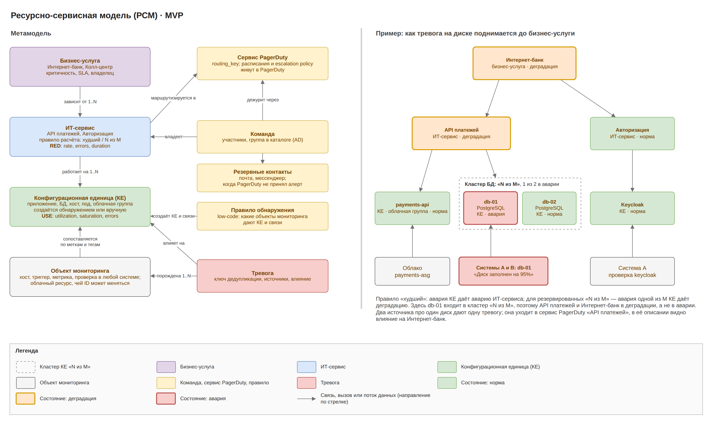

# Umbrella MVP · 5. Ресурсно-сервисная модель

РСМ связывает технический сигнал из любого источника с ИТ-сервисом, бизнес-услугой, сервисом PagerDuty и резервными контактами. Связи РСМ также определяют, какие КЕ попадут на дашборд инцидента в Grafana и какие инциденты видит пользователь. Нижние уровни строятся автоматически из данных мониторинга, бизнес-услуги задаются вручную.

## Метамодель и пример

RED-сигналы (rate, errors, duration) вешаются на ИТ-сервисы, USE-сигналы (utilization, saturation, errors) — на КЕ. Поэтому РСМ сразу связывает симптом у пользователя с ресурсом, который его вызвал.

## Сущности

| Сущность | Что описывает | Ключевые атрибуты | Откуда берётся |
| --- | --- | --- | --- |
| Бизнес-услуга | то, что видит клиент или бизнес | имя, критичность, SLA, владелец | вручную в UI |
| ИТ-сервис | технический сервис, из которого собрана услуга | команда-владелец, правило расчёта статуса, сервис PagerDuty, резервные контакты | обнаружение по меткам и тегам + ручная правка |
| КЕ | приложение, БД, хост, под, облачная логическая группа | тип, окружение, идентификаторы (host, name), история облачных ID, ссылки на источники, статус | CMDB Discovery |
| Связь КЕ | зависимость между КЕ или КЕ и сервисом | тип (работает на, использует, входит в), направление, источник связи | CMDB Discovery по правилам, ручная правка |
| Объект мониторинга | то, что источник присылает в событии | хост, триггер, метрика, облачный ресурс с плавающим ID | из событий и инвентаря |
| Правило обнаружения | как объекты мониторинга превращаются в КЕ и связи | выражение CEL, тип КЕ, доверие | low-code, инженер мониторинга |
| Команда | кто отвечает за сервис | участники, группа корпоративного каталога, папка Grafana | синхронизация с каталогом |
| Сервис PagerDuty | куда уходит алерт | ссылка на routing_key в OpenBao, сервис по умолчанию | ссылка из ИТ-сервиса |
| Резервные контакты | кого оповещать, если PagerDuty недоступен, а кеш дежурств пуст или старше 24 ч, и кого звать через 10 мин без подтверждения | e-mail, адрес webhook-канала команды (ссылки на OpenBao), порядок | вручную в UI |

Облачный инстанс в РСМ не является отдельной КЕ: КЕ — это его логическая группа, а ID инстансов хранятся в её истории.

## Расчёт влияния

Статус поднимается снизу вверх: объект мониторинга → КЕ → ИТ-сервис → бизнес-услуга. Статусы: норма, деградация, авария.

1. **КЕ** получает худший severity среди открытых тревог: critical и error дают аварию, warning — деградацию.
2. **ИТ-сервис** считается по своему правилу. Правило «худший»: авария любой КЕ даёт аварию ИТ-сервиса. Для резервированных КЕ правило «N из M»: авария одной из M КЕ даёт деградацию, авария становится, когда работающих КЕ меньше N.
3. **Бизнес-услуга** берёт худший статус своих ИТ-сервисов.

## Где РСМ используется

- **Маршрутизация:** тревога на КЕ уходит в сервис PagerDuty того ИТ-сервиса, на котором работает КЕ.
- **Резервное оповещение:** кеш дежурств ищется по сервису PagerDuty этого ИТ-сервиса; если кеш пуст или старше 24 ч, берутся резервные контакты сервиса; они же получают сообщение, если за 10 мин нет подтверждения.
- **Схлопывание:** ключ дедупликации строится от КЕ.
- **Плановые работы:** окно на сервис гасит все его КЕ (БП-3).
- **Связь RED и USE:** RED-тревога сервиса и USE-тревога его КЕ, открытые в одном окне 10 мин, связываются; USE-тревога помечается вероятной причиной.
- **Контекст в PagerDuty и сообщениях:** влияние на бизнес-услуги идёт в custom_details PagerDuty и в текст резервного сообщения.
- **Фильтры дашборда инцидентов:** бизнес-услуга, ИТ-сервис, КЕ, тип КЕ и команда берутся из РСМ.

Тревога без КЕ не теряется: она уходит в сервис PagerDuty по умолчанию и в очередь «без КЕ».

## Контекст инцидента в Grafana

Context Builder строит дашборд инцидента по связям из карты CMDB:

1. Правило «Связи контекста» выбирается по типу КЕ инцидента, сигналу и ИТ-сервису.
2. Relation Resolver обходит граф от КЕ инцидента по связям заданного типа и направления на глубину не больше 3: например, от службы приложения вниз к хосту и вбок к используемой БД.
3. Для каждой найденной КЕ атрибуты РСМ становятся переменными запросов: ${ci.host} и ${ci.name} из идентификаторов КЕ, ${service} из ИТ-сервиса.
4. Дашборд кладётся в папку Grafana команды-владельца ИТ-сервиса.

Поэтому качество контекста зависит от карты: у КЕ должны быть идентификаторы, по которым хранилища метрик, логов и трейсов находят её данные; панель для КЕ без нужного идентификатора не строится, а в сводке инцидента появляется пометка. Изменения карты попадают в дашборд при следующей сборке: она происходит, когда меняется тревога или публикуется новая версия правил.

## Области доступа

Область роли задаётся через сущности РСМ: бизнес-услуги, ИТ-сервисы, команды, а также коннекторы и источники.

- Пользователь видит инцидент, если КЕ тревоги входит в ИТ-сервис из его области, ИТ-сервис входит в бизнес-услугу из его области или принадлежит его команде.
- Тревоги без КЕ видны только ролям с областью «все сервисы» или с областью по источнику тревоги.
- Права на коннекторы и шаблоны источников ограничиваются областью по коннекторам и источникам.
- Область пользователя из нескольких групп — объединение областей; личные представления дашборда не расширяют область.
