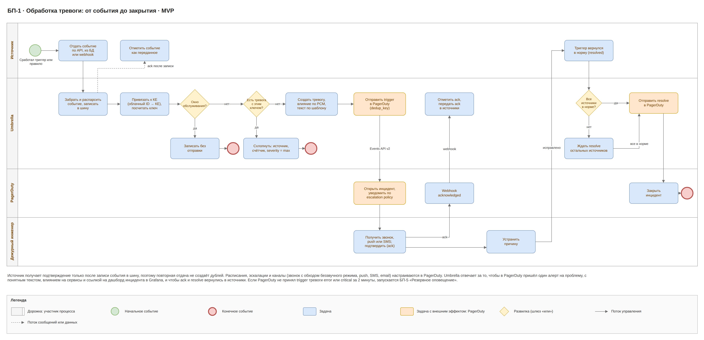
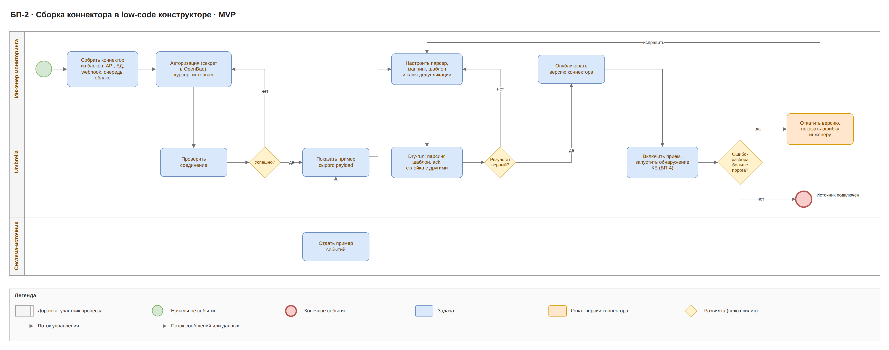
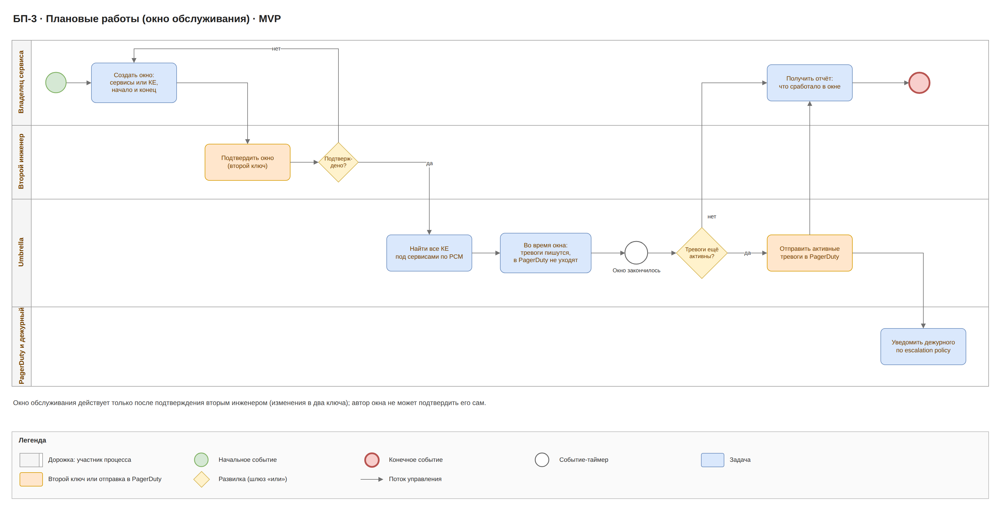
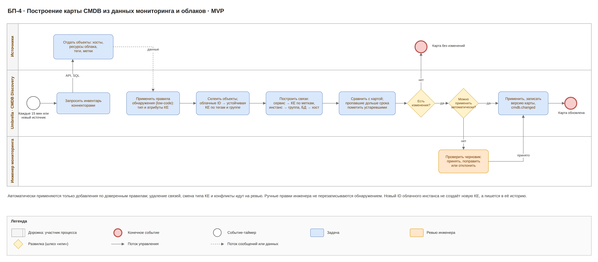
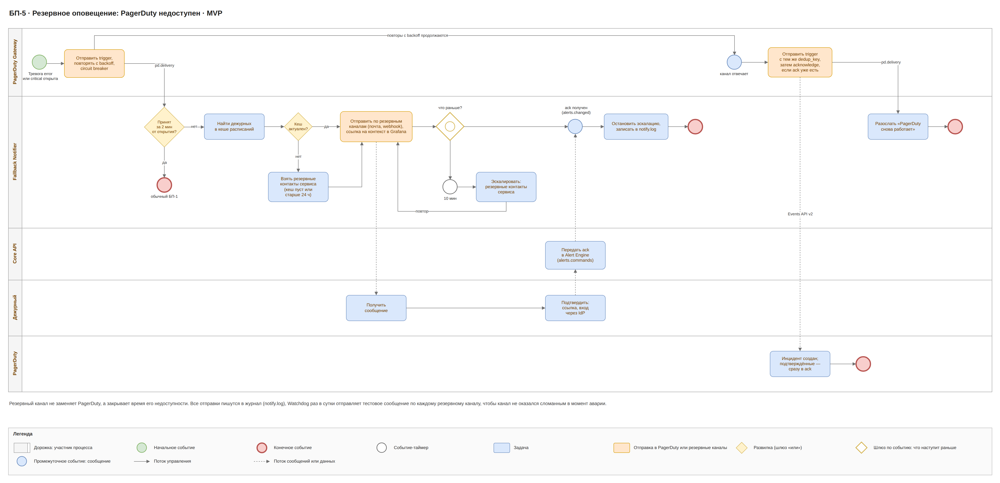
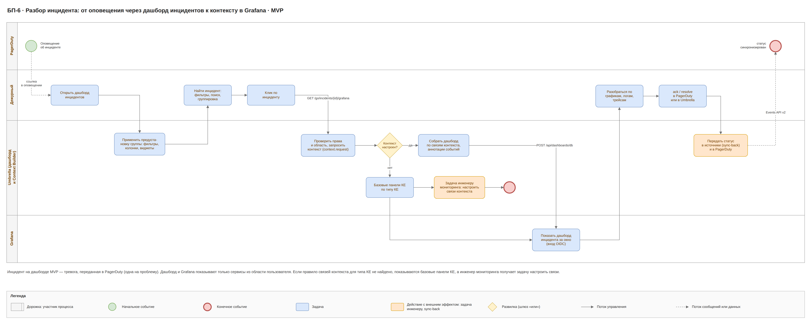
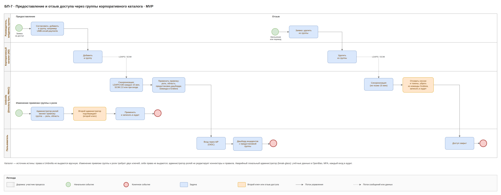

# Umbrella MVP · 6. Бизнес-процессы

Семь процессов покрывают MVP: обработка тревоги, сборка коннектора, плановые работы, построение карты CMDB, резервное оповещение, разбор инцидента и предоставление и отзыв доступа. Схемы в нотации, близкой к BPMN, с дорожками по участникам.

## Перечень процессов

| Код | Процесс | Участники | Результат |
| --- | --- | --- | --- |
| БП-1 | Обработка тревоги | источник, Umbrella, PagerDuty, дежурный | один инцидент PagerDuty на проблему, закрыт везде |
| БП-2 | Сборка коннектора в low-code конструкторе | инженер мониторинга, Umbrella, система-источник | события источника идут в Umbrella |
| БП-3 | Плановые работы | владелец сервиса, второй инженер, Umbrella, PagerDuty | работы прошли без ложных тревог |
| БП-4 | Построение карты CMDB | источники и облака, Umbrella, инженер | актуальная карта КЕ и связей |
| БП-5 | Резервное оповещение | PagerDuty Gateway, Fallback Notifier, Core API, дежурный, резервные контакты, PagerDuty | дежурный узнал о тревоге, хотя PagerDuty недоступен |
| БП-6 | Разбор инцидента | PagerDuty, дежурный, Umbrella (дашборд инцидентов и Context Builder), Grafana | дежурный видит метрики, логи и трейсы затронутых КЕ на одном дашборде |
| БП-7 | Предоставление и отзыв доступа | руководитель (владелец группы), корпоративный каталог, Umbrella, пользователь; администраторы ролей | права, область и предустановка дашборда соответствуют группам каталога |

## БП-1. Обработка тревоги

Коннектор забирает и парсит событие, пишет его в шину и только потом отмечает в источнике как переданное. Событие привязывается к КЕ и либо гасится окном обслуживания, либо схлопывается с открытой тревогой, либо создаёт новую и уходит в PagerDuty.

- Расписания, таймауты эскалации и каналы задаются в escalation policy PagerDuty.
- Повторы и события других источников про ту же проблему имеют тот же dedup_key и не создают новых инцидентов.
- Resolve уходит, когда в норму вернулись все источники тревоги.
- Если PagerDuty не принял тревогу error или critical за 2 минуты с момента открытия, запускается БП-5.

## БП-2. Сборка коннектора

Инженер собирает подключение из блоков без кода: авторизацию (секрет сразу уходит в OpenBao, в коннекторе ссылка), курсор, парсер, маппинг, шаблон и способ подтверждения. Dry-run на живых данных показывает результат до публикации.

Если доля ошибок разбора после публикации превышает порог, Umbrella сама откатывает коннектор на предыдущую версию; неразобранные события лежат в events.dlq.

## БП-3. Плановые работы

Владелец сервиса задаёт окно обслуживания на сервис или КЕ, второй инженер подтверждает окно (два ключа). Через РСМ Umbrella находит все затронутые КЕ. Тревоги во время окна записываются, но не уходят ни в PagerDuty, ни в резервные каналы.

После окончания окна всё, что ещё горит, уходит в PagerDuty.

## БП-4. Построение карты CMDB

CMDB Discovery раз в 15 минут забирает инвентарь, превращает его в КЕ и связи и сравнивает с текущей картой. Инженер участвует только там, где автоматике нельзя доверять.

- Автоматически применяются только добавления по доверенным правилам; удаления, смена типа и конфликты идут на ревью.
- КЕ, которую никто не видит дольше заданного срока, помечается устаревшей, а не удаляется.
- Ручные правки не перезаписываются обнаружением.

## БП-5. Резервное оповещение

Если тревога уровня error или critical не принята PagerDuty в течение 2 минут с момента открытия, Fallback Notifier находит дежурных в кеше расписаний (если кеш пуст или старше 24 ч — резервные контакты сервиса) и отправляет письмо или webhook с одноразовой подписанной ссылкой подтверждения. Дальше процесс ждёт одно из двух событий: дежурный открывает ссылку, входит через IdP и подтверждает тревогу в Core API, или через 10 минут без подтверждения сообщение уходит резервным контактам. Когда PagerDuty снова принимает события, туда уходит trigger с тем же dedup_key, а подтверждённые тревоги — как acknowledge.

- Предупреждения (warning) и info по резервным каналам не отправляются, они ждут PagerDuty.
- Открытый circuit breaker прекращает попытки отправки в PagerDuty, но отсчёт 2 минут продолжается.
- Все отправки пишутся в журнал; при шторме получатель получает одну сводку.
- Работоспособность каналов Watchdog проверяет каждый день тестовым сообщением.

## БП-6. Разбор инцидента

Дежурный открывает дашборд инцидентов со своей предустановкой, находит инцидент фильтрами или поиском и щёлкает по нему. Core API проверяет права и запрашивает у Context Builder дашборд; Context Builder обходит карту CMDB по правилам «Связи контекста», создаёт или обновляет дашборд в папке команды в Grafana и возвращает ссылку. Браузер открывает Grafana в новой вкладке, вход — через тот же IdP.

- Подходящего правила нет: строится дашборд с базовыми панелями КЕ по её типу, сводкой инцидента и аннотациями событий; инженер мониторинга получает задачу настроить связи, а такие инциденты видны в отчёте «Инциденты без связей контекста».
- Grafana недоступна: дашборд инцидентов работает, ссылка показывает ошибку, дежурный продолжает разбор по боковой панели Umbrella.
- Дежурный подтверждает инцидент на дашборде или в PagerDuty; статус синхронизируется в обе стороны и в источники.

## БП-7. Предоставление и отзыв доступа

Руководитель заказывает доступ, администратор каталога добавляет сотрудника в группу корпоративного каталога с префиксом UMB-* (например, UMB-oncall-payments). При следующей синхронизации (не позже 15 минут) или сразу по SCIM Umbrella получает членство; группа уже привязана к роли, области и предустановке дашборда. Context Builder добавляет пользователя в команду Grafana с правами на папку. Привязку новой группы к роли настраивает один администратор ролей и подтверждает второй.

- Удаление из группы: при следующей синхронизации права отзываются, сессии и токены пользователя аннулируются, членство в команде Grafana снимается — не позже 15 минут.
- Никто не может выдать права себе; администратор ролей не редактирует коннекторы и правила.
- Каталог недоступен: Umbrella работает с последними синхронизированными группами; аварийный доступ — только break-glass администратор с MFA и аудитом.
- Все изменения привязок и членства в группах пишутся в аудит и уходят в SIEM.
