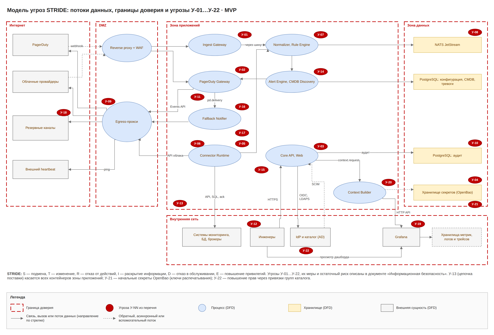

# Umbrella MVP · 7. Информационная безопасность

Umbrella хранит учётные данные ко всем источникам, решает, дойдёт ли алерт до дежурного, и показывает данные инцидентов в Grafana. Поэтому главные цели защиты — секреты (только в OpenBao), целостность конвейера и настроек подавления, доверие к резервным каналам, права доступа из корпоративного каталога и данные инцидентов на дашбордах Grafana.

## Требования и меры

| Область | Мера |
| --- | --- |
| Аутентификация | OIDC через корпоративный IdP, MFA на стороне IdP, короткие сессии; сервисные токены API со сроком жизни; в Grafana вход через тот же IdP |
| Авторизация | ролевая модель: группы корпоративного каталога → роль, область, предустановка дашборда (см. ниже); проверка каждого запроса в Core API |
| Синхронизация с каталогом | LDAPS 636 раз в 15 мин (только группы с префиксом UMB-* или из заданного OU) или SCIM 2.0 от IdP; group claims OIDC при входе; удаление из группы → отзыв прав, сессий и токенов не позже 15 мин |
| Секреты | все секреты без исключений (логины, пароли, токены, ключи API и HMAC, ключ подписи ссылок подтверждения, сертификаты, пароль SMTP-релея, адреса и токены webhook, токен сервисного аккаунта Grafana, учётные данные источников данных Grafana, учётные данные S3) только в OpenBao ×3 (Raft); в конфигурации, БД, коде, образах, Kubernetes Secrets и логах только ссылки; ротация без перепубликации |
| Начальные секреты | auto-unseal (transit второго экземпляра OpenBao или KMS) либо Шамир 3 из 5 у назначенных хранителей; способ распечатывания выбирает ИБ; root token отзывается после первичной настройки; сертификаты mTLS выдаёт PKI OpenBao, учётные данные S3 — движок S3 OpenBao, оба через агент-инжектор |
| Минимальные права в источниках | IAM-роли облака только на чтение; учётки БД только SELECT и UPDATE флага; API-токены с правами чтения и ack; токен PagerDuty REST только на чтение расписаний |
| Grafana | токен сервисного аккаунта Context Builder даёт права только на папки Umbrella; права на папки по командам из групп каталога; учётные данные источников данных подставляет агент OpenBao, в конфигурации Grafana их нет |
| Шифрование | TLS 1.2+ на всех соединениях, mTLS между сервисами (ingress → сервисы 8443), шифрование дисков PostgreSQL, NATS и бэкапов |
| Входящие webhooks | токен или HMAC на коннектор, проверка подписи PagerDuty и облаков, IP-списки, WAF, лимиты частоты |
| Песочница low-code | CEL и JSONata без сети и файлов, лимиты времени и памяти; RE2 |
| Защита от SSRF | HTTP-блоки ходят только к адресам из списка разрешённых и только через egress-прокси; запрещены 169.254.0.0/16, loopback, адреса зон приложений и данных (4222, 5432, 8200, Kubernetes API); сетевые политики Kubernetes |
| Данные событий | маскирование ПДн и секретов; в PagerDuty, резервные сообщения и аннотации Grafana уходят только поля из разрешённого списка; сырые события 7 дней, нормализованные 30 дней |
| Резервное оповещение | ссылка подтверждения одноразовая, подписана, живёт 1 ч и сама прав не даёт: Core API требует вход через IdP и право incident.ack на сервис; лимиты на канал и получателя; контакты дежурных хранятся ссылками и видны только ролям с правом |
| Аудит | все изменения конфигурации, привязок групп и ролей, действия с тревогами, входы break-glass и резервные отправки в неизменяемый журнал с выгрузкой в SIEM (6514 syslog TLS) |
| Сеть | исходящий трафик только через egress-прокси по списку; сетевые политики Kubernetes |
| Разработка и поставка | SAST, проверка зависимостей и образов, SBOM, подписанные образы, фиксированные версии |

## Ролевая модель

Пользователь входит в группу корпоративного каталога. Группа привязывается к роли (набору разрешений), области (бизнес-услуги, ИТ-сервисы, команды, коннекторы и источники) и предустановке дашборда. Привязку настраивает администратор ролей, изменение вступает в силу после подтверждения вторым администратором ролей. Пользователь в нескольких группах получает объединение разрешений и областей; в списке предустановок видны все, по умолчанию открывается предустановка группы с наивысшим приоритетом. Личные представления строятся поверх предустановки и не расширяют область.

| Разрешение | Наблюдатель | Дежурный инженер | Инженер мониторинга | Владелец сервиса | Аудитор | Администратор ролей | Администратор Umbrella |
| --- | --- | --- | --- | --- | --- | --- | --- |
| dashboard.view | ✓ | ✓ | ✓ | ✓ | ✓ | — | ✓ |
| incident.ack | — | ✓ | — | — | — | — | ✓ |
| incident.silence | — | ✓ | ✓ | — | — | — | ✓ |
| connector.edit, connector.publish, template.edit, rule.edit | — | — | ✓ | — | — | — | ✓ |
| maintenance.create | — | ✓ | ✓ | ✓ | — | — | ✓ |
| maintenance.approve | — | — | — | ✓ | — | — | ✓ |
| cmdb.review, routing.edit | — | — | ✓ | ✓ | — | — | ✓ |
| contacts.edit | — | — | — | ✓ | — | — | ✓ |
| context.edit (связи Grafana) | — | — | ✓ | — | — | — | ✓ |
| presets.edit | — | — | — | — | — | ✓ | ✓ |
| roles.admin | — | — | — | — | — | ✓ | — |
| audit.read | — | — | — | — | ✓ | ✓ | ✓ |

Разрешения действуют только в пределах области роли. Встроенные роли — стартовый набор: состав разрешений меняет администратор ролей в два ключа.

Разделение обязанностей:

- Администратор ролей не редактирует коннекторы, правила, подавление и маршрутизацию; администратор Umbrella не управляет привязками групп.
- Никто не выдаёт права себе: Core API отклоняет изменение привязки, которое расширяет права автора, и изменение, подтверждённое тем же человеком.
- Окно обслуживания создаёт один человек, подтверждает другой (maintenance.create и maintenance.approve в одной заявке у разных людей).
- Break-glass администратор нужен только при недоступности каталога или IdP: учётные данные в OpenBao, MFA, каждый вход оповещает ИБ и пишется в аудит.

Те же группы каталога Context Builder отражает в командах Grafana и выдаёт им права на папки Umbrella, поэтому дашборд инцидента в Grafana видит только команда, которая видит инцидент в Umbrella.

## Модель угроз

Метод STRIDE по контейнерам C4-2 и потокам П-01…П-10. Границы доверия:

- интернет и DMZ (webhooks PagerDuty и облаков, исходящие вызовы через egress-прокси);
- DMZ и зона приложений;
- зона приложений и внутренняя сеть (пользователи, источники, каталог, IdP, SIEM, почтовый релей, Grafana);
- зона приложений и зона данных;
- Umbrella и Grafana (дашборды с данными инцидентов вне контура Umbrella).

| Актив | Чем ценен | Свойство |
| --- | --- | --- |
| Все секреты и начальные секреты OpenBao | доступ ко всем системам мониторинга, их БД, облакам и Grafana | конфиденциальность, доступность |
| Поток событий и тревог | от него зависит оповещение дежурных | целостность, доступность |
| Конфигурация: коннекторы, шаблоны, подавление, маршрутизация, связи контекста | её изменение может скрыть аварию или раскрыть данные | целостность |
| Привязки групп к ролям и областям | определяют, кто что видит и меняет | целостность |
| Карта CMDB и РСМ | полная карта инфраструктуры полезна атакующему | конфиденциальность |
| Дашборды инцидентов в Grafana | показывают КЕ, сервисы и тексты событий | конфиденциальность |
| routing keys PagerDuty | позволяют создавать ложные инциденты | конфиденциальность |
| Кеш дежурств и резервные контакты | персональные данные сотрудников | конфиденциальность |
| Журнал аудита | нужен для расследований | целостность |

Нарушители: внешний (подделка webhooks), внутренний с ролью инженера (злоупотребление low-code и подавлением), внутренний с доступом к каталогу (добавление себя в группу), скомпрометированный источник (вредный payload), скомпрометированная зависимость или образ, посторонний получатель резервного сообщения.

## Перечень угроз

| № | Угроза (STRIDE) | Где | Мера | Остаточный риск |
| --- | --- | --- | --- | --- |
| У-01 | S: поддельный webhook источника или облака создаёт ложные тревоги | Ingest Gateway, reverse proxy | токен или HMAC на коннектор, IP-списки, WAF | низкий |
| У-02 | S: поддельный webhook PagerDuty закрывает тревогу | PagerDuty Gateway | проверка подписи Webhooks v3, сверка статуса по API | низкий |
| У-03 | T: изменение коннектора, шаблона или подавления, чтобы скрыть алерты | Core API | RBAC, подавление в два ключа, версии и аудит, отчёт «что подавлено» | средний |
| У-04 | I: утечка секретов | OpenBao, PostgreSQL, логи | все секреты только в OpenBao, шифрование, маскирование, ротация | средний |
| У-05 | E: SSRF через HTTP-блок | Connector Runtime | список разрешённых адресов, только через egress-прокси, запрет 169.254.0.0/16, loopback и адресов зон приложений и данных (4222, 5432, 8200, Kubernetes API), сетевые политики | низкий |
| У-06 | D: вредный payload | парсеры | лимиты размера и времени, RE2 | низкий |
| У-07 | E: внедрение кода через выражения low-code | Normalizer, Rule Engine, Connector Runtime | песочница CEL и JSONata | низкий |
| У-08 | D: шторм событий от одного источника | вся цепочка | лимиты на коннектор, обратное давление JetStream, приоритет critical | средний |
| У-09 | D: недоступность PagerDuty или egress | PagerDuty Gateway | outbox и повторы, резервные каналы через 2 мин, внешний heartbeat | низкий |
| У-10 | R: отказ от изменения настроек | PostgreSQL: аудит, Core API | неизменяемый аудит с выгрузкой в SIEM | низкий |
| У-11 | I: ПДн или секреты из события уходят в PagerDuty | шаблон события | маскирование, разрешённый список полей | средний |
| У-12 | E: компрометация учётной записи инженера | веб-интерфейс | MFA в IdP, короткие сессии, права по областям | средний |
| У-13 | T: вредная зависимость или образ | сборка и поставка | SBOM, сканирование, подпись образов | средний |
| У-14 | T: подмена облачного ID или тега | Identity Resolver | проверка ID через API облака, тег вместе с аккаунтом | низкий |
| У-15 | I: просмотр карты CMDB посторонними | Core API | RBAC и области | низкий |
| У-16 | S: ложное подтверждение тревоги через резервный канал (пересланная или перехваченная ссылка) | Fallback Notifier, Core API | ссылка одноразовая, подписана, живёт 1 ч; подтверждение только после входа через IdP и проверки права incident.ack на сервис; аудит | низкий |
| У-17 | I: утечка контактов дежурных из кеша или резервного сообщения | PostgreSQL, Fallback Notifier | контакты ссылками, доступ по ролям, в сообщении нет чужих контактов, кеш хранит только текущие смены | низкий |
| У-18 | D: шторм или злоупотребление резервными каналами (спам дежурным, блокировка релея) | Fallback Notifier, egress | только error и critical, сводка при шторме, лимиты на канал и получателя, ежедневная проверка канала | средний |
| У-19 | I: утечка данных инцидента через дашборды Grafana | Grafana, папки Umbrella, Context Builder | права на папки только командам из групп каталога, вход через IdP, в сводку и аннотации только поля из разрешённого списка, маскирование, удаление дашбордов через 30 дней после закрытия | средний |
| У-20 | T/E: инъекция в запросы панелей Grafana и злоупотребление токеном Grafana | Context Builder, Grafana | шаблоны запросов только из разрешённого списка, экранирование переменных под язык запроса, свободный текст из событий в запросы не попадает; токен сервисного аккаунта в OpenBao, права только на папки Umbrella, ротация, аудит вызовов API | низкий |
| У-21 | I/D: компрометация или потеря начальных секретов (ключи распечатывания OpenBao) | OpenBao | auto-unseal либо Шамир 3 из 5 у разных хранителей в сейфах, root token отозван, учения по распечатыванию раз в полгода, журнал доступа к ключам | средний |
| У-22 | E: повышение прав через изменение привязок групп или каталога | Core API (Directory Sync, RBAC Policy Engine), корпоративный каталог | привязки в два ключа, синхронизируются только группы UMB-* из заданного OU, нельзя выдать права себе, изменения привязок и членства в привилегированных группах уходят в SIEM с оповещением ИБ, пересмотр прав раз в квартал | средний |

Модель угроз пересматривается при каждом новом типе блока конструктора, канала оповещения или типа панели Grafana и не реже раза в полгода.
