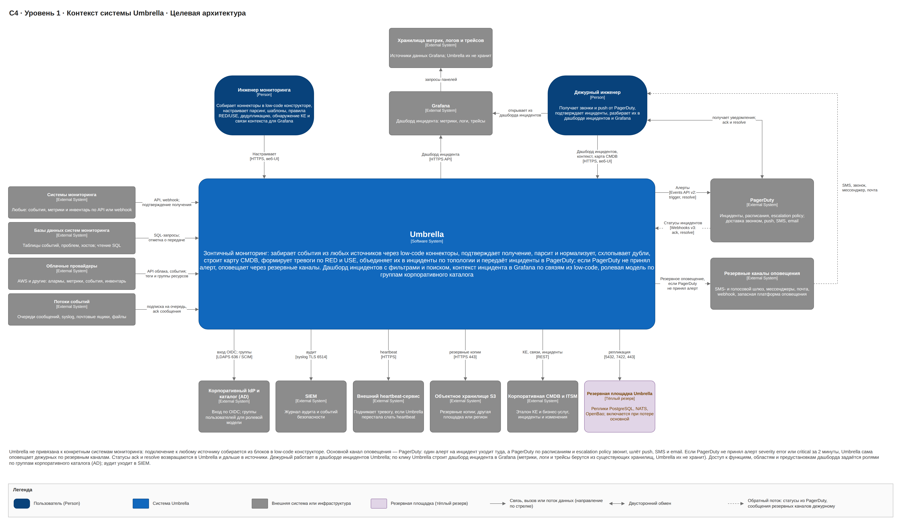
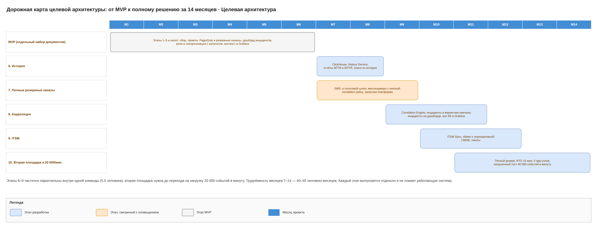

# Umbrella · целевая архитектура · 1. Обзор

Целевая архитектура Umbrella — это полное решение зонтичного мониторинга: события из любых источников собираются, нормализуются, схлопываются и коррелируются в инциденты, в PagerDuty уходит один алерт на инцидент, а если PagerDuty недоступен, дежурного будят SMS, звонком или сообщением в мессенджере с кнопкой подтверждения. Решение держит 20 000 событий в минуту на двух площадках, хранит историю 13 месяцев в ClickHouse, обменивается данными с корпоративной CMDB и ITSM, показывает инциденты на собственном дашборде и открывает по каждому инциденту сгенерированный дашборд Grafana. Набор документов самодостаточен; путь от MVP описан в разделах «Отличия от MVP» и «Дорожная карта».

## Паспорт

| Поле | Значение |
| --- | --- |
| Название | Umbrella, зонтичный мониторинг · целевая архитектура |
| Назначение | Единая точка сбора событий из любых источников, их парсинга, нормализации, схлопывания и топологической корреляции с передачей одного алерта на инцидент в PagerDuty, гарантированным резервным оповещением, дашбордом инцидентов, контекстом инцидента в Grafana и историей для анализа |
| Владелец архитектуры | Dmitriy |
| Статус | Архитектура, реализация в месяцы 7–14 |
| Пользователи | Наблюдатели, дежурные инженеры, инженеры мониторинга, владельцы сервисов (отчёты, плановые работы), аудиторы, администраторы ролей, администраторы Umbrella; роли назначаются через группы корпоративного каталога |
| Входящие интеграции | Любые системы мониторинга, их БД, облачные провайдеры, очереди, syslog, почта (через low-code конструктор); корпоративная CMDB и ITSM (бизнес-услуги, владельцы); корпоративный каталог (группы, LDAPS или SCIM); PagerDuty (Webhooks v3, REST API только на чтение) |
| Исходящие интеграции | PagerDuty (Events API v2) как основной канал; резервные каналы: SMS- и голосовой шлюз, мессенджеры с кнопкой, почта через корпоративный релей, HTTPS webhook, запасная платформа оповещения; Grafana (HTTP API: дашборды, аннотации, команды, права папок); корпоративная CMDB и ITSM (технические КЕ, инциденты); SIEM (журнал аудита, syslog TLS); внешний heartbeat; S3-хранилище бэкапов на другой площадке или в другом регионе |
| Идентификация | Корпоративный IdP (OIDC, MFA) для Umbrella и Grafana; корпоративный каталог (например, AD) — источник истины для групп |
| Нагрузка | До 20 000 событий в минуту (≈ 330 в секунду); нагрузочный тест на 40 000 в минуту |
| Критичность | Доступность 99,95%; задержка событие → PagerDuty p95 не более 30 с; оповещение по резервному каналу не позже 3 мин от события; контекст инцидента в Grafana открывается не дольше 2 с |
| Отказоустойчивость | Две площадки, тёплый резерв: RPO ≤ 1 мин, RTO ≤ 15 мин; RPO секретов ≤ 15 мин |
| Хранение | PostgreSQL: нормализованные события 7 дней, сырые события 3 дня, тревоги, инциденты, конфигурация; ClickHouse: история событий без поля raw 13 месяцев, агрегаты 3 года |
| Стек | Go, NATS JetStream, PostgreSQL, ClickHouse, OpenBao, React; Kubernetes; Grafana для контекста инцидента |
| Ограничения по вендорам | Платные российские продукты запрещены, open source разрешён (ClickHouse допустим); SMS- и голосовой шлюз выбираются без платных российских продуктов; все секреты только в OpenBao |

## Резюме

Сегодня одна проблема даёт несколько алертов из разных систем, а дежурный сам сопоставляет их, ищет влияние на сервисы и собирает графики по разным инструментам. Umbrella забирает события из любых источников, привязывает их к КЕ и сервисам, собирает связанные тревоги в инцидент с вероятной причиной и отдаёт в PagerDuty один алерт на инцидент (dedup_key umb-inc-‹id инцидента›) с влиянием на бизнес-услуги.

Кроме того, дежурного можно разбудить звонком или SMS, даже когда PagerDuty недоступен, и он подтверждает тревогу прямо из сообщения; эскалация идёт по уровням escalation policy; видна история и динамика шума за 13 месяцев; карта Umbrella обменивается данными с корпоративной CMDB и ITSM; потеря площадки восстанавливается за 15 минут.

Для работы с инцидентами есть три функции. Дашборд инцидентов в веб-интерфейсе показывает инциденты с живым обновлением, фильтрами, полнотекстовым поиском (в том числе по истории) и массовыми действиями по правам. Щелчок по инциденту открывает дашборд Grafana, который Context Builder генерирует по low-code «Связям контекста»: метрики, логи и трейсы всех КЕ инцидента в нужном окне времени, вероятная причина выделена. Доступ к функциям, областям и предустановкам дашборда выдаётся через группы корпоративного каталога, удаление из группы отзывает доступ не позже чем через 15 минут.

Umbrella состоит из 15 собственных контейнеров на Go и React, шины NATS JetStream, PostgreSQL, ClickHouse и OpenBao. Основная площадка — пять app-узлов, три узла данных и три узла ClickHouse; резервная — три app-узла и три узла данных. Развитие стоит 40–45 человеко-месяцев за 8 месяцев (месяцы 7–14) командой 5,5 человека и 2 штатные единицы на поддержку; лицензий нет, платные только PagerDuty и тарифы SMS- и голосового шлюза.

## Место в ландшафте

Umbrella стоит между слоем сбора телеметрии и слоем управления инцидентами и не заменяет ни один из них.

| Слой | Системы | Роль относительно Umbrella |
| --- | --- | --- |
| Сбор телеметрии | системы мониторинга, хранилища метрик, логов и трейсов, облачный мониторинг | источники событий, метрик и инвентаря; остаются как есть; хранилища служат источниками данных Grafana |
| Консолидация и корреляция событий | Umbrella | парсинг, нормализация, схлопывание, корреляция, карта CMDB, RED и USE, дашборд инцидентов, история |
| Визуализация | Grafana (корпоративная; если её нет, Grafana OSS в зоне приложений) | показывает метрики, логи и трейсы инцидента на дашборде, который генерирует Umbrella |
| Инциденты и оповещение | PagerDuty | основной канал: один алерт на инцидент, дежурства, эскалации, доставка |
| Резервное оповещение | SMS- и голосовой шлюз, мессенджеры, корпоративный почтовый релей, webhook, запасная платформа оповещения | используются Umbrella, только когда PagerDuty не принял алерт |
| Управление ИТ-услугами | корпоративная CMDB и ITSM | мастер бизнес-услуг и владельцев; получает технические КЕ и инциденты из Umbrella |
| Идентификация и доступ | корпоративный IdP, корпоративный каталог (AD) | вход через OIDC с MFA; каталог — мастер групп, из которых Umbrella назначает роли |
| Безопасность и самоконтроль | SIEM, внешний heartbeat | SIEM получает журнал аудита; внешний heartbeat поднимает тревогу, если Umbrella перестала работать |
| Хранение бэкапов | S3-хранилище на другой площадке или в другом регионе | бэкапы PostgreSQL, ClickHouse и снапшоты OpenBao |

## Анализ дублирования

Пересечения есть с PagerDuty, Grafana, корпоративными CMDB, ITSM и каталогом; граница проведена явно.

| Функция | Где уже есть | Решение в целевой архитектуре |
| --- | --- | --- |
| Дежурства, эскалации, основная доставка | PagerDuty | в Umbrella не делаем; Umbrella читает расписания и escalation policy только для резервного оповещения |
| Доставка, когда PagerDuty недоступен | запасные платформы оповещения | Fallback Notifier с несколькими каналами; запасная платформа подключается как один из каналов |
| Приём алертов от систем мониторинга | PagerDuty принимает напрямую | оставляем в Umbrella: прямой приём не даёт общего ключа по КЕ, схлопывания между источниками, корреляции и влияния по РСМ |
| Корреляция и шумоподавление | платные AIOps-опции PagerDuty | своя топологическая корреляция по карте CMDB, объяснимая; ML только предлагает правила |
| Правила алертинга | сами системы мониторинга | Rule Engine считает RED и USE только там, где источник не алертит |
| Хранение метрик, логов и трейсов | системы мониторинга и их хранилища | не делаем; Grafana читает эти хранилища напрямую |
| Дашборды метрик | Grafana | дашборды не рисуем сами: Grafana умеет показывать метрики, но не знает, какие КЕ связаны с инцидентом по карте CMDB; Umbrella по «Связям контекста» генерирует для инцидента дашборд Grafana с нужными панелями и окном времени |
| Список инцидентов с действиями | PagerDuty, Grafana | собственный дашборд инцидентов в Umbrella: в PagerDuty нет тревог до схлопывания, КЕ и состояния резервного оповещения, в Grafana нет действий и ролевых областей (ADR-20) |
| История и отчёты | аналитика PagerDuty | в Umbrella история событий и тревог до схлопывания, которой в PagerDuty нет; отчёты по инцидентам PagerDuty остаются в PagerDuty |
| Карта КЕ и бизнес-услуги | корпоративная CMDB | CMDB — мастер бизнес-услуг, Umbrella — мастер технических КЕ из мониторинга; обмен через ITSM Sync |
| Пользователи и группы | корпоративный каталог | каталог — мастер групп; Umbrella хранит только привязки групп к ролям, областям и предустановкам и синхронизирует группы, а не ведёт свои |
| Готовые зонтичные продукты | коммерческие event-management платформы и open source аналоги | рассмотрены в ADR-01: не дают конструктор с ack в источник, РСМ и резервное оповещение в одном продукте |

## Отличия от MVP

| Область | MVP | Целевая архитектура |
| --- | --- | --- |
| Резервные каналы | почта, webhook; подтверждение по одноразовой ссылке в Core API после входа через IdP; эскалация резервным контактам через 10 мин | SMS, звонок, мессенджеры с кнопкой, почта, webhook, запасная платформа оповещения; подтверждение прямо из сообщения; эскалация по уровням escalation policy |
| Алерт в PagerDuty | один на тревогу, dedup_key umb-‹id тревоги› | один на инцидент, dedup_key umb-inc-‹id инцидента› |
| Корреляция | нет: RED-тревога сервиса и USE-тревога его КЕ только связываются, USE помечается вероятной причиной | Correlation Engine объединяет тревоги в инцидент по топологии карты и паре RED/USE, вероятная причина |
| Дашборд инцидентов | тревоги, переданные в PagerDuty; поиск по горячим данным | инциденты Correlation Engine; поиск и по истории в ClickHouse |
| Контекст в Grafana | панели КЕ тревоги | панели всех КЕ инцидента, вероятная причина выделена |
| Роли | базовый набор разрешений | добавляются reports.view, itsm.admin, correlation.edit |
| История | PostgreSQL 30 дней | ClickHouse 13 месяцев, агрегаты 3 года, отчёты |
| CMDB и ITSM | нет интеграции | ITSM Sync: экспорт КЕ, импорт бизнес-услуг, инциденты в ITSM |
| Нагрузка | 5000 событий в минуту | 20 000 событий в минуту |
| Площадки | одна, холодный резерв, RTO 1 ч | две, тёплый резерв, RTO 15 мин |
| Доступность | 99,9% | 99,95% |
| Собственные контейнеры | 12 | 15 (History Service, Correlation Engine, ITSM Sync) |

## Состав документации

Набор целевой архитектуры состоит из девяти документов; у каждой схемы есть легенда, исходник всех схем: target/diagrams/umbrella-target.drawio.

| № | Документ | Что внутри |
| --- | --- | --- |
| 1 | Обзор | этот документ |
| 2 | [Umbrella · целевая архитектура · 2. Функциональная архитектура](02-functional.md) | функции и потоки, дашборд инцидентов, контекст в Grafana, ролевая модель, конструктор, дедупликация |
| 3 | [Umbrella · целевая архитектура · 3. C4 и компоненты](03-c4.md) | C4: контекст, контейнеры, компоненты каждого контейнера, макеты дашборда и Grafana, ролевая модель, шина, последовательности, модель данных |
| 4 | [Umbrella · целевая архитектура · 4. Инфраструктура и технологии](04-infra.md) | развёртывание, узлы, сеть, сайзинг, отказоустойчивость, интеграции, технологии |
| 5 | [Umbrella · целевая архитектура · 5. Ресурсно-сервисная модель](05-rsm.md) | ресурсно-сервисная модель, связи для контекста Grafana, области доступа |
| 6 | [Umbrella · целевая архитектура · 6. Бизнес-процессы](06-bp.md) | семь бизнес-процессов, включая резервное оповещение, разбор инцидента и управление доступом |
| 7 | [Umbrella · целевая архитектура · 7. Информационная безопасность](07-security.md) | ИБ, ролевая модель, модель угроз STRIDE, перечень угроз |
| 8 | [Umbrella · целевая архитектура · 8. Управление архитектурой](08-governance.md) | стоимость, требования и трассировка, ADR, ответственность, проверки, риски |
| 9 | [Umbrella · целевая архитектура · 9. Глоссарий](09-glossary.md) | глоссарий |

MVP описан отдельным набором, начиная с обзора: [Umbrella MVP · 1. Обзор](../../mvp/docs/01-overview.md).

## Дорожная карта

Целевая архитектура строится за этапы 6–10 поверх работающего MVP. Этапы 6–9 частично параллельны внутри одной команды; вторая площадка нужна до перехода на нагрузку 20 000 событий в минуту. Каждый этап выпускается отдельно и не ломает работающую систему.

| Этап | Месяцы | Результат |
| --- | --- | --- |
| MVP (этапы 1–5 и пилот) | 1–6 | один алерт на тревогу в PagerDuty, low-code коннекторы, карта CMDB, резервное оповещение по почте и webhook, дашборд инцидентов, контекст в Grafana, роли из каталога; 28–34 человеко-месяца |
| 6. История | 7–8 | ClickHouse, History Service, отчёты MTTA и MTTR, шумные источники; поиск по истории на дашборде инцидентов через History Service; разрешение reports.view |
| 7. Полные резервные каналы | 7–9 | SMS- и голосовой шлюз, мессенджеры с кнопкой, подтверждение из сообщения через Ack Handler, уровни escalation policy, кеш дежурств на 7 дней вперёд, запасная платформа оповещения |
| 8. Корреляция | 9–11 | Correlation Engine, инциденты с вероятной причиной, один алерт PagerDuty на инцидент (umb-inc-‹id›); дашборд показывает инциденты-группы; контекст Grafana по всем КЕ инцидента с выделенной причиной; разрешение correlation.edit |
| 9. ITSM | 10–12 | ITSM Sync, обмен с корпоративной CMDB, инциденты в ITSM; области ролей по бизнес-услугам из ITSM; разрешение itsm.admin |
| 10. Вторая площадка и 20 000/мин | 11–14 | тёплый резерв, RTO 15 мин, пять app-узлов, Grafana и Context Builder на резервной площадке, нагрузочный тест на 40 000 событий в минуту, DR-учения |

Полный путь от начала MVP до целевой архитектуры занимает 14 месяцев и 68–79 человеко-месяцев.
