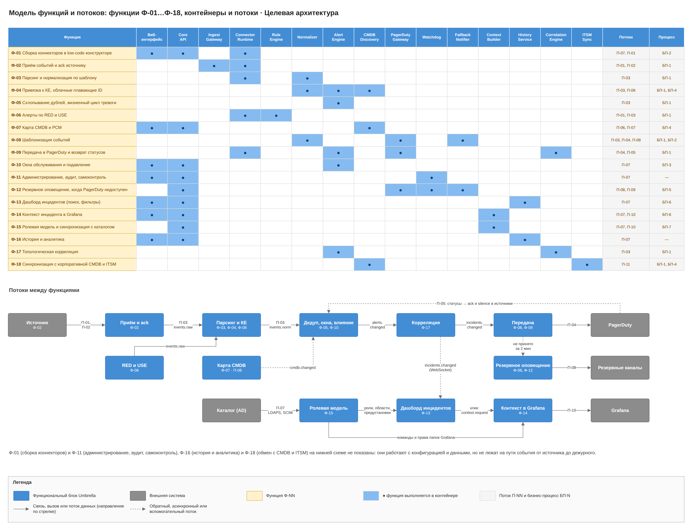
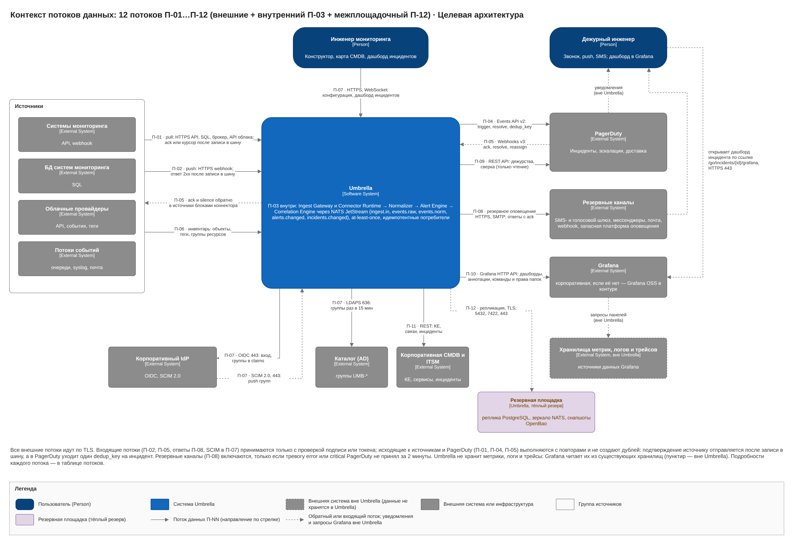
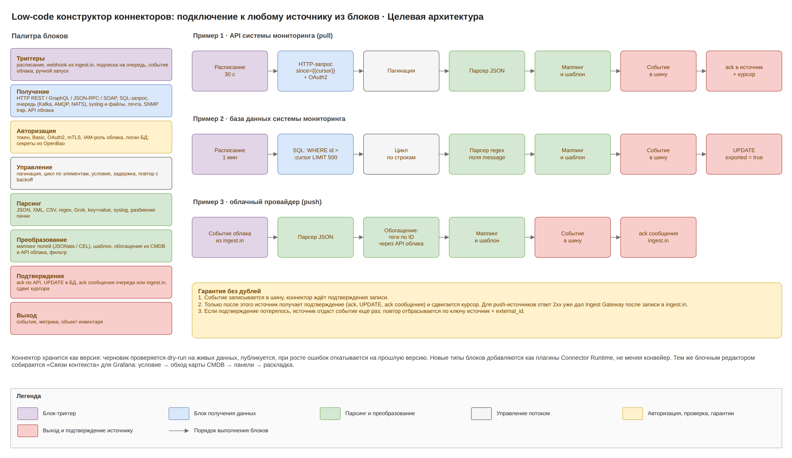
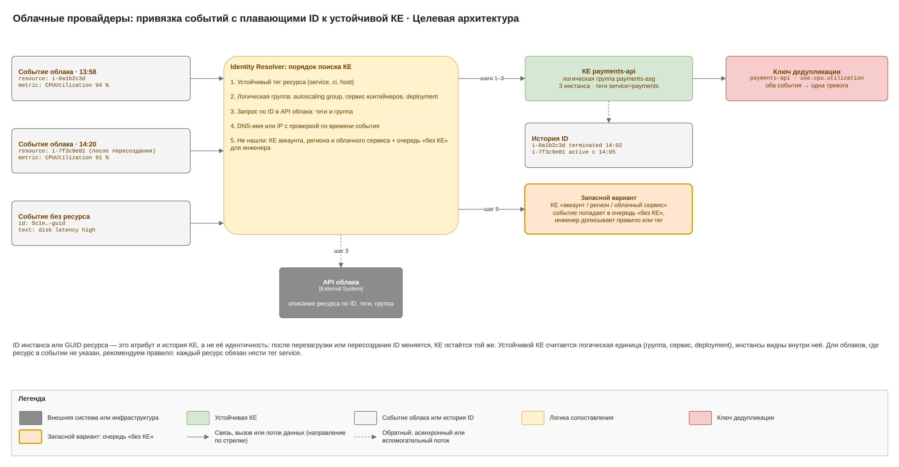
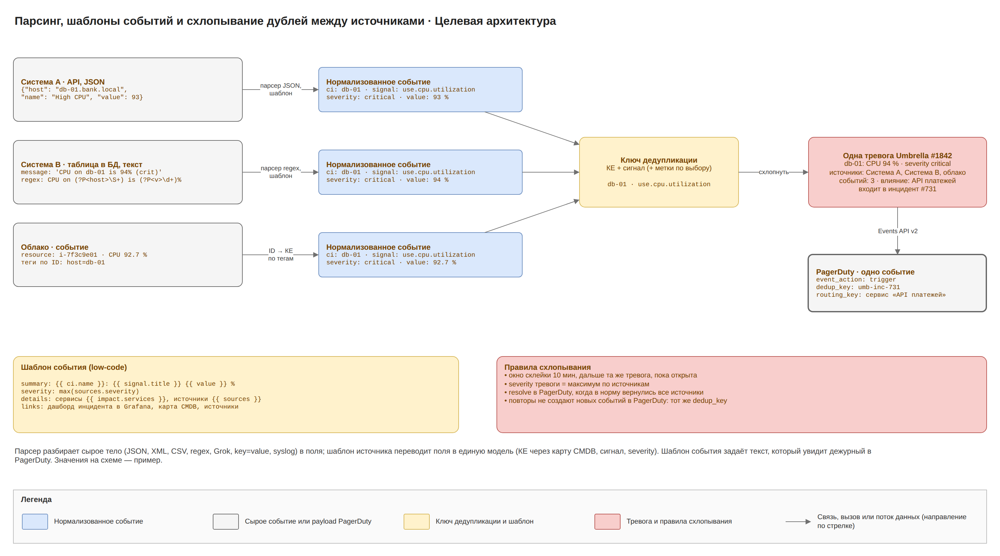
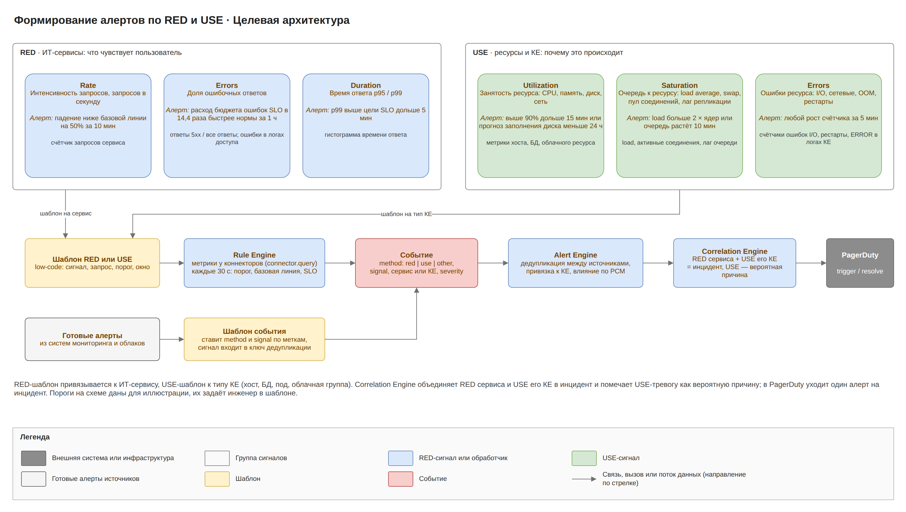

# Umbrella · целевая архитектура · 2. Функциональная архитектура

Umbrella выполняет 18 функций; данные идут по 12 потокам (10 внешних, внутренний конвейер П-03 и межплощадочная репликация П-12): от сбора событий конструктором через корреляцию в инциденты до передачи в PagerDuty, резервного оповещения, дашборда инцидентов, контекста в Grafana, истории и обмена с корпоративной CMDB и ITSM.

## Модель функций

| № | Функция | Контейнеры | Процесс |
| --- | --- | --- | --- |
| Ф-01 | Сборка коннекторов в low-code конструкторе | Веб-интерфейс, Core API, Connector Runtime | БП-2 |
| Ф-02 | Приём событий и подтверждение получения источнику | Connector Runtime, Ingest Gateway | БП-1 |
| Ф-03 | Парсинг и нормализация по шаблону источника | Connector Runtime, Normalizer | БП-1 |
| Ф-04 | Привязка к КЕ, включая облачные ресурсы с плавающими ID | Normalizer, Alert Engine, CMDB Discovery | БП-1, БП-4 |
| Ф-05 | Схлопывание дублей и жизненный цикл тревоги | Alert Engine | БП-1 |
| Ф-06 | Алерты по RED и USE | Rule Engine, Connector Runtime | БП-1 |
| Ф-07 | Карта CMDB и ресурсно-сервисная модель | Веб-интерфейс, Core API, CMDB Discovery | БП-4 |
| Ф-08 | Шаблонизация событий | Normalizer, PagerDuty Gateway, Fallback Notifier | БП-1, БП-2 |
| Ф-09 | Передача в PagerDuty и возврат статусов в источники | PagerDuty Gateway, Alert Engine, Connector Runtime | БП-1 |
| Ф-10 | Окна обслуживания и подавление | Веб-интерфейс, Core API, Alert Engine | БП-3 |
| Ф-11 | Администрирование, аудит, самоконтроль | Веб-интерфейс, Core API, Watchdog | — |
| Ф-12 | Резервное оповещение, когда PagerDuty недоступен | PagerDuty Gateway, Fallback Notifier, Core API, Watchdog | БП-5 |
| Ф-13 | Дашборд инцидентов (поиск, фильтры) | Веб-интерфейс, Core API, History Service | БП-6 |
| Ф-14 | Контекст инцидента в Grafana | Веб-интерфейс, Core API, Context Builder | БП-6 |
| Ф-15 | Ролевая модель и синхронизация с каталогом | Core API, Context Builder | БП-7 |
| Ф-16 | История и аналитика | Веб-интерфейс, Core API, History Service | — |
| Ф-17 | Топологическая корреляция | Correlation Engine, Alert Engine | БП-1 |
| Ф-18 | Синхронизация с корпоративной CMDB и ITSM | ITSM Sync, CMDB Discovery | БП-1, БП-4 |

## Потоки данных

Объёмы даны для пика 20 000 событий в минуту; для PagerDuty и резервных каналов оценка после схлопывания и корреляции.

| № | Откуда → куда | Протокол | Данные | Гарантия |
| --- | --- | --- | --- | --- |
| П-01 | Источник → Connector Runtime (pull) | HTTPS API, SQL, протокол брокера, API облака | сырые события, до 330/с | ack или курсор после записи в шину |
| П-02 | Источник, облако, сетевые устройства → Ingest Gateway или слушатель syslog в Connector Runtime (push) | HTTPS webhook; syslog TLS 6514 | сырые события | ответ 2xx (выполняет Ingest Gateway) только после записи в шину |
| П-03 | Connector Runtime → Normalizer → Alert Engine → Correlation Engine (внутренний) | NATS JetStream: ingest.in, events.raw, events.norm, alerts.changed, incidents.changed | распарсенные и нормализованные события, тревоги, инциденты | at-least-once, идемпотентные потребители, transactional outbox |
| П-04 | Correlation Engine → PagerDuty Gateway → PagerDuty | NATS incidents.changed, HTTPS Events API v2 | trigger, acknowledge, resolve по инциденту; единицы–десятки в минуту | outbox, повторы, dedup_key umb-inc-‹id› |
| П-05 | PagerDuty → Umbrella → источники | HTTPS Webhooks v3, NATS pd.inbound, connector.command | ack, resolve, reassign | проверка подписи, сверка по REST API, идемпотентно |
| П-06 | Источники, облака → CMDB Discovery | инвентарь-коннекторы | хосты, ресурсы, теги, группы; раз в 15 мин | полный снимок и diff |
| П-07 | Пользователь ↔ Веб-интерфейс, Core API; Core API ↔ IdP и каталог | HTTPS, WebSocket; OIDC 443; LDAPS 636 (pull раз в 15 мин) или SCIM 2.0 443 (push от IdP) | конфигурация, дашборд инцидентов, действия; вход, группы и их участники | TLS, RBAC, аудит; отзыв доступа не позже 15 мин |
| П-08 | Fallback Notifier ↔ резервные каналы ↔ дежурный | HTTPS API SMS- и голосового шлюза, API мессенджеров, SMTP 587, HTTPS webhook | текст тревоги, кнопка или одноразовая ссылка; обратно ответы SMS и нажатия кнопок; только error и critical | журнал отправок, подписанные токены, проверка подписи ответов, лимиты на канал |
| П-09 | PagerDuty Gateway → PagerDuty REST API | HTTPS, токен только на чтение | расписания на 7 дней вперёд, escalation policy, статусы инцидентов; раз в 5 мин | кеш в PostgreSQL; кеш пуст или старше 24 ч → резервные контакты |
| П-10 | Context Builder → Grafana HTTP API | HTTPS 443 | дашборды инцидентов, аннотации событий, команды и права папок | идемпотентно по uid umb-‹id›, сервисный токен только на папки Umbrella |
| П-11 | ITSM Sync ↔ корпоративная CMDB и ITSM | HTTPS REST (блоки конструктора) | технические КЕ и связи наружу; бизнес-услуги и владельцы внутрь; инциденты и статусы | outbox в PostgreSQL, идемпотентно по внешнему id, конфликты на ревью |
| П-12 | Основная площадка → резервная (межплощадочный) | репликация PostgreSQL 5432, зеркало потоков NATS 7422, снапшоты OpenBao через S3 443; всё TLS | всё состояние Umbrella | асинхронно, отставание ≤ 1 мин; секреты ≤ 15 мин |

Служебные соединения — выгрузка аудита в SIEM (syslog TLS 6514), heartbeat во внешний сервис и бэкапы в S3 — не нумеруются как потоки; они показаны на интеграционной схеме и в таблице сетевых доступов.

## Подключение источников: low-code конструктор

Umbrella не привязана к конкретным системам мониторинга. Подключение к любому источнику инженер собирает в конструкторе из блоков, готовый коннектор исполняет Connector Runtime.

| Категория блоков | Блоки |
| --- | --- |
| Триггеры | расписание, событие из ingest.in (push), подписка на очередь, событие облака, ручной запуск |
| Получение | HTTP REST, GraphQL, JSON-RPC, SOAP; SQL-запрос к БД системы мониторинга; очередь (Kafka, AMQP, NATS); syslog и файлы; почтовый ящик; SNMP trap; API облака |
| Авторизация | токен, Basic, OAuth2, mTLS, IAM-роль облака, логин БД; логины, пароли и токены только в OpenBao, в коннекторе ссылка |
| Управление | пагинация, цикл, условие, задержка, повтор с backoff |
| Парсинг | JSON, XML, CSV, regex, Grok, key=value, syslog, разбиение пачки |
| Преобразование | маппинг JSONata и CEL, шаблон, обогащение из CMDB и API облака, фильтр |
| Подтверждение | ack по API, UPDATE в БД, ack сообщения в очереди или в ingest.in, сдвиг курсора |
| Выход | событие, метрика, объект инвентаря |

Коннектор хранится как версия: черновик проверяется dry-run на живых данных, публикуется и откатывается при росте ошибок разбора (БП-2). HTTP-блоки ходят наружу только через egress-прокси и только к адресам из разрешённого списка.

**Подтверждение получения.** Pull-коннектор пишет событие в NATS JetStream и ждёт подтверждения записи (PubAck); только после этого блок «Подтверждение» отвечает источнику и сдвигает курсор. Для push-источников ответ 2xx выполняет Ingest Gateway после записи в ingest.in; коннектор забирает событие из ingest.in, разбирает его, пишет в events.raw и подтверждает сообщение ingest.in. Если подтверждение потерялось и источник отдал событие повторно, inbox отбрасывает его по ключу источник + external_id (ключи хранятся 7 дней). Для источников без ack роль подтверждения играет курсор в PostgreSQL.

**Парсинг.** JSON и XML (API, webhooks), CSV (выгрузки), regex и Grok (текст, строки БД, логи), key=value и syslog RFC 3164/5424 (сетевое оборудование), разбиение пачки. Неразобранное событие уходит в events.dlq с исходным телом и видно в разделе «Ошибки разбора».

## Облачные ресурсы и плавающие ID

Облачные провайдеры подключаются тем же конструктором: алармы приходят webhook или через очередь, метрики и инвентарь забираются по API с IAM-ролью. Событие часто несёт только ID инстанса, который меняется после перезагрузки.

ID инстанса — это атрибут и история КЕ, а не её идентичность. Устойчивая КЕ — это логическая единица: autoscaling-группа, сервис контейнеров, deployment или ресурс с устойчивым тегом. Identity Resolver ищет КЕ по порядку:

1. Устойчивый тег ресурса (service, ci, host).
2. Логическая группа ресурса.
3. Запрос по ID в API облака: теги и группа; ответ кешируется.
4. DNS-имя или IP с проверкой по времени события.
5. Не нашли: КЕ уровня «аккаунт / регион / облачный сервис», событие попадает в очередь «без КЕ».

## Единая модель события и шаблоны

| Сущность | Что это | Ключевые поля |
| --- | --- | --- |
| Event | Один сигнал от источника, неизменяемый | source, external_id, ci, signal, method (red / use / other), severity, status, value, labels, raw, received_at |
| Alert (тревога) | Все события с одним ключом дедупликации | dedup_key, ci, signal, sources, severity, status (open, acknowledged, resolved, closed), count, first_seen, last_seen, incident_id |
| Incident (инцидент) | Тревоги одной проблемы по топологии; каждая тревога сразу входит в инцидент из одной или нескольких тревог | alerts, root_alert, probable_cause_ci, severity, status, pd_dedup_key (umb-inc-‹id›), pd_state, fallback_used, itsm_ref |
| Notification | Отправка по резервному каналу | incident, alert, channel, recipient, level, status, ack_token, sent_at |
| КЕ и связь | Элемент карты CMDB | type, name, identities, logical_group, source_refs, status, relations |

Severity приводится к четырём уровням PagerDuty: critical, error, warning, info.

- **Шаблон источника** переводит поля любого источника в единую модель: КЕ, сигнал по справочнику (например, use.cpu.utilization), severity. Пишется выражениями JSONata и CEL.
- **Шаблон события** задаёт, что увидит дежурный: заголовок, детали, ссылки на карту CMDB, на источник и на контекст инцидента в Grafana (/go/incidents/{id}/grafana). Один шаблон используется и для PagerDuty, и для резервных каналов, поэтому текст совпадает.

## Схлопывание дублей

Normalizer вычисляет кандидата КЕ и предварительный ключ; Alert Engine (CI Resolver) окончательно привязывает событие к КЕ по карте и пересчитывает ключ дедупликации. Ключ дедупликации = КЕ + сигнал, при необходимости плюс выбранные метки. Окно склейки 10 минут, severity тревоги равна максимуму по источникам. Resolve тревоги наступает, когда в норму вернулись все её источники.

## Карта CMDB и RED/USE

CMDB Discovery раз в 15 минут забирает инвентарь, по low-code правилам строит КЕ и связи, склеивает объекты разных источников и облачные инстансы с их группами. Добавления по доверенным правилам применяются сразу, удаления и конфликты идут на ревью. Бизнес-услуги и их владельцы импортируются из корпоративной ITSM через ITSM Sync; если в ITSM услуги нет, она задаётся вручную.

Rule Engine формирует алерты по RED для ИТ-сервисов и USE для КЕ и размечает теми же метками готовые алерты источников. Сам Rule Engine в источники не ходит: метрики он запрашивает у Connector Runtime через connector.query (NATS request/reply).

| Метод · сигнал | Условие по умолчанию |
| --- | --- |
| RED · Rate | падение на 50% от базовой линии за 10 мин |
| RED · Errors | расход бюджета ошибок SLO в 14,4 раза быстрее нормы за 1 ч |
| RED · Duration | p99 выше цели SLO дольше 5 мин |
| USE · Utilization | выше 90% дольше 15 мин или прогноз заполнения диска меньше 24 ч |
| USE · Saturation | load больше 2 × ядер или очередь растёт 10 мин |
| USE · Errors | любой рост счётчика ошибок за 5 мин |

Экран «Покрытие RED/USE» показывает пробелы в мониторинге.

## Корреляция в инциденты

Каждая новая тревога сразу входит в инцидент: Correlation Engine либо добавляет её к открытому инциденту, либо открывает новый инцидент из одной тревоги, поэтому корреляция не задерживает оповещение. Связанные тревоги объединяются по связям карты CMDB (хост → поды → сервисы, БД → сервисы) и по паре RED сервиса + USE его КЕ; вероятная причина ранжируется по глубине в графе, времени начала и истории совместных срабатываний.

- В PagerDuty уходит один алерт на инцидент с dedup_key umb-inc-‹id инцидента›; severity инцидента равна максимуму по его тревогам, причина и влияние на бизнес-услуги идут в custom_details.
- Если объединяются два инцидента, по которым уже есть алерты, младший закрывается в PagerDuty с пометкой «объединён с umb-inc-‹id›», его тревоги переходят в старший.
- Инцидент закрывается, когда закрыты все его тревоги.
- Корреляция объяснима: на дашборде и в боковой панели видно, по какой связи тревоги объединены; инженер может вручную разделить инцидент. Pattern Learner по истории в ClickHouse только предлагает правила инженеру.

## История и аналитика

History Service архивирует events.norm (без поля raw), alerts.changed, incidents.changed и notify.log в ClickHouse: 13 месяцев событий, агрегаты 3 года. Отчёты: MTTA и MTTR, шумные источники, покрытие RED/USE, SLA бизнес-услуг, работа резервных каналов, точность корреляции. Через History Service дашборд инцидентов ищет по истории. Потеря ClickHouse не влияет на передачу алертов.

## Оповещение: PagerDuty и резервные каналы

PagerDuty — основной канал: он ведёт инциденты, расписания, escalation policy и доставку, включая звонок сквозь беззвучный режим. Umbrella отправляет туда один алерт на инцидент (Events API v2, dedup_key umb-inc-‹id›, ссылка на контекст в Grafana в links) и получает статусы по Webhooks v3.

Резервное оповещение включается, когда основной канал не работает:

| Параметр | Решение в целевой архитектуре |
| --- | --- |
| Условие включения | только тревоги уровня error и critical: алерт её инцидента не принят PagerDuty за 2 мин с момента открытия тревоги; открытый circuit breaker (5 ошибок подряд или 60 с без ответа) прекращает попытки отправки, но отсчёт 2 минут продолжается |
| Каналы | SMS-шлюз, голосовой шлюз (звонок с синтезом речи), мессенджеры (бот с кнопкой «Принять»), почта через корпоративный релей, HTTPS webhook, запасная платформа оповещения; порядок каналов задаётся на уровне escalation policy |
| Получатели | дежурные уровня из кеша расписаний PagerDuty (обновляется каждые 5 мин, хранит расписания на 7 дней вперёд); если кеш пуст или старше 24 ч, резервные контакты сервиса из РСМ |
| Подтверждение | кнопка в мессенджере или ответ на SMS кодом → reverse proxy + WAF → Ack Handler в Fallback Notifier (проверка подписи); нажатие клавиши в звонке → Ack Handler; одноразовая подписанная ссылка (живёт 1 ч) → Core API, вход через IdP; результат → alerts.commands |
| Эскалация | по уровням escalation policy из кеша с их таймаутами; после последнего уровня — резервные контакты сервиса |
| Шторм | больше 20 тревог за 5 мин на получателя → одна сводка |
| Возврат PagerDuty | накопленные инциденты уходят trigger с теми же dedup_key, подтверждённые отправляются как acknowledge; рассылается «PagerDuty снова работает» |
| Проверка канала | Watchdog раз в сутки отправляет тестовое сообщение по каждому каналу |

Процесс описан в БП-5, последовательность и компоненты в документе «C4 и компоненты». SMS- и голосовой шлюз выбираются из поставщиков без платных российских продуктов, к основному шлюзу есть резервный маршрут через второго поставщика.

## Дашборд инцидентов

Дашборд инцидентов — отдельная страница веб-интерфейса для дежурных, инженеров и владельцев сервисов. Инцидент на дашборде — это инцидент Correlation Engine, группа из одной или нескольких тревог.

Макет страницы и состав компонентов приведены в документе «C4 и компоненты».

| Возможность | Что делает |
| --- | --- |
| Список | таблица или карточки инцидентов с живым обновлением по WebSocket; счётчики по severity; мини-шкала инцидентов по часам |
| Фильтры | статус, severity, бизнес-услуга, ИТ-сервис, КЕ, тип КЕ, команда, источник, метод (RED / USE), состояние в PagerDuty (принят, не принят, ack), резервное оповещение (было, нет), период |
| Поиск | полнотекстовый по заголовку, КЕ, сервису и тексту событий: горячие данные за 7 дней в PostgreSQL (полнотекстовый и триграммный индексы), более ранние — в ClickHouse через History Service |
| Представление | сортировка, группировка по сервису, команде или КЕ; сохранённые представления; ссылка с фильтрами в URL; экспорт CSV |
| Действия | массовые ack и silence по правам (incident.ack, incident.silence); каждое действие в аудите |
| Переходы | щелчок по инциденту открывает его дашборд Grafana в новой вкладке; значок «i» открывает боковую панель Umbrella: тревоги и события, шкала времени, связь по карте, вероятная причина, статус в PagerDuty, журнал резервных отправок |
| Видимость | пользователь видит только инциденты своей области (бизнес-услуги, ИТ-сервисы, команды, источники); при открытии применяется предустановка дашборда его группы |

## Контекст инцидента в Grafana

Grafana умеет показывать метрики, логи и трейсы, но не знает, какие из них относятся к инциденту. Umbrella знает это по карте CMDB и по правилам «Связи контекста» и генерирует для инцидента дашборд Grafana. Используется корпоративная Grafana; если её нет, Grafana OSS разворачивается в зоне приложений (2 реплики, её база в PostgreSQL). Источники данных Grafana — существующие хранилища метрик, логов и трейсов; Umbrella их не хранит. Пользователи входят в Grafana через тот же корпоративный IdP.

1. Пользователь щёлкает по инциденту на дашборде; браузер открывает /go/incidents/{id}/grafana в Core API.
2. Core API проверяет права на инцидент и запрашивает Context Builder через NATS request/reply context.request.
3. Context Builder подбирает правила «Связей контекста», обходит карту CMDB от всех КЕ инцидента, подставляет переменные в шаблоны запросов и собирает JSON дашборда.
4. Context Builder сохраняет дашборд через Grafana HTTP API в папку команды (uid umb-‹id›, повтор безопасен) и пишет аннотации с событиями инцидента.
5. Core API возвращает URL с окном времени, браузер переходит в Grafana.

Окно времени по умолчанию — от начала инцидента минус 10 минут до его закрытия (или текущего момента) плюс 10 минут; правило может задать своё. Дашборд генерируется по запросу за 2 с или быстрее, кешируется и пересобирается при изменении инцидента или правил. Он включает панели всех КЕ инцидента, вероятная причина выделена отдельной строкой сверху. Та же ссылка /go/incidents/{id}/grafana уходит в links события PagerDuty и в резервные сообщения. Дашборды удаляются через 30 дней после закрытия инцидента.

Пример владельца: правило «служба приложения упала» даёт панели CPU, RAM и диска хоста, логи и трейсы службы, а также метрики связанной БД из карты; окно 10 минут.

## Ролевая модель и каталог

Источник истины для людей и групп — корпоративный каталог (например, AD). Umbrella не ведёт своих групп: она синхронизирует группы каталога и привязывает их к ролям, областям и предустановкам дашборда.

- **Синхронизация:** LDAPS 636 раз в 15 минут по группам из заданной OU или с префиксом (например, UMB-*) либо SCIM 2.0 push от IdP; при входе группы приходят в claims OIDC (just-in-time). Исключение из группы отзывает доступ на ближайшей синхронизации (не позже 15 минут), сессии и токены отзываются.
- **Модель:** Пользователь ∈ Группа каталога → привязка (настраивает Администратор ролей, изменение в два ключа) → Роль (набор разрешений) + Область (бизнес-услуги, ИТ-сервисы, команды, коннекторы и источники) + Предустановки дашборда.
- **Разрешения:** dashboard.view, incident.ack, incident.silence, connector.edit, connector.publish, template.edit, rule.edit, maintenance.create, maintenance.approve, cmdb.review, routing.edit, contacts.edit, context.edit, presets.edit, roles.admin, audit.read, reports.view, itsm.admin, correlation.edit.
- **Встроенные роли:** Наблюдатель, Дежурный инженер, Инженер мониторинга, Владелец сервиса, Аудитор, Администратор ролей, Администратор Umbrella. Администратор ролей не правит коннекторы и правила; никто не выдаёт права сам себе.
- **Несколько групп:** разрешения и области объединяются; доступны все предустановки групп, по умолчанию — предустановка группы с высшим приоритетом. Личные представления строятся поверх предустановки и не расширяют область роли.
- **Grafana:** Context Builder создаёт в Grafana команды по группам каталога и выдаёт им права на папки своих команд.
- **Аварийный вход:** локальный администратор break-glass, учётные данные в OpenBao, MFA, каждое использование в аудите.

Подробно модель описана в документе «C4 и компоненты» (схема ролевой модели) и в документе «Информационная безопасность».

## Low-code настройка

Инженер настраивает всё в визуальном редакторе из узлов и связей, с выражениями CEL и JSONata. Настройка хранится как версионируемый JSON с dry-run, автором, откатом и экспортом в YAML для Git; публикация проходит по правам connector.publish и аналогичным.

- Коннекторы и шаблоны источников.
- Шаблоны событий и правила схлопывания.
- Правила RED и USE.
- Правила обнаружения CMDB.
- Правила корреляции.
- Маршрутизация в PagerDuty, резервные контакты и каналы сервисов.
- Обмен с ITSM (блоки REST, SOAP, SQL).
- «Связи контекста» для Grafana.
- Предустановки дашборда для групп.

**«Связи контекста».** Правило собирается из блоков так же, как коннектор:

| Блок | Что задаёт |
| --- | --- |
| Условие | тип КЕ, сигнал, сервис или бизнес-услуга, к которым применяется правило |
| Обход карты | тип связи, направление (вверх, вниз, в обе стороны), глубина не больше 3 |
| Панель метрик | источник данных Grafana и шаблон запроса с переменными ${ci.host}, ${ci.name}, ${service} и другими |
| Панель логов | источник данных логов и шаблон запроса по КЕ или сервису |
| Панель трейсов | источник данных трейсов и сервис |
| Сводка инцидента | таблица тревог, вероятная причина, ссылки в Umbrella и PagerDuty |
| Раскладка и окно | порядок строк и панелей; окно времени, если оно отличается от стандартного |

Перед публикацией правило проверяется dry-run на реальном инциденте: редактор показывает, какие КЕ найдены обходом и какие запросы получились. Правила версионируются и публикуются так же, как коннекторы; подстановка переменных идёт только в шаблоны из белого списка с экранированием под язык запроса, свободный текст из событий в запросы не попадает.
