# Umbrella · целевая архитектура · 3. C4 и компоненты

Umbrella состоит из 15 собственных контейнеров, шины NATS JetStream, PostgreSQL, ClickHouse и хранилища секретов OpenBao; ниже каждый собственный контейнер разобран до компонентов. Цвета по соглашениям C4: тёмно-синий — человек, синий — Umbrella, серый — внешняя система; под каждой схемой легенда.

## Уровень 1. Контекст

Umbrella стоит между любыми источниками событий и PagerDuty. Основной канал оповещения — PagerDuty; резервные каналы (SMS, звонок, мессенджеры с кнопкой, почта, webhook, запасная платформа оповещения) используются, только если PagerDuty не принял алерт за 2 минуты. Вокруг: корпоративный IdP и каталог (вход и группы), Grafana (контекст инцидента), корпоративная CMDB и ITSM, SIEM, внешний heartbeat, S3-хранилище бэкапов и резервная площадка.

## Уровень 2. Контейнеры

Контейнеры обработки не хранят состояния и общаются через NATS JetStream, поэтому каждый масштабируется отдельно. Состояние и конфигурация живут в PostgreSQL, история — в ClickHouse, секреты — только в OpenBao.

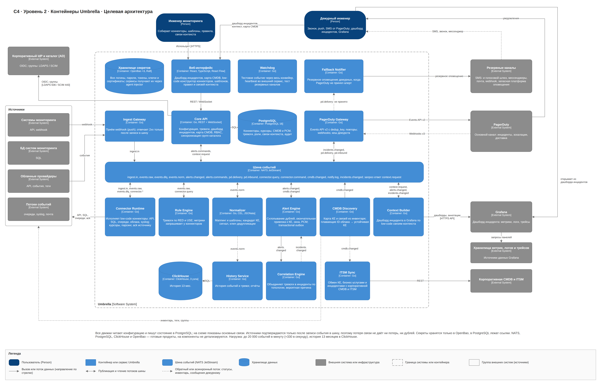

| Контейнер | Технология | Отвечает за |
| --- | --- | --- |
| Веб-интерфейс | React, TypeScript, React Flow | дашборд инцидентов, карта CMDB, low-code конструктор коннекторов, шаблонов, правил и «Связей контекста», отчёты, администрирование ролей |
| Core API | Go, REST + WebSocket | конфигурация, тревоги и инциденты, поиск, карта CMDB, синхронизация с каталогом, RBAC и предустановки, аудит, переход в Grafana, прокси отчётов |
| Ingest Gateway | Go | приём webhook; ответ 2xx только после записи в шину |
| Connector Runtime | Go | исполнение коннекторов: API, БД, очереди, syslog, облака; курсоры, парсинг, inbox, ack источнику; запросы метрик и команды в источники |
| Normalizer | Go, CEL, JSONata | шаблоны источников: поля, кандидат КЕ, сигнал, предварительный ключ дедупликации |
| Rule Engine | Go, CEL | алерты по RED и USE на метриках, полученных через connector.query |
| Alert Engine | Go | окончательная привязка к КЕ, схлопывание, окна обслуживания, влияние по РСМ, привязка тревоги к инциденту, sync-back в источники |
| Correlation Engine | Go | инциденты по топологии карты и паре RED/USE, вероятная причина |
| CMDB Discovery | Go | карта КЕ и связей, плавающие ID облака → устойчивая КЕ |
| ITSM Sync | Go | обмен с корпоративной CMDB и ITSM |
| PagerDuty Gateway | Go | Events API v2 с dedup_key umb-inc-‹id›, outbox, повторы, circuit breaker, Webhooks v3, кеш дежурств |
| Fallback Notifier | Go | резервное оповещение: SMS, звонок, мессенджеры с кнопкой, почта, webhook, запасная платформа; подтверждение из сообщения |
| Watchdog | Go | сквозная проба конвейера, тест резервных каналов, отставание резервной площадки, heartbeat наружу |
| Context Builder | Go | генерация дашбордов инцидентов в Grafana по «Связям контекста», аннотации, команды и права папок Grafana |
| History Service | Go | архив событий, тревог, инцидентов и отправок в ClickHouse; отчёты и поиск по истории |
| Шина событий | NATS JetStream, 3 узла | потоки конвейера, оповещения и инцидентов, R3, зеркало на резервную площадку |
| PostgreSQL | PostgreSQL 16 | конфигурация, курсоры и inbox, горячие события 7 дней (raw 3 дня), тревоги, инциденты, CMDB и РСМ, outbox, кеш дежурств, журнал отправок, роли и предустановки, аудит |
| ClickHouse | ClickHouse, 3 узла, Keeper | история 13 месяцев, агрегаты 3 года |
| Хранилище секретов | OpenBao ×3, Raft | все логины, пароли, токены, ключи и сертификаты |

NATS JetStream, PostgreSQL, ClickHouse и OpenBao — готовые продукты; они не разбираются до компонентов, их настройка описана в документе «Инфраструктура и технологии». Grafana — внешняя для Umbrella система.

## Уровень 3. Веб-интерфейс

Веб-интерфейс не хранит данных и секретов: всё идёт через Core API с токеном пользователя. Разделы и действия, на которые у роли нет разрешений, скрыты, но проверка прав всегда выполняется на стороне Core API.

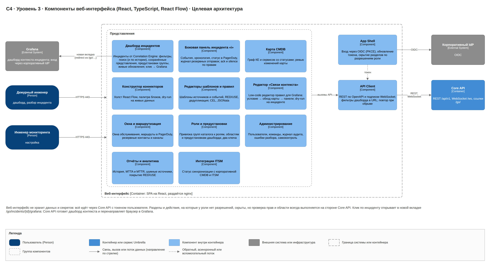

| Компонент | Что делает |
| --- | --- |
| Дашборд инцидентов | инциденты от Correlation Engine: таблица или карточки, счётчики по severity, мини-шкала по часам, фильтры, поиск (в том числе по истории), группировка, сохранённые представления, предустановки группы, экспорт CSV, массовые ack и silence, живые обновления; щелчок открывает Grafana |
| Панель инцидента «i» | тревоги и события, хронология, связь по карте, вероятная причина, статус в PagerDuty, журнал резервных отправок; ack и silence по правам |
| Карта CMDB | граф КЕ и сервисов со статусами; ревью изменений карты и конфликтов импорта из ITSM |
| Конструктор коннекторов | холст React Flow, палитра блоков, dry-run на живых данных |
| Редакторы шаблонов и правил | шаблоны источников и событий, правила RED/USE, дедупликации и корреляции; CEL, JSONata |
| Связи контекста | low-code редактор правил для Grafana: условие → обход карты → панели → раскладка; dry-run на реальном инциденте |
| Окна и маршрутизация | окна обслуживания, маршруты в PagerDuty, резервные контакты и каналы |
| Отчёты и аналитика | история, MTTA и MTTR, шумные источники, покрытие RED/USE, SLA бизнес-услуг |
| Интеграции ITSM | статус синхронизации с корпоративной CMDB и ITSM, ошибки обмена |
| Роли и предустановки | привязка групп каталога к ролям, областям и предустановкам дашборда; изменения в два ключа |
| Администрирование | пользователи, команды, журнал аудита, ошибки разбора, самоконтроль |
| App Shell | вход через OIDC (PKCE), обновление токена, скрытие разделов по разрешениям роли |
| API Client | REST по OpenAPI и подписки WebSocket; фильтры дашборда в URL; повтор при обрыве |

Дашборд инцидентов — главная страница для дежурных. Макет показывает расположение фильтров, счётчиков, шкалы, списка и боковой панели.

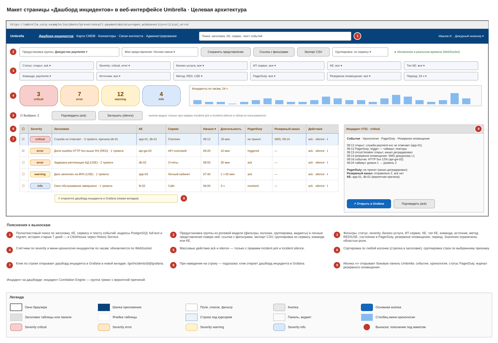

## Уровень 3. Core API

Core API пропускает каждый запрос через AuthN и RBAC Policy Engine, фильтрует данные по области пользователя и пишет каждое изменение в аудит до ответа. Secrets Broker сразу передаёт введённые логины и токены в OpenBao и возвращает ссылку.

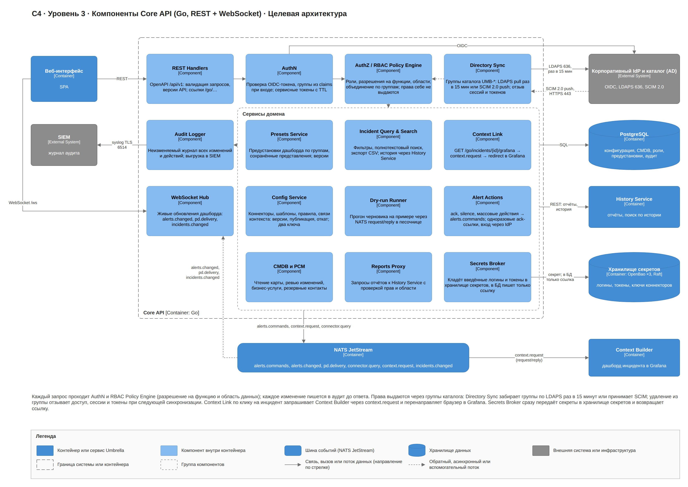

| Компонент | Что делает |
| --- | --- |
| REST Handlers | OpenAPI /api/v1, валидация запросов, версии API |
| AuthN | проверка OIDC-токена, сервисные токены с TTL, отзыв сессий и токенов |
| Directory Sync | группы каталога по LDAPS 636 раз в 15 мин (OU или префикс UMB-*) или SCIM 2.0 push от IdP; группы из claims OIDC при входе; исключённым из группы отзывает доступ |
| RBAC Policy Engine | разрешения ролей и области (бизнес-услуги, ИТ-сервисы, команды, коннекторы и источники) по привязкам групп; проверка на каждом запросе; запрет выдачи прав самому себе |
| Presets Service | предустановки дашборда по группам, их версии, приоритет групп, личные представления в пределах области |
| Audit Logger | неизменяемый журнал изменений и действий; выгрузка в SIEM по syslog TLS 6514 |
| WebSocket Hub | живые обновления дашборда по alerts.changed, incidents.changed и pd.delivery с фильтром по области |
| Incident Query & Search | список, фильтры и поиск инцидентов: горячие данные в PostgreSQL (полнотекстовый и триграммный индексы), история через History Service; экспорт CSV |
| Context Link | GET /go/incidents/{id}/grafana: проверка прав, запрос context.request в Context Builder, перенаправление в Grafana |
| Config Service | версии коннекторов, шаблонов, правил, «Связей контекста»; публикация и откат; подавление и привязки групп в два ключа |
| Dry-run Runner | прогон черновика на примере через NATS request/reply в песочнице |
| Alert Actions | ack, silence, комментарии, массовые действия → alerts.commands; принимает одноразовую подписанную ссылку из резервного сообщения после входа через IdP |
| CMDB и РСМ | чтение карты, ревью изменений, бизнес-услуги, резервные контакты сервисов |
| Reports Proxy | запросы отчётов к History Service с проверкой reports.view |
| Secrets Broker | кладёт введённые секреты в OpenBao, в БД пишет только ссылку |

Ролевая модель: пользователь входит в группы каталога, группа через привязку получает роль, область и предустановки дашборда; те же группы зеркалируются в команды Grafana.

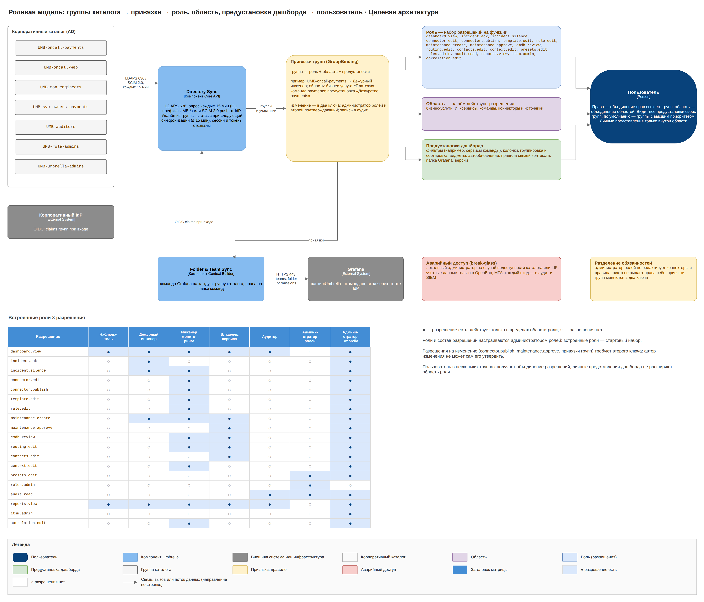

| Роль | Основные разрешения |
| --- | --- |
| Наблюдатель | dashboard.view, reports.view |
| Дежурный инженер | dashboard.view, reports.view, incident.ack, incident.silence, maintenance.create |
| Инженер мониторинга | dashboard.view, reports.view, incident.silence, connector.edit, connector.publish, template.edit, rule.edit, maintenance.create, cmdb.review, routing.edit, context.edit, correlation.edit |
| Владелец сервиса | dashboard.view, reports.view, maintenance.create, maintenance.approve, cmdb.review, routing.edit, contacts.edit |
| Аудитор | dashboard.view, reports.view, audit.read; без действий |
| Администратор ролей | roles.admin, presets.edit, audit.read; без прав на коннекторы, правила и инциденты |
| Администратор Umbrella | все разрешения, кроме roles.admin, включая itsm.admin; привязки групп меняет только Администратор ролей |

Разрешения действуют только в пределах области роли; полная матрица ролей и разрешений приведена на схеме ролевой модели.

## Уровень 3. Приём событий

Ingest Gateway только проверяет подлинность запроса и надёжно пишет тело в шину; разбор выполняет Connector Runtime тем же коннектором, что и для pull-источников.

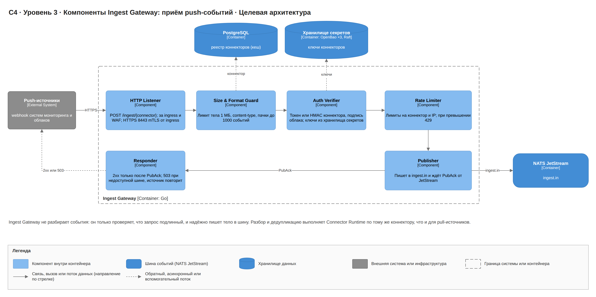

| Компонент | Что делает |
| --- | --- |
| HTTP Listener | POST /ingest/{connector}; за ingress и WAF; TLS |
| Size & Format Guard | лимит тела 1 МБ, content-type, пачки до 1000 событий |
| Auth Verifier | токен или HMAC коннектора, подпись облака; ключи из OpenBao |
| Rate Limiter | лимиты на коннектор и IP; при превышении 429 |
| Publisher | пишет в ingest.in и ждёт PubAck от JetStream |
| Responder | 2xx только после PubAck; 503 при недоступной шине, источник повторит |

Connector Runtime исполняет собранные коннекторы: ack источнику и сдвиг курсора идут строго после подтверждения записи в шину, повторы отбрасывает Inbox Dedup. Коннекторы шардируются между четырьмя репликами.

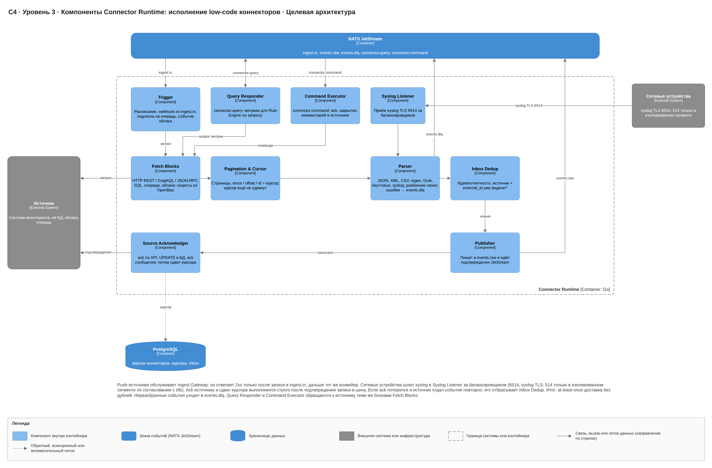

| Компонент | Что делает |
| --- | --- |
| Trigger | расписание, сообщение из ingest.in, подписка на очередь, событие облака |
| Syslog Listener | приём syslog по TLS 6514 от сетевых устройств за балансировщиком; 514 только в изолированном сегменте по согласованию с ИБ |
| Fetch Blocks | HTTP REST, GraphQL, JSON-RPC, SQL, очередь, API облака; авторизация по ссылкам на секреты OpenBao; HTTP только через egress-прокси |
| Pagination & Cursor | страницы, since / offset / id > курсор; курсор ещё не сдвинут |
| Parser | JSON, XML, CSV, regex, Grok, key=value, syslog; разбиение пачки; неразобранное → events.dlq |
| Inbox Dedup | идемпотентность по ключу источник + external_id, ключи 7 дней |
| Publisher | пишет в events.raw и ждёт PubAck |
| Source Acknowledger | ack по API, UPDATE в БД, ack сообщения очереди или ingest.in; затем сдвиг курсора |
| Query Responder | отвечает на connector.query: запросы метрик для Rule Engine и dry-run |
| Command Executor | исполняет connector.command: ack и silence обратно в источники |

Normalizer без состояния: реплики делят поток events.raw через общий durable consumer.

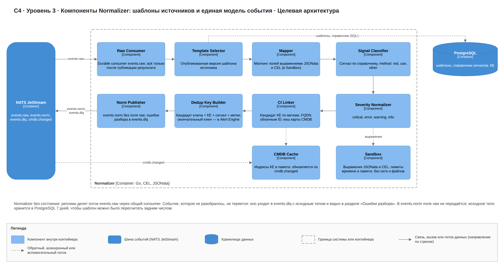

| Компонент | Что делает |
| --- | --- |
| Raw Consumer | durable consumer events.raw; ack только после публикации результата |
| Template Selector | опубликованная версия шаблона источника |
| Mapper | маппинг полей выражениями JSONata и CEL |
| Signal Classifier | сигнал по справочнику, method: red, use, other |
| Severity Normalizer | critical, error, warning, info |
| CI Linker | кандидат КЕ по меткам, FQDN, облачным ID |
| Dedup Key Builder | предварительный ключ = кандидат КЕ + сигнал + выбранные метки |
| Norm Publisher | событие в PostgreSQL (raw хранится 3 дня), events.norm без поля raw; ошибки в events.dlq |
| Sandbox | лимиты времени и памяти выражений, без сети и файлов |
| CMDB Cache | индексы КЕ в памяти, обновляются по cmdb.changed |

Rule Engine сам не ходит в источники: метрики забирает Connector Runtime через connector.query; правило включается только там, где источник не алертит.

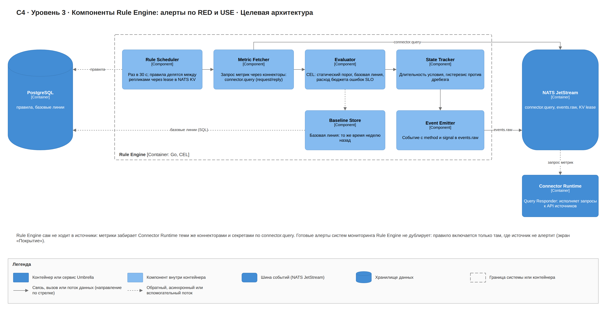

| Компонент | Что делает |
| --- | --- |
| Rule Scheduler | раз в 30 с; правила делятся между репликами через lease в NATS KV |
| Metric Fetcher | запрос метрик через connector.query (request/reply) |
| Evaluator | CEL: статический порог, базовая линия, расход бюджета ошибок SLO |
| State Tracker | длительность условия, гистерезис против дребезга |
| Baseline Store | базовая линия: то же время неделю назад |
| Event Emitter | событие с method и signal в events.raw |

## Уровень 3. Тревоги, корреляция и карта

Alert Engine хранит состояние тревог в PostgreSQL и публикует alerts.changed через transactional outbox: изменение тревоги и запись outbox делаются в одной транзакции. Группировку в инциденты выполняет Correlation Engine, Alert Engine только привязывает тревогу к инциденту.

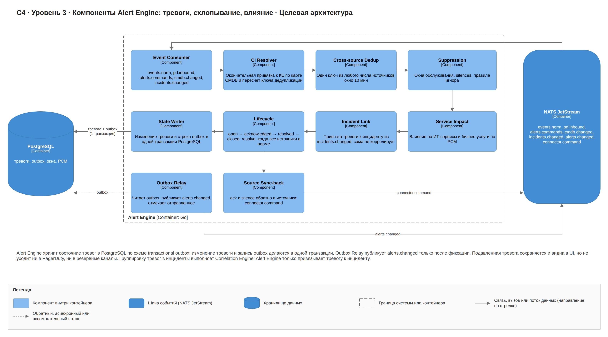

| Компонент | Что делает |
| --- | --- |
| Event Consumer | events.norm, pd.inbound, alerts.commands, cmdb.changed, incidents.changed |
| CI Resolver | окончательная привязка к КЕ по карте CMDB и пересчёт ключа дедупликации |
| Cross-source Dedup | один ключ из любого числа источников; окно 10 мин |
| Suppression | окна обслуживания, silences, правила игнора |
| Service Impact | влияние на ИТ-сервисы и бизнес-услуги по РСМ |
| Incident Link | привязка тревоги к инциденту по incidents.changed |
| Lifecycle | open → acknowledged → resolved → closed; resolve, когда все источники в норме; ack из PagerDuty или резервного канала применяется ко всем тревогам инцидента |
| State Writer | изменение тревоги и строка outbox в одной транзакции PostgreSQL |
| Outbox Relay | читает outbox, публикует alerts.changed и отмечает отправленное |
| Source Sync-back | ack и silence обратно в источники через connector.command |

Correlation Engine держит скользящее окно открытых тревог, сразу включает каждую новую тревогу в инцидент (новый или существующий), ищет общую причину по связям карты и паре RED/USE и публикует incidents.changed.

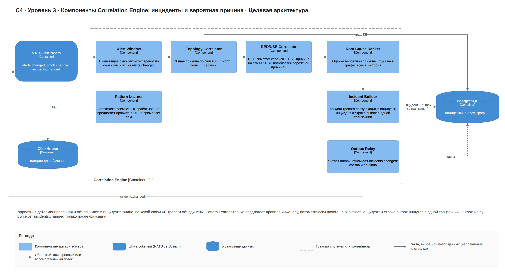

| Компонент | Что делает |
| --- | --- |
| Alert Window | скользящее окно открытых тревог по сервисам и КЕ; читает alerts.changed и cmdb.changed |
| Topology Correlator | общая причина по связям КЕ: хост → поды → сервисы, БД → сервисы |
| RED/USE Correlator | симптом сервиса (RED) + причина на его КЕ (USE); USE-тревога помечается вероятной причиной |
| Root Cause Ranker | вероятная причина: глубина в графе, время начала, история совместных срабатываний |
| Incident Builder | каждая тревога сразу входит в инцидент; состав, severity, причина, объединение инцидентов; публикует incidents.changed |
| Pattern Learner | статистика совместных срабатываний из ClickHouse; предлагает правила, сам не применяет |

CMDB Discovery строит карту КЕ из инвентаря источников и облаков и привязывает плавающие облачные ID к устойчивым КЕ. Работает в двух репликах с выбором лидера.

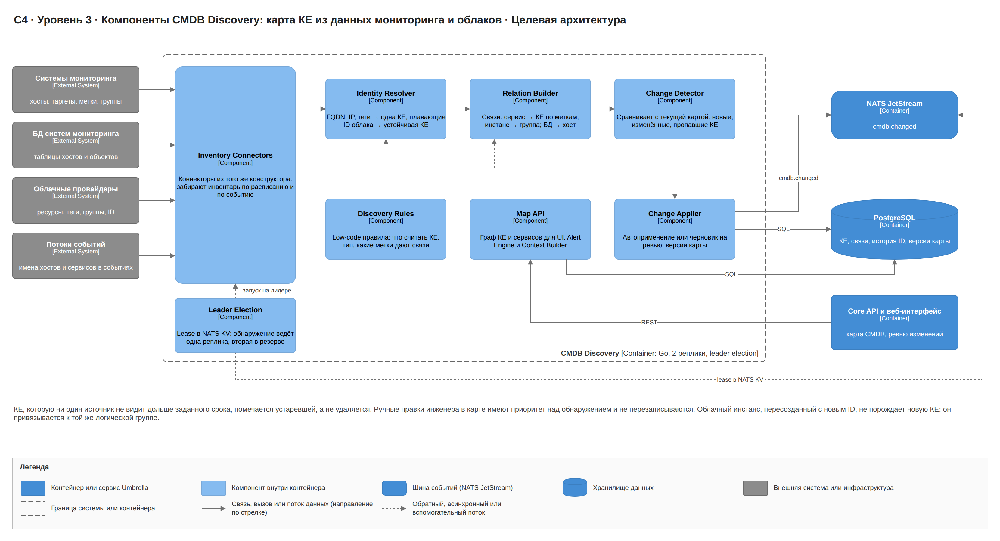

| Компонент | Что делает |
| --- | --- |
| Inventory Connectors | коннекторы того же конструктора: инвентарь по расписанию и по событию |
| Identity Resolver | FQDN, IP, теги → одна КЕ; плавающие ID облака → устойчивая КЕ |
| Relation Builder | связи: сервис → КЕ по меткам, инстанс → группа, БД → хост |
| Change Detector | сравнение с текущей картой: новые, изменённые, пропавшие КЕ |
| Discovery Rules | low-code правила: что считать КЕ, тип, какие метки дают связи |
| Change Applier | автоприменение доверенных добавлений или черновик на ревью; версии карты; cmdb.changed |
| Map API | граф КЕ и сервисов для Core API, Alert Engine и Context Builder |
| Leader Election | lease в NATS KV: обнаружение ведёт одна из двух реплик, вторая в резерве |

ITSM Sync выгружает технические КЕ в корпоративную CMDB, импортирует бизнес-услуги и владельцев, создаёт инциденты в ITSM для критичных бизнес-услуг и синхронизирует статусы; адаптеры собираются блоками конструктора. Работает в двух репликах с выбором лидера.

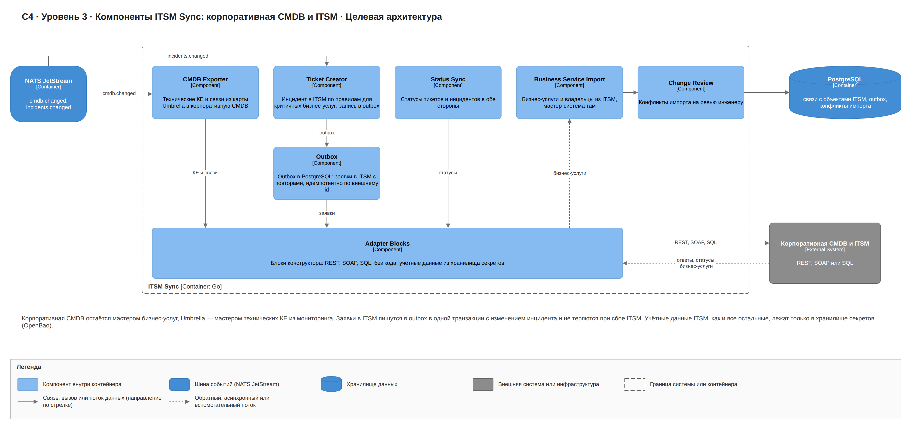

| Компонент | Что делает |
| --- | --- |
| CMDB Exporter | технические КЕ и связи из карты Umbrella в корпоративную CMDB по cmdb.changed |
| Business Service Import | бизнес-услуги и владельцы из ITSM; мастер-система — ITSM |
| Ticket Creator | инцидент в ITSM по incidents.changed для критичных бизнес-услуг |
| Status Sync | статусы инцидентов в обе стороны |
| Change Review | конфликты импорта на ревью инженеру |
| Outbox Relay | outbox в PostgreSQL: заявки в ITSM с повторами, идемпотентно по внешнему id |
| Adapter Blocks | блоки конструктора REST, SOAP, SQL; учётные данные по ссылкам из OpenBao |

## Уровень 3. Оповещение

PagerDuty Gateway ведёт основной канал: outbox в PostgreSQL, повторы с backoff, circuit breaker (5 ошибок подряд или 60 с без ответа); Delivery Tracker сообщает в pd.delivery, принял ли PagerDuty событие. On-call Sync раз в 5 минут копирует расписания на 7 дней вперёд и escalation policy в кеш дежурств; токен REST API только на чтение.

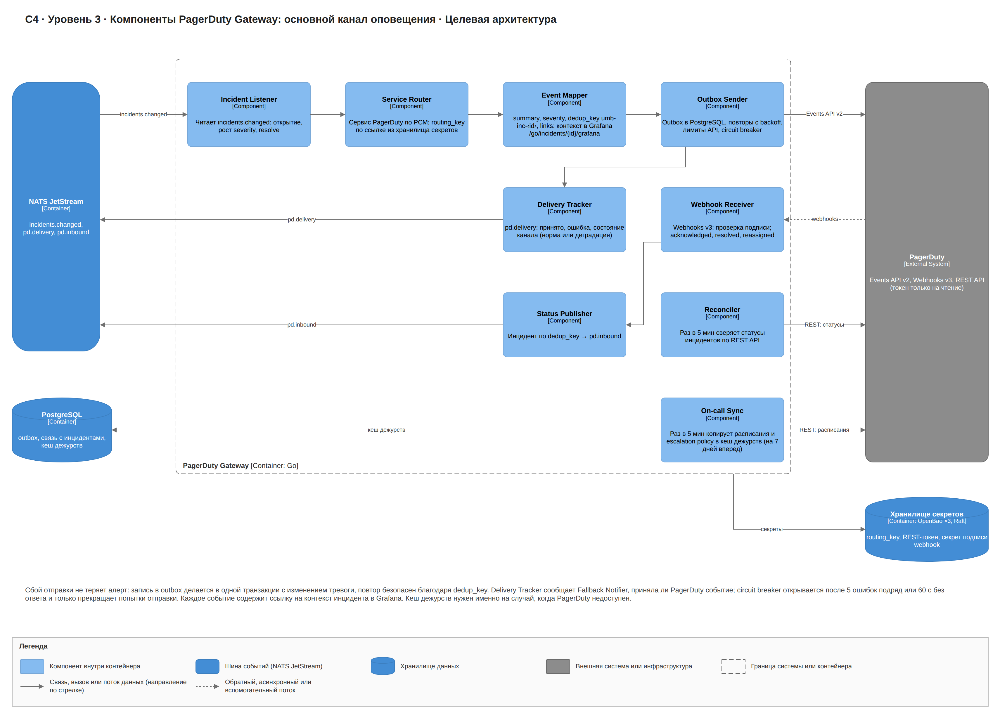

| Компонент | Что делает |
| --- | --- |
| Incident Listener | читает incidents.changed: открытие, рост severity, ack, resolve, объединение |
| Service Router | сервис PagerDuty по РСМ; routing_key по ссылке из OpenBao |
| Event Mapper | шаблон события → summary, severity, dedup_key umb-inc-‹id›, custom_details с причиной и влиянием, links со ссылкой на контекст в Grafana |
| Outbox Sender | outbox в PostgreSQL, повторы с backoff, лимиты API, circuit breaker |
| Delivery Tracker | pd.delivery: принято, ошибка, состояние канала (норма или деградация) |
| Webhook Receiver | Webhooks v3: проверка подписи; acknowledged, resolved, reassigned |
| Status Publisher | инцидент по dedup_key → pd.inbound |
| Reconciler | раз в 5 мин сверяет статусы инцидентов по REST API |
| On-call Sync | расписания, escalation policy, уровни и их таймауты в кеш дежурств |

Fallback Notifier включается для тревог error и critical, когда алерт их инцидента не принят PagerDuty за 2 минуты с момента открытия тревоги; открытый circuit breaker прекращает попытки отправки, но отсчёт 2 минут продолжается. Оповещение идёт по уровням escalation policy из кеша, подтверждение принимается прямо из сообщения.

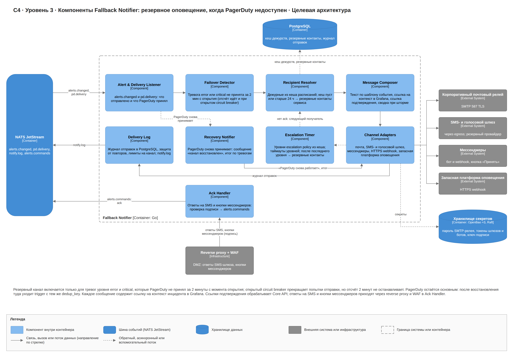

| Компонент | Что делает |
| --- | --- |
| Alert & Delivery Listener | alerts.changed и pd.delivery: что отправлено и что PagerDuty принял |
| Failover Detector | тревога error или critical не принята за 2 мин; состояние circuit breaker |
| Recipient Resolver | дежурные уровня из кеша; кеш пуст или старше 24 ч → резервные контакты сервиса |
| Message Composer | текст по шаблону события, ссылка на контекст в Grafana, сводка при шторме |
| Channel Adapters | SMS-шлюз (основной и резервный маршрут), голосовой шлюз, мессенджеры, почта через корпоративный релей, webhook, запасная платформа оповещения |
| Escalation Timer | уровни escalation policy и их таймауты; после последнего уровня — резервные контакты |
| Delivery Log | журнал отправок, защита от повторов, лимиты и бюджет на канал, notify.log |
| Ack Handler | ответы SMS, кнопки мессенджеров и клавиши звонка через reverse proxy + WAF: проверка подписи провайдера, одноразового токена и отправителя по кешу → alerts.commands |
| Recovery Notifier | «PagerDuty снова работает»: trigger с теми же dedup_key, подтверждённые как acknowledge, итог по тревогам |

Watchdog раз в минуту прогоняет тестовое событие через конвейер до PagerDuty Gateway (тестовый сервис PagerDuty с автоматическим resolve и низкой срочностью), раз в сутки проверяет каждый резервный канал и следит за отставанием резервной площадки. Работает в двух репликах с выбором лидера.

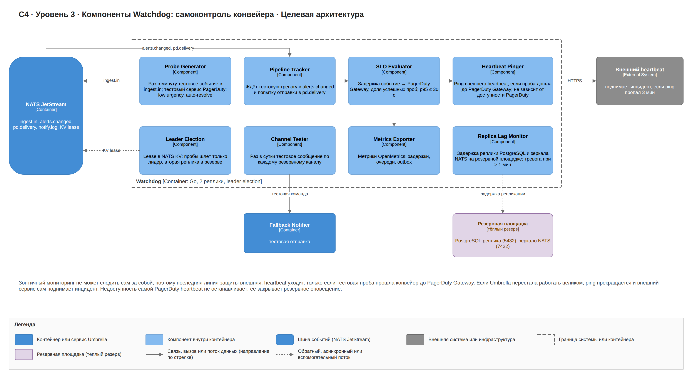

| Компонент | Что делает |
| --- | --- |
| Probe Generator | раз в минуту тестовое событие через синтетический коннектор в ingest.in |
| Pipeline Tracker | ждёт тестовую тревогу в alerts.changed и её приём PagerDuty Gateway в pd.delivery |
| SLO Evaluator | задержка событие → PagerDuty, доля успешных проб, порог 30 с |
| Heartbeat Pinger | ping внешнего heartbeat, если проба дошла до PagerDuty Gateway, независимо от доступности PagerDuty |
| Channel Tester | раз в сутки тестовое сообщение по каждому резервному каналу через Fallback Notifier |
| Replica Lag Monitor | отставание реплики PostgreSQL и зеркала NATS на резервной площадке, возраст снапшота OpenBao |
| Metrics Exporter | метрики OpenMetrics: задержки, очереди, outbox |
| Leader Election | одна активная реплика проб |

## Уровень 3. Context Builder

Context Builder генерирует дашборд Grafana для инцидента по «Связям контекста». Он не хранит метрики, логи и трейсы: в дашборде только запросы к существующим хранилищам, которые Grafana выполняет сама.

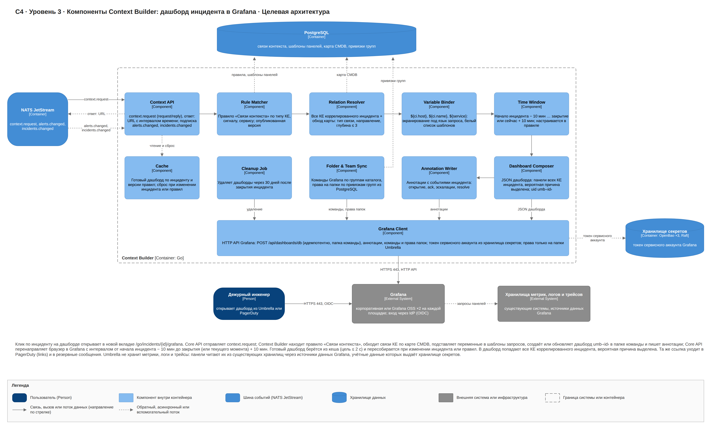

| Компонент | Что делает |
| --- | --- |
| Context API | отвечает на NATS request/reply context.request от Core API: URL дашборда с окном времени |
| Rule Matcher | подбирает опубликованные правила «Связей контекста» по типу КЕ, сигналу и сервису |
| Relation Resolver | обходит граф карты CMDB от всех КЕ инцидента: тип связи, направление, глубина ≤ 3 |
| Variable Binder | подставляет ${ci.host}, ${ci.name}, ${service} в шаблоны из белого списка с экранированием под язык запроса; свободный текст из событий в запросы не попадает |
| Time Window | окно от начала инцидента − 10 мин до закрытия (или сейчас) + 10 мин, либо окно правила |
| Dashboard Composer | JSON дашборда: строка вероятной причины сверху, панели метрик, логов и трейсов по КЕ инцидента, сводка инцидента |
| Grafana Client | POST /api/dashboards/db в папку команды, uid umb-‹id›, повтор безопасен; сервисный токен из OpenBao с правами только на папки Umbrella |
| Annotation Writer | аннотации с событиями инцидента: открытие, ack, эскалация, resolve |
| Folder & Team Sync | команды Grafana по группам каталога и права на папки команд |
| Cleanup Job | удаляет дашборды через 30 дней после закрытия инцидента |
| Cache | готовые дашборды; сбрасывается при изменении инцидента или правил |

Пример сгенерированного дашборда для инцидента «служба приложения упала»: строка причины, CPU, RAM и диск хоста, логи и трейсы службы, метрики связанной БД, аннотации событий.

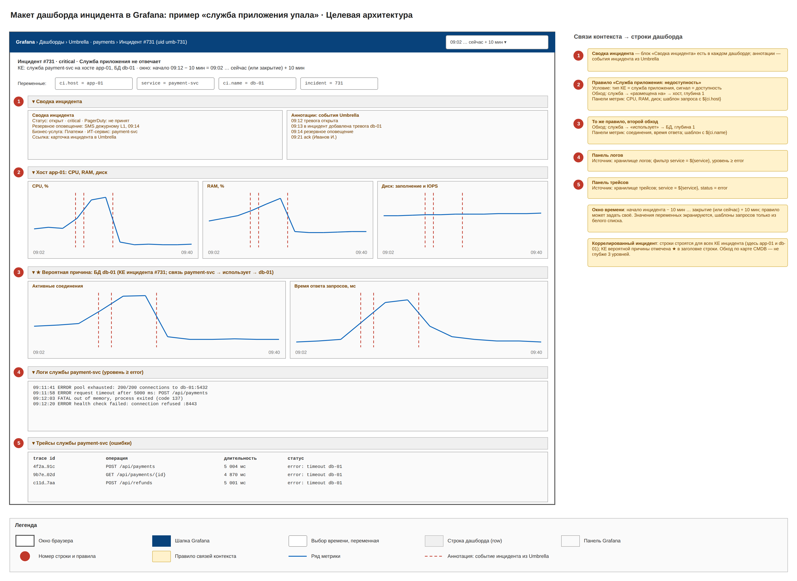

## Уровень 3. History Service

History Service пакетно пишет потоки в ClickHouse, держит партиции по дням с TTL 13 месяцев и агрегаты на 3 года, отдаёт отчёты и поиск по истории и маскирует поля по правам.

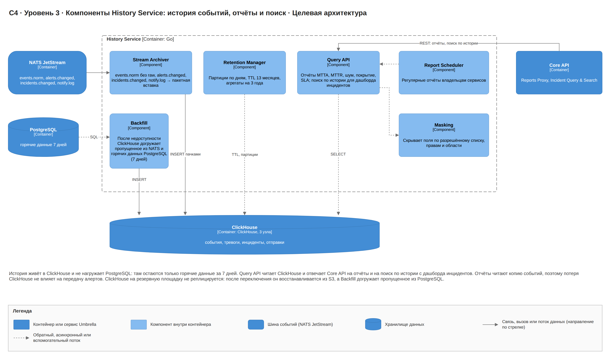

| Компонент | Что делает |
| --- | --- |
| Stream Archiver | events.norm (без поля raw), alerts.changed, incidents.changed, notify.log → пакетная вставка в ClickHouse |
| Retention Manager | партиции по дням, TTL 13 месяцев, агрегаты на 3 года |
| Query API | отчёты MTTA, MTTR, шум по источникам, покрытие, SLA услуг; поиск инцидентов по истории для дашборда |
| Report Scheduler | регулярные отчёты владельцам сервисов |
| Masking | скрывает поля по разрешённому списку и области пользователя |

После недоступности ClickHouse History Service догружает пропущенное: из потоков NATS, пока они хранятся, а более раннее — из горячих данных PostgreSQL (7 дней).

## Потоки шины

В шине 13 потоков и отдельный subject request/reply context.request. ingest.in — сырые push-события от Ingest Gateway и Watchdog; events.raw — события после парсинга и от Rule Engine; events.dlq — неразобранные события; events.norm — нормализованные события без поля raw; alerts.changed — изменения тревог; alerts.commands — команды людей (ack, resolve, silence); pd.delivery — приём событий PagerDuty и состояние канала; pd.inbound — статусы из PagerDuty; connector.query — запросы метрик и dry-run в режиме request/reply; connector.command — ack и silence в источники; cmdb.changed — изменения карты; notify.log — журнал резервных отправок; incidents.changed — состав инцидентов и вероятная причина. context.request — запрос Core API на генерацию контекста в Grafana. ingest.in, events.raw и events.norm хранятся 24 ч, events.dlq 14 дней, notify.log 30 дней, остальные потоки 7 дней. WebSocket Hub в Core API читает alerts.changed, incidents.changed и pd.delivery; Alert Engine читает cmdb.changed и incidents.changed; Connector Runtime читает alerts.changed для коннектора статусов Inventory DB.

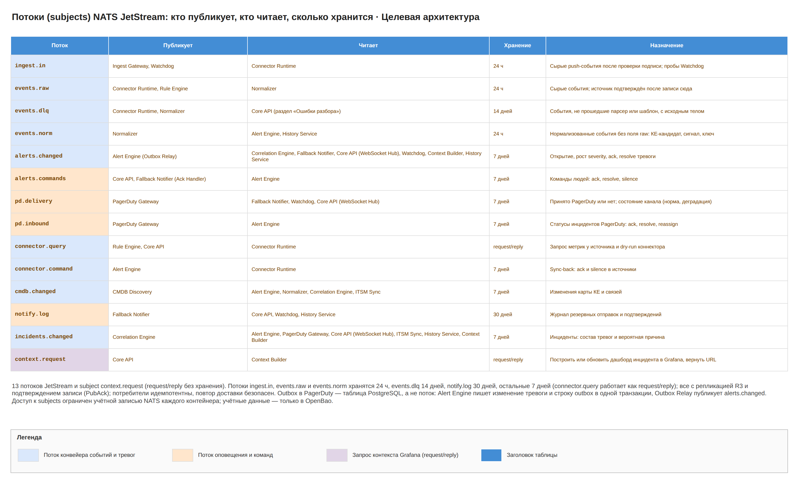

## Компоненты и интерфейсы

Каждый контейнер показан с интерфейсами, которые он предоставляет (●) и использует (○).

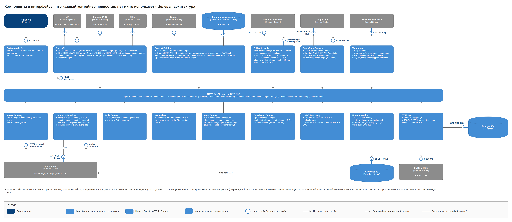

## Проведение сеанса

Последовательность одного события от pull-источника до ack и resolve: Connector Runtime → Normalizer → Alert Engine → Correlation Engine (alerts.changed → incidents.changed) → PagerDuty Gateway с dedup_key umb-inc-‹id›; внизу разобраны сбои внутри сеанса.

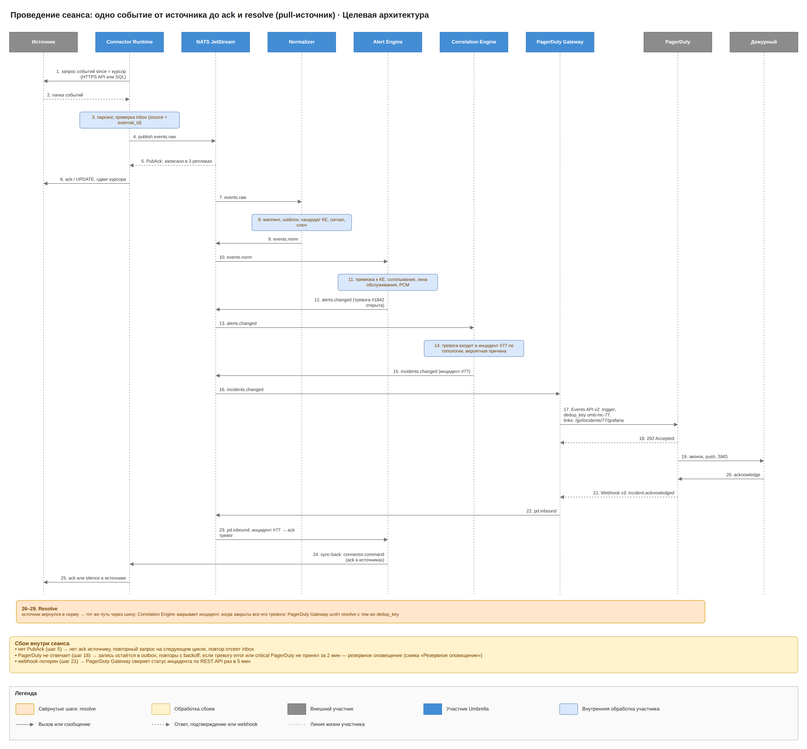

## Резервное оповещение

Последовательность, когда PagerDuty не принимает алерт: выбор дежурных уровня из кеша, SMS, звонок или мессенджер с кнопкой; без подтверждения за таймаут уровня — следующий уровень; подтверждение из сообщения через Ack Handler; когда PagerDuty снова принимает события — trigger с тем же dedup_key.

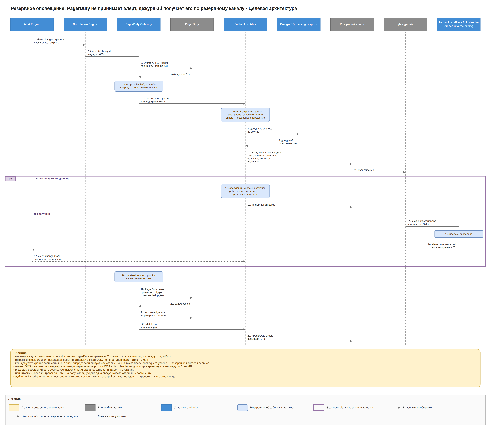

## Открытие инцидента в Grafana

Последовательность от щелчка на дашборде инцидентов до открытого дашборда Grafana: Core API проверяет права, Context Builder строит или берёт из кеша дашборд, сохраняет его через HTTP API и пишет аннотации, браузер переходит по URL с окном времени. Если Grafana недоступна, пользователь видит страницу с ошибкой и ссылкой на боковую панель инцидента в Umbrella.

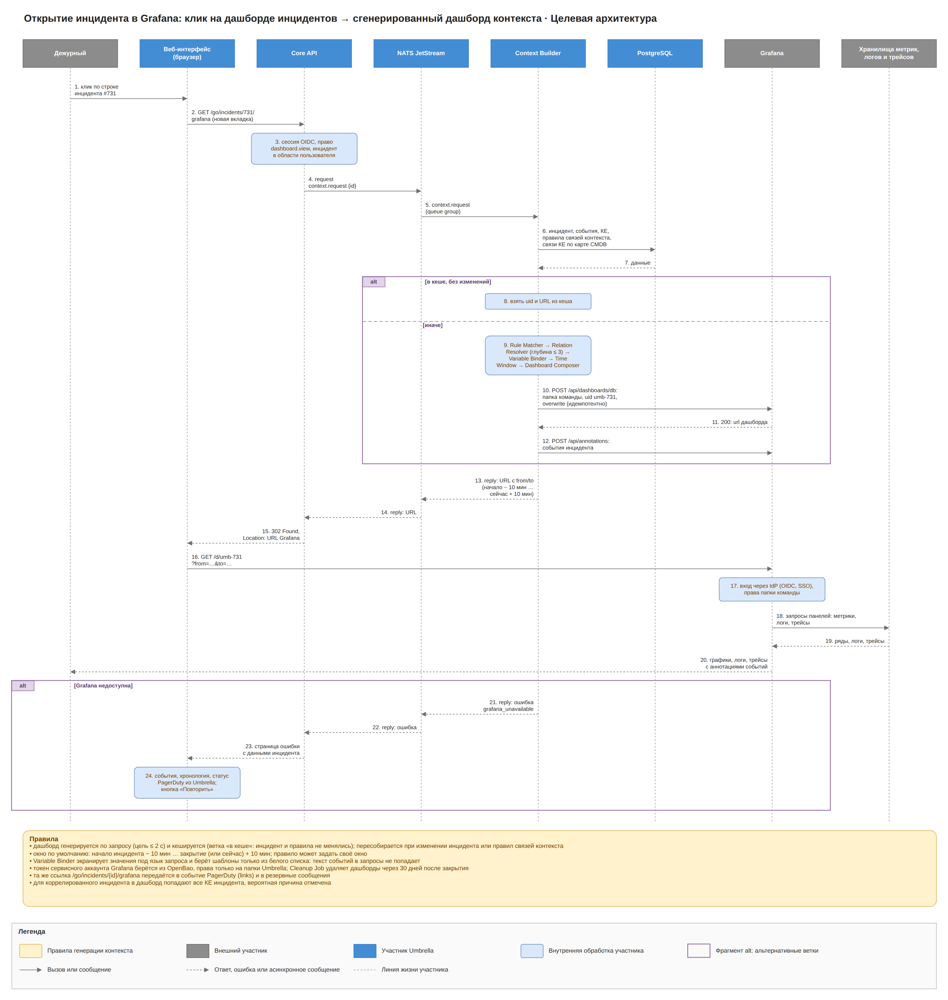

## Модель данных

Логическая модель в PostgreSQL: конфигурация (коннекторы, шаблоны, правила, правила обнаружения, «Связи контекста» и шаблоны панелей), операционные данные (события, тревоги, инциденты, outbox, inbox, окна обслуживания, silences), CMDB и РСМ, резервное оповещение (кеш дежурств с таймаутами уровней, резервные контакты, уведомления), связи с объектами ITSM, дашборды Grafana, доступ (группы каталога, привязки, роли, разрешения, области, предустановки, сохранённые представления, пользователи) и аудит. Инцидент содержит одну или несколько тревог (Incident 1:N Alert, Alert.incident_id). История событий и тревог лежит в ClickHouse. Секретов в БД нет, только ссылки.

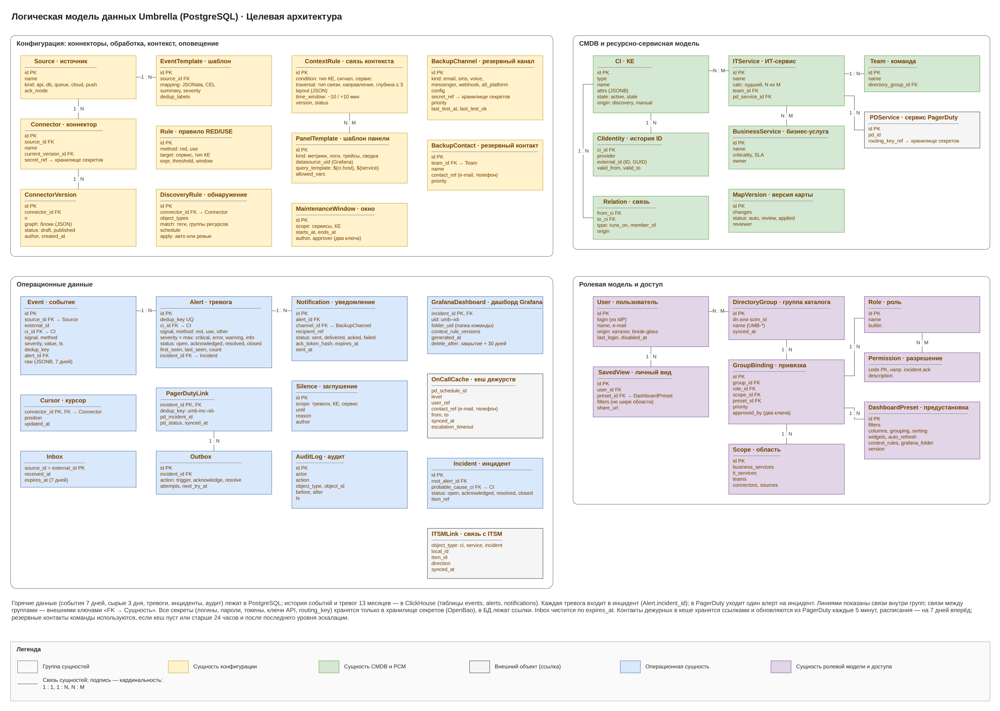

## Слои ИТ-модели

Пять слоёв: бизнес, прикладной слой Umbrella, данные, технологии, инфраструктура; нижний слой обслуживает верхний. Внешние приложения (PagerDuty, Grafana, CMDB и ITSM, каталог, резервные каналы) показаны боковой колонкой «интеграция».

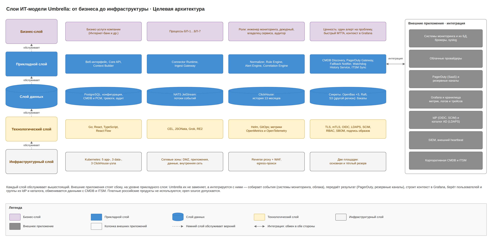
