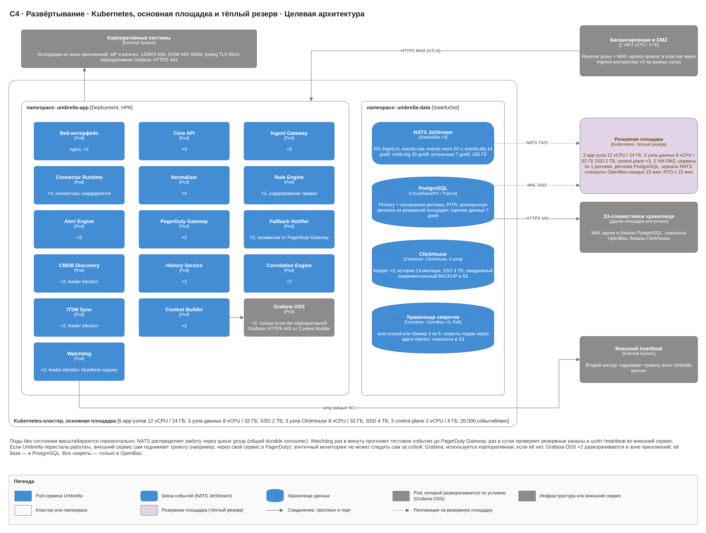
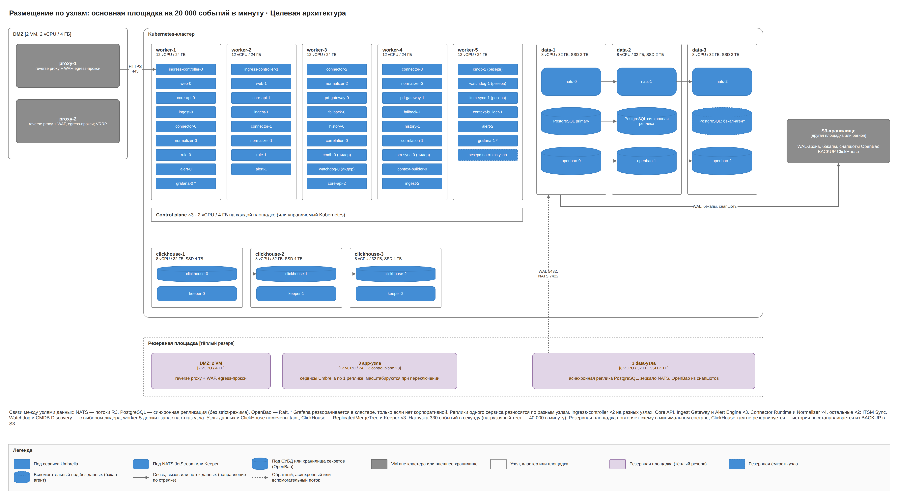
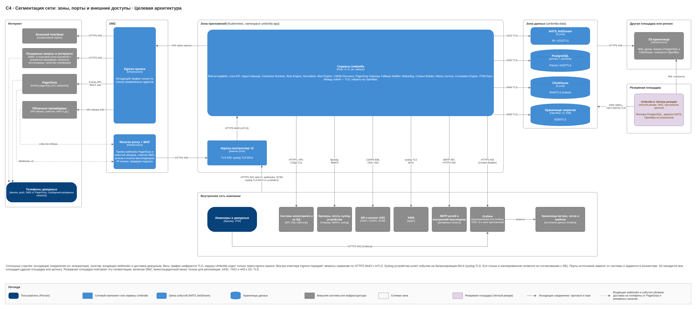
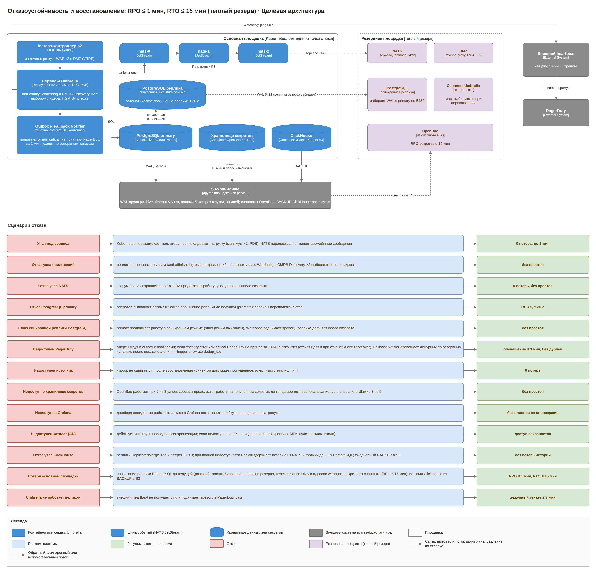
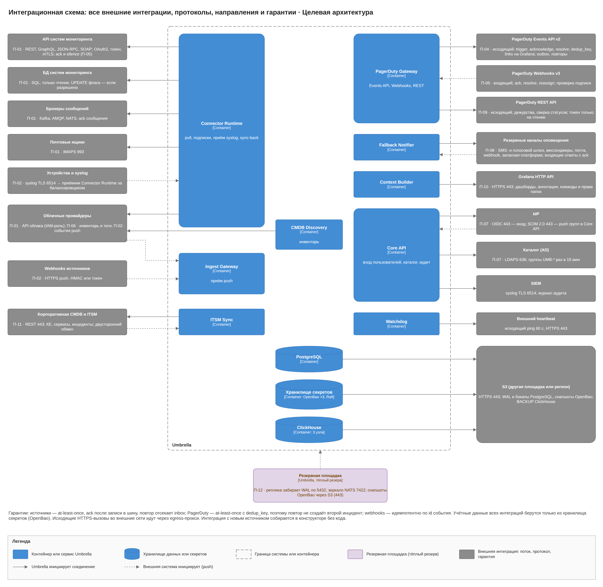

# Umbrella · целевая архитектура · 4. Инфраструктура и технологии

Целевой контур — это две площадки в Kubernetes. Основная: пять app-узлов, три узла данных, три узла ClickHouse и две VM в DMZ; резервная в тёплом резерве: три app-узла, три узла данных и две VM в DMZ. Контур держит 20 000 событий в минуту с доступностью 99,95%, RPO ≤ 1 мин и RTO ≤ 15 мин.

## Развёртывание

На основной площадке каждый сервис работает в двух–четырёх репликах на разных узлах; реплики одного контейнера делят работу через queue group (общий durable consumer) NATS. CMDB Discovery, ITSM Sync и Watchdog работают в двух репликах с выбором лидера. PDB не даёт остановить больше одной реплики сервиса при обслуживании узлов, HPA добавляет реплики Connector Runtime и Normalizer при росте очереди. Fallback Notifier развёрнут отдельно от PagerDuty Gateway, чтобы сбой одного не выключал другой. Секреты попадают в поды только через agent injector OpenBao; Kubernetes Secrets для учётных данных не используются. Развёртывание обеих площадок ведётся через GitOps (Helm-чарты в Git).

Резервная площадка держит сервисы в минимальном составе (по одной реплике), асинхронную реплику PostgreSQL, зеркало потоков NATS и восстанавливаемый из снапшота OpenBao.

## Размещение по узлам

| Площадка | Узлы | Что размещено |
| --- | --- | --- |
| Основная | 5 app-узлов по 12 vCPU / 24 ГБ | все сервисы Umbrella, Grafana (если разворачивается), ingress-контроллер ×2 на разных узлах; пятый узел — запас N+1 |
| Основная | 3 узла данных по 8 vCPU / 32 ГБ, SSD 2 ТБ | NATS JetStream ×3, PostgreSQL (ведущая и синхронная реплика), OpenBao ×3 (Raft) |
| Основная | 3 узла ClickHouse по 8 vCPU / 32 ГБ, SSD 4 ТБ | ClickHouse ×3 и ClickHouse Keeper ×3 |
| Основная | 2 VM в DMZ по 2 vCPU / 4 ГБ | reverse proxy + WAF, egress-прокси |
| Резервная | 3 app-узла по 12 vCPU / 24 ГБ | сервисы по одной реплике, при переключении масштабируются |
| Резервная | 3 узла данных по 8 vCPU / 32 ГБ, SSD 2 ТБ | асинхронная реплика PostgreSQL, NATS ×3 с зеркалом потоков, OpenBao ×3 |
| Резервная | 2 VM в DMZ по 2 vCPU / 4 ГБ | reverse proxy + WAF, egress-прокси |

Control plane Kubernetes — три узла по 2 vCPU / 4 ГБ на каждой площадке или управляемый Kubernetes.

## Сегментация сети

Четыре сетевые зоны на каждой площадке: DMZ, зона приложений, зона данных и внутренняя сеть. ClickHouse живёт в зоне данных. Наружу Umbrella ходит только через egress-прокси (PagerDuty, облачные мессенджеры, SMS- и голосовой шлюз, запасная платформа, heartbeat, API облаков); снаружи принимает только webhooks PagerDuty, события облаков, ответы SMS-шлюза и нажатия кнопок мессенджеров через reverse proxy с WAF. Межплощадочный канал используется только для репликации. S3-хранилище бэкапов находится на другой площадке или в другом регионе.

| Откуда | Куда | Порт / протокол |
| --- | --- | --- |
| Пользователи (браузер) | Ingress: веб-интерфейс, Core API, WebSocket | 443 HTTPS |
| Пользователи (браузер) | Grafana | 443 HTTPS, вход через IdP по OIDC |
| Системы мониторинга с webhook во внутренней сети | Ingress → Ingest Gateway | 443 HTTPS |
| PagerDuty (Webhooks v3), облачные провайдеры, SMS-шлюз (ответы), мессенджеры (кнопки) | Reverse proxy + WAF в DMZ | 443 HTTPS, подпись запроса |
| Reverse proxy | Ingress | 443 HTTPS |
| Ingress | Сервисы Umbrella | 8443 HTTPS (mTLS) |
| Сервисы Umbrella | NATS | 4222 TLS |
| Сервисы Umbrella, Grafana (её база, если разворачивается) | PostgreSQL | 5432 TLS |
| Сервисы Umbrella (agent injector) | OpenBao | 8200 TLS |
| History Service, Correlation Engine (Pattern Learner) | ClickHouse | 9440 TLS (native) |
| Узлы ClickHouse между собой | ClickHouse, Keeper | 9010 HTTPS (репликация), 9281 TLS (Keeper) |
| Сетевые устройства, системы с syslog | Балансировщик → слушатель syslog Connector Runtime | 6514 syslog TLS; 514 только в изолированном сегменте по согласованию с ИБ |
| Connector Runtime, CMDB Discovery | API систем мониторинга | HTTPS, порт задаётся в коннекторе |
| Connector Runtime, CMDB Discovery | БД систем мониторинга | порт СУБД, TLS |
| Connector Runtime | брокеры сообщений, почтовые ящики | порт брокера с TLS, 993 IMAPS |
| Connector Runtime, CMDB Discovery | API облаков через egress-прокси | 443 HTTPS |
| Core API | IdP | 443 OIDC |
| Core API (Directory Sync) | корпоративный каталог | 636 LDAPS |
| IdP (SCIM 2.0 push) | Ingress → Core API | 443 HTTPS |
| Core API (Audit Logger) | SIEM | 6514 syslog TLS |
| Context Builder | Grafana HTTP API (внутренняя сеть или зона приложений) | 443 HTTPS |
| Grafana | хранилища метрик, логов и трейсов (вне Umbrella) | порты хранилищ, TLS |
| PagerDuty Gateway, Watchdog | events.pagerduty.com, api.pagerduty.com, внешний heartbeat через egress | 443 HTTPS |
| Fallback Notifier | корпоративный почтовый релей (внутренний) | 587 SMTP STARTTLS |
| Fallback Notifier | внутренний мессенджер (webhook напрямую) | 443 HTTPS |
| Fallback Notifier | облачные мессенджеры, SMS- и голосовой шлюз, запасная платформа через egress | 443 HTTPS |
| Fallback Notifier | резервный маршрут к SMS-шлюзу второго поставщика через отдельный канал связи | 443 HTTPS |
| ITSM Sync | корпоративная CMDB и ITSM | 443 HTTPS |
| PostgreSQL, ClickHouse, OpenBao | S3-хранилище (другая площадка или регион) | 443 HTTPS |
| Реплика PostgreSQL резервной площадки | ведущая PostgreSQL основной площадки (реплика забирает WAL) | 5432 TLS |
| NATS резервной площадки | NATS основной площадки (leafnode, зеркало потоков) | 7422 TLS |
| OpenBao резервной площадки | снапшоты Raft в S3 | 443 HTTPS |

## Сайзинг

Оценка для 20 000 событий в минуту при среднем размере события 2 КБ: около 57 ГБ сырых событий в сутки. В ClickHouse после сжатия около 6 ГБ в сутки вместе с тревогами, инцидентами и журналом отправок; 13 месяцев ≈ 2,4 ТБ на реплику. Цифры подтверждает нагрузочный тест на 40 000 событий в минуту на этапе 10.

| Компонент | Реплик | CPU / RAM на реплику | Диск |
| --- | --- | --- | --- |
| Веб-интерфейс (nginx) | 2 | 0,25 vCPU / 256 МБ | — |
| Core API | 3 | 1 vCPU / 1 ГБ | — |
| Ingest Gateway | 3 | 0,5 vCPU / 512 МБ | — |
| Connector Runtime | 4 | 1,5 vCPU / 2 ГБ | — |
| Normalizer | 4 | 1 vCPU / 1 ГБ | — |
| Rule Engine | 2 | 1 vCPU / 1 ГБ | — |
| Alert Engine | 3 | 1,5 vCPU / 2 ГБ | — |
| Correlation Engine | 2 | 2 vCPU / 4 ГБ | — |
| CMDB Discovery (выбор лидера) | 2 | 1 vCPU / 2 ГБ | — |
| ITSM Sync (выбор лидера) | 2 | 0,5 vCPU / 512 МБ | — |
| PagerDuty Gateway | 2 | 0,5 vCPU / 512 МБ | — |
| Fallback Notifier | 2 | 0,5 vCPU / 512 МБ | — |
| Watchdog (выбор лидера) | 2 | 0,25 vCPU / 256 МБ | — |
| Context Builder | 2 | 0,5 vCPU / 1 ГБ | — |
| History Service | 2 | 1 vCPU / 2 ГБ | — |
| Grafana OSS (если корпоративной нет) | 2 | 0,5 vCPU / 1 ГБ | база в PostgreSQL |
| Ingress-контроллер | 2 | 0,5 vCPU / 512 МБ | — |
| NATS JetStream | 3 | 2 vCPU / 8 ГБ | 250 ГБ SSD: ingest.in, events.raw, events.norm по 24 ч (events.norm без поля raw), events.dlq 14 дней, notify.log 30 дней, остальные потоки 7 дней |
| PostgreSQL | 2 + асинхронная реплика на резервной площадке | 4 vCPU / 16 ГБ | ≈ 600 ГБ: нормализованные события без raw 7 дней (~100 ГБ), raw 3 дня (~175 ГБ), полнотекстовые и триграммные индексы (~150 ГБ), тревоги, инциденты, конфигурация, inbox 7 дней, журналы (~75 ГБ), WAL (~100 ГБ) |
| ClickHouse | 3 + Keeper ×3 | 8 vCPU / 32 ГБ | 4 ТБ SSD: 13 месяцев ≈ 2,4 ТБ; расширение при заполнении 70% |
| OpenBao | 3 | 0,5 vCPU / 1 ГБ | 10 ГБ SSD, Raft |

Запросы сервисов на app-узлах в сумме около 36 vCPU и 50 ГБ и помещаются на четыре узла (48 vCPU / 96 ГБ) с запасом под системные поды, то есть контур переживает потерю одного app-узла. На узле данных PostgreSQL, NATS и OpenBao занимают до 6,5 vCPU и 25 ГБ, поэтому при потере узла данных PostgreSQL продолжает работу на оставшемся узле с повышенной репликой, а NATS и OpenBao — на двух узлах из трёх.

S3: бэкапы PostgreSQL (WAL и ежедневные снимки, 30 дней), ежедневные инкрементальные BACKUP ClickHouse и снапшоты OpenBao, всего около 10 ТБ.

Резервная площадка: 3 app-узла по 12 vCPU / 24 ГБ, 3 узла данных по 8 vCPU / 32 ГБ с SSD 2 ТБ, 2 VM в DMZ. ClickHouse на резервной площадке не держится: при длительной работе на резерве он разворачивается из бэкапа в S3, а до этого история за 7 дней доступна из PostgreSQL и после восстановления догружается History Service.

## Отказоустойчивость и восстановление

- Каждый сервис в двух и более репликах на разных узлах; ingress-контроллер ×2 на разных узлах; CMDB Discovery, ITSM Sync и Watchdog ×2 с выбором лидера; единых точек отказа внутри площадки нет.
- NATS в трёх узлах с репликацией R3 переживает потерю одного узла без потери событий.
- PostgreSQL: ведущая и синхронная реплика под Patroni или CloudNativePG без строгого режима: при отказе реплики ведущая продолжает работу асинхронно и поднимается тревога; автоматическое повышение реплики до ведущей (promote) до 30 с. archive_timeout ≤ 60 с.
- OpenBao в трёх узлах (Raft); сервисы держат полученные секреты в памяти до конца аренды.
- ClickHouse: ReplicatedMergeTree и Keeper 2 из 3; при полной недоступности ClickHouse события копятся в потоках NATS, после восстановления History Service догружает пропущенное из NATS и из горячих данных PostgreSQL (7 дней); передача алертов не страдает.
- Бэкапы в S3 на другой площадке или в другом регионе: WAL PostgreSQL непрерывно и полный снимок раз в сутки, хранение 30 дней; ClickHouse — ежедневный инкрементальный BACKUP; снапшоты Raft OpenBao каждые 15 минут и сразу после изменения секрета.
- Тёплый резерв: асинхронная реплика PostgreSQL забирает WAL с основной площадки, потоки NATS зеркалируются через leafnode, OpenBao восстанавливается из последнего снапшота. Переключение: повышение реплики до ведущей (promote), масштабирование сервисов резерва, смена DNS и адресов webhook у PagerDuty, облаков, SMS-шлюза и мессенджеров. RPO ≤ 1 мин, RTO ≤ 15 мин; RPO секретов ≤ 15 мин.
- Push-события, которые JetStream уже принял, но которые ещё не попали в PostgreSQL и в зеркало, при потере площадки могут быть потеряны (до 1 мин); pull-источники перечитываются с сохранённого курсора.
- Недоступен PagerDuty: инциденты ждут в outbox; тревоги error и critical, не принятые за 2 минуты, уходят по резервным каналам. При общем сбое интернета работают внутренний мессенджер и почтовый релей, а SMS-шлюз доступен по резервному маршруту второго поставщика.
- Недоступна Grafana: дашборд инцидентов и боковая панель Umbrella работают, ссылка на Grafana показывает страницу с ошибкой; оповещение не затронуто.
- Недоступен каталог: действуют группы последней успешной синхронизации; вход по OIDC работает, пока доступен IdP; при недоступности IdP — локальный администратор break-glass.
- Umbrella не работает целиком: внешний heartbeat не получает ping и поднимает тревогу в PagerDuty сам не позже 3 мин.

## Интеграционная схема

Все внешние интеграции с протоколом, направлением и гарантией; учётные данные всех интеграций берутся только из OpenBao.

## Наблюдаемость самой Umbrella

Все сервисы отдают метрики OpenMetrics и трассировки OpenTelemetry: задержка от события до ответа PagerDuty, длина очередей и outbox, доля схлопнутых событий, доля тревог в инцидентах из нескольких тревог, события без КЕ, ошибки разбора, задержка записи в ClickHouse, ошибки обмена с ITSM, время генерации контекста в Grafana, возраст последней синхронизации с каталогом, отставание реплики PostgreSQL и зеркала NATS на резервной площадке, отправки и доля подтверждений по каждому резервному каналу, результат ежедневной проверки каналов. Отказ самой Umbrella ловит внешний heartbeat.

## Технологии и обоснование

| Слой | Выбор | Почему |
| --- | --- | --- |
| Бэкенд и коннекторы | Go | высокая пропускная способность, один бинарник, зрелые драйверы HTTP, SQL, Kafka, AMQP, NATS, SDK облаков и CEL |
| Шина событий | NATS JetStream | персистентные потоки с перечитыванием, request/reply, зеркалирование потоков на вторую площадку из коробки; проще Kafka в эксплуатации |
| Горячие данные | PostgreSQL 16 | реляционная карта CMDB и РСМ, транзакции outbox и inbox, полнотекстовый и триграммный поиск для дашборда |
| История | ClickHouse | open source, сжатие в 8–10 раз, быстрые агрегаты по миллиардам строк; не платный продукт, соответствует ADR-09 |
| Фронтенд | React, TypeScript, React Flow | готовый холст для low-code редакторов, карты CMDB и дашборда |
| Выражения | CEL, JSONata, RE2 | безопасно исполняются на сервере в песочнице |
| Корреляция | свой движок на Go по графу КЕ | объяснимость, данные уже в карте CMDB |
| Основное оповещение | PagerDuty | доставка, расписания и эскалации уже готовы, включая обход беззвучного режима |
| Резервное оповещение | SMS- и голосовой шлюз по HTTPS API, боты мессенджеров, SMTP, webhook, запасная платформа | разбудить человека, когда PagerDuty недоступен; каналы не зависят друг от друга |
| Контекст инцидента | Grafana, HTTP API | уже показывает метрики, логи и трейсы из существующих хранилищ; Umbrella генерирует только дашборд |
| Обмен с ITSM | REST, SOAP, SQL через блоки конструктора | без кода под конкретную ITSM |
| Секреты | OpenBao ×3 на Raft, agent injector | единое место для всех логинов, паролей, токенов, ключей и сертификатов; ротация, аудит, PKI для mTLS |
| Вход и роли | OIDC, LDAPS, SCIM 2.0, RBAC | корпоративный вход с MFA; группы из каталога назначают роли, области и предустановки |
| Поставка | Kubernetes, Helm, GitOps | одинаковое развёртывание обеих площадок, воспроизводимый резерв |

Платных российских продуктов в стеке нет, российский open source допустим.

| Слой | Альтернатива | Почему нет |
| --- | --- | --- |
| Шина | Apache Kafka | при 330 событиях в секунду избыточна, тяжелее в эксплуатации на двух площадках |
| Шина | RabbitMQ | Streams дают перечитывание, но это вторая модель рядом с очередями; NATS проще в эксплуатации и уже нужен для request/reply |
| Движок конструктора | Node-RED, Apache NiFi | нет семантики ack источнику после записи и inbox; второй рантайм рядом с Go |
| Горячие данные | MongoDB | карта CMDB и РСМ реляционные, нужны транзакции outbox и inbox |
| История | хранить в PostgreSQL | 13 месяцев при 20 000 событий в минуту — десятки ТБ без сжатия |
| История и поиск | полнотекстовые поисковые движки | дороже по дискам и памяти для аналитических запросов; полнотекстового поиска PostgreSQL хватает для горячих данных |
| Корреляция | ML-платформа | необъяснимые группировки, нужна разметка; ML оставлен для предложений правил |
| Контекст инцидента | свои графики в Umbrella | пришлось бы хранить или проксировать метрики, логи и трейсы; Grafana это уже умеет |
| Контекст инцидента | один шаблонный дашборд Grafana с переменными в URL | не учитывает связи КЕ по карте и разные типы КЕ в одном инциденте |
| Секреты | Kubernetes Secrets | не дают аудита доступа, динамических учётных данных и единого места для всех секретов |
| Площадки | активный-активный режим | сложность консистентности тревог и инцидентов; тёплого резерва хватает для RTO 15 мин |
