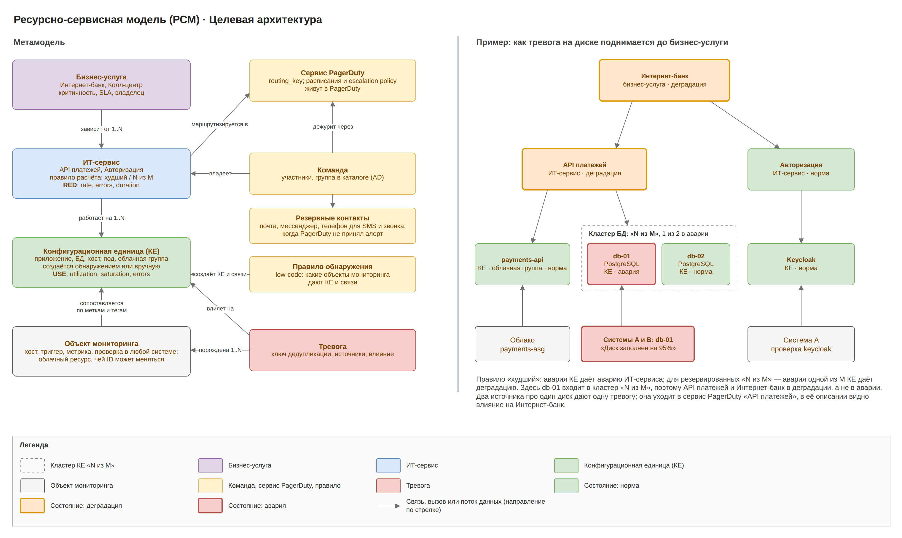

# Umbrella · целевая архитектура · 5. Ресурсно-сервисная модель

РСМ связывает технический сигнал из любого источника с ИТ-сервисом, бизнес-услугой, сервисом PagerDuty и резервными контактами. Нижние уровни строятся автоматически из данных мониторинга; бизнес-услуги и владельцы импортируются из корпоративной CMDB и ITSM через ITSM Sync, технические КЕ выгружаются туда. Связи карты служат и для корреляции, и для контекста инцидента в Grafana, а бизнес-услуги и сервисы задают области ролей.

## Метамодель и пример

RED-сигналы (rate, errors, duration) вешаются на ИТ-сервисы, USE-сигналы (utilization, saturation, errors) на КЕ. Поэтому РСМ сразу связывает симптом у пользователя с ресурсом, который его вызвал.

## Сущности

| Сущность | Что описывает | Ключевые атрибуты | Откуда берётся |
| --- | --- | --- | --- |
| Бизнес-услуга | то, что видит клиент или бизнес | имя, критичность, SLA, владелец, внешний id в ITSM | импорт из ITSM; вручную, если в ITSM её нет |
| ИТ-сервис | технический сервис, из которого собрана услуга | команда-владелец, правило расчёта статуса, сервис PagerDuty, резервные контакты | обнаружение по меткам и тегам + ручная правка |
| КЕ | приложение, БД, хост, под, облачная логическая группа | тип, окружение, идентификаторы, история облачных ID, ссылки на источники, статус | CMDB Discovery; выгружается в корпоративную CMDB |
| Связь КЕ | зависимость между КЕ или КЕ и сервисом | тип (работает на, использует, входит в), направление, источник | CMDB Discovery по правилам обнаружения, ручная правка |
| Объект мониторинга | то, что источник присылает в событии | хост, триггер, метрика, облачный ресурс с плавающим ID | из событий и инвентаря |
| Правило обнаружения | как объекты мониторинга превращаются в КЕ и связи | выражение CEL, тип КЕ, доверие | low-code, инженер мониторинга |
| Команда | кто отвечает за сервис | участники, группа корпоративного каталога, папка в Grafana | синхронизация с каталогом |
| Сервис PagerDuty | куда уходит алерт инцидента | ссылка на routing_key в OpenBao, сервис по умолчанию | ссылка из ИТ-сервиса |
| Резервные контакты | кого оповещать, если PagerDuty недоступен, а кеш дежурств пуст или старше 24 ч, и после последнего уровня escalation policy | телефон, e-mail, аккаунт мессенджера, webhook команды (ссылки), порядок | вручную в UI или из ITSM |

Облачный инстанс в РСМ не является отдельной КЕ: КЕ — это его логическая группа, а ID инстансов хранятся в её истории.

## Расчёт влияния

Статус поднимается снизу вверх: объект мониторинга → КЕ → ИТ-сервис → бизнес-услуга. Статусы: норма, деградация, авария.

1. **КЕ** получает худший severity среди открытых тревог: critical и error дают аварию, warning — деградацию.
2. **ИТ-сервис** считается по своему правилу. Правило «худший»: авария любой КЕ даёт аварию ИТ-сервиса. Для резервированных КЕ правило «N из M»: авария одной из M КЕ даёт деградацию, авария стольких КЕ, что работающих осталось меньше N, — аварию.
3. **Бизнес-услуга** берёт худший статус своих ИТ-сервисов.

## Где РСМ используется

- **Маршрутизация:** алерт инцидента уходит в сервис PagerDuty ИТ-сервиса, на котором работает КЕ вероятной причины; влияние на бизнес-услуги идёт в custom_details.
- **Резервное оповещение:** кеш дежурств ищется по сервису PagerDuty этого ИТ-сервиса; если кеш пуст или старше 24 ч, а также после последнего уровня escalation policy берутся резервные контакты сервиса.
- **Схлопывание:** ключ дедупликации строится от КЕ.
- **Корреляция:** Correlation Engine объединяет тревоги по связям КЕ и ИТ-сервисов и указывает вероятную причину.
- **Плановые работы:** окно на сервис гасит все его КЕ (БП-3).
- **ITSM:** для инцидентов, затрагивающих критичные бизнес-услуги, ITSM Sync создаёт инцидент в ITSM.
- **Контекст в Grafana:** блок «Обход карты» в «Связях контекста» идёт по связям РСМ от всех КЕ инцидента (тип связи, направление, глубина ≤ 3) и находит, например, хост службы и связанную БД; их атрибуты (${ci.host}, ${ci.name}, ${service}) подставляются в шаблоны запросов панелей. Команда ИТ-сервиса определяет папку Grafana, в которую сохраняется дашборд.
- **Области ролей:** область привязки группы задаётся бизнес-услугами, ИТ-сервисами, командами и источниками; через РСМ область раскрывается до КЕ, тревог и инцидентов. Пользователь видит инцидент на дашборде, если хотя бы одна его тревога относится к КЕ из области.
- **Предустановки дашборда:** фильтр по умолчанию в предустановке группы обычно равен сервисам её команды из РСМ.
- **Контекст сообщения:** влияние на бизнес-услуги идёт в текст резервного сообщения.

Тревога без КЕ не теряется: она уходит в сервис PagerDuty по умолчанию и в очередь «без КЕ»; на дашборде такие инциденты видят роли с областью «все сервисы».
