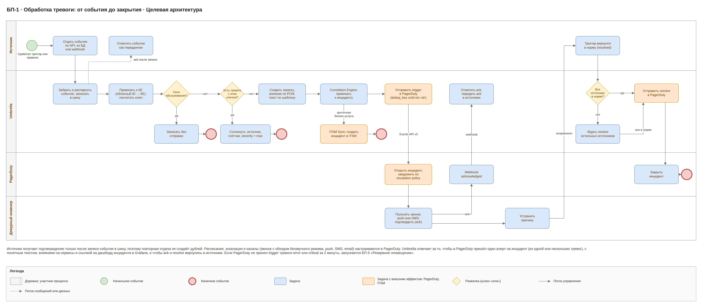
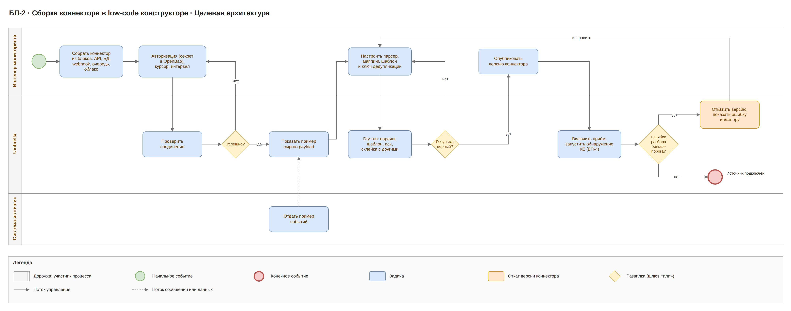
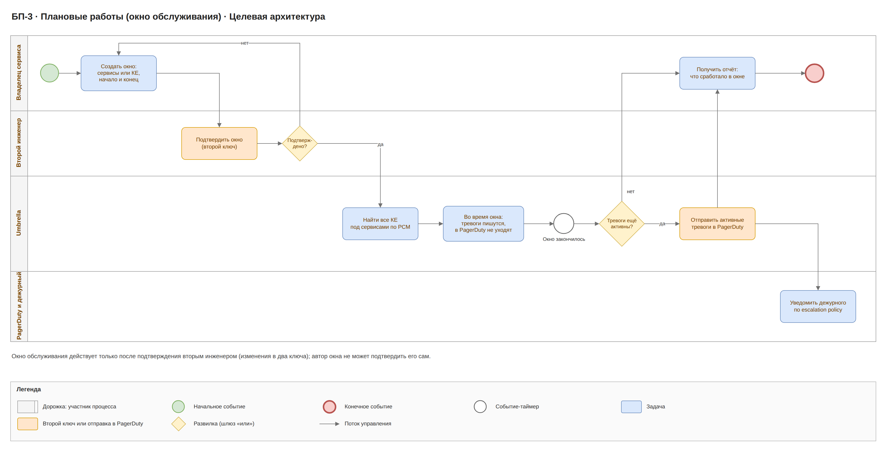
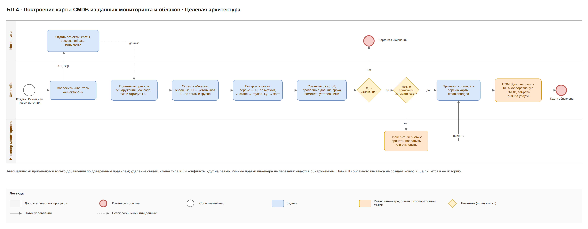
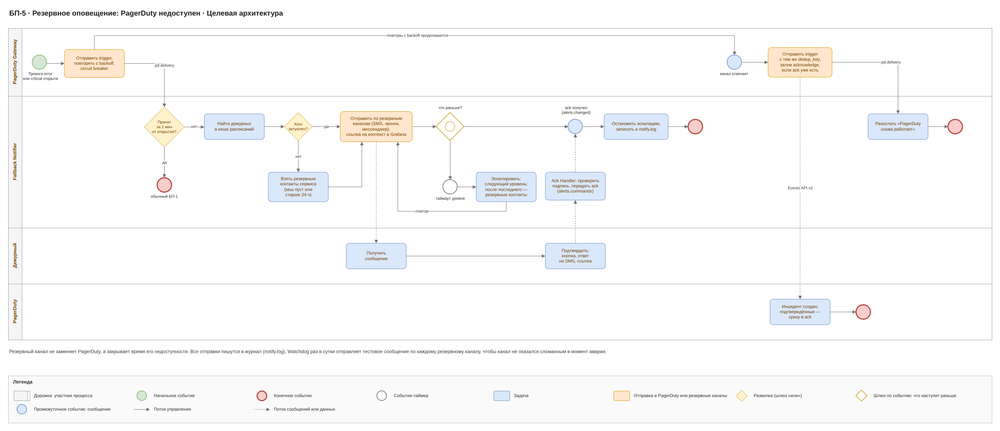
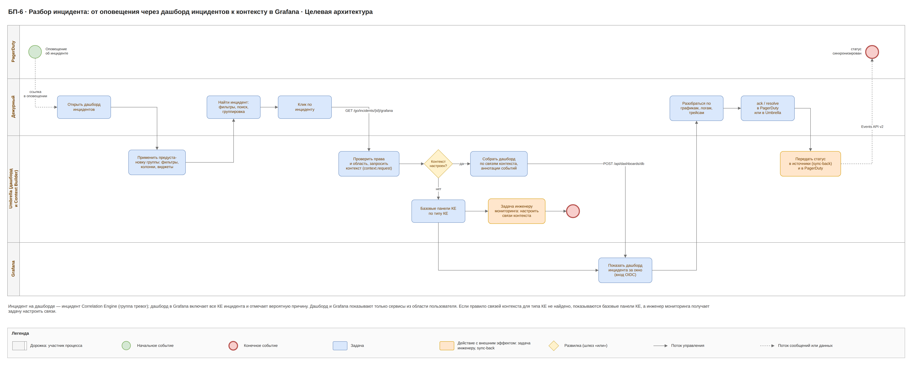
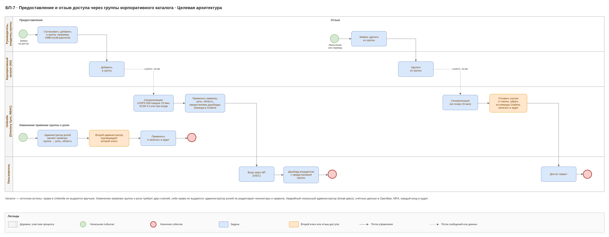

# Umbrella · целевая архитектура · 6. Бизнес-процессы

Семь процессов целевой архитектуры: обработка тревоги, сборка коннектора, плановые работы, построение карты CMDB, резервное оповещение, разбор инцидента и предоставление и отзыв доступа; схемы в нотации, близкой к BPMN, с дорожками по участникам.

## Перечень процессов

| Код | Процесс | Участники | Результат |
| --- | --- | --- | --- |
| БП-1 | Обработка тревоги | источник, Umbrella, PagerDuty, ITSM, дежурный | один алерт PagerDuty на инцидент, закрыт везде |
| БП-2 | Сборка коннектора в low-code конструкторе | инженер мониторинга, Umbrella, система-источник | события источника идут в Umbrella |
| БП-3 | Плановые работы | владелец сервиса, второй инженер, Umbrella, PagerDuty | работы прошли без ложных тревог |
| БП-4 | Построение карты CMDB | источники и облака, Umbrella, инженер, корпоративная CMDB и ITSM | актуальная карта КЕ и связей, согласованная с корпоративной CMDB |
| БП-5 | Резервное оповещение | PagerDuty Gateway, Fallback Notifier, дежурный, PagerDuty | дежурный узнал о тревоге, хотя PagerDuty недоступен |
| БП-6 | Разбор инцидента | PagerDuty, дежурный, Umbrella (дашборд инцидентов и Context Builder), Grafana | дежурный видит инцидент, его причину и связанные метрики, логи и трейсы за минуты |
| БП-7 | Предоставление и отзыв доступа | руководитель (владелец группы), корпоративный каталог, Umbrella, пользователь; администраторы ролей | у сотрудника ровно те права, области и предустановки, которые даёт его группа |

## БП-1. Обработка тревоги

Коннектор забирает и парсит событие, пишет его в шину и только потом отмечает в источнике как переданное. Событие привязывается к КЕ и либо гасится окном обслуживания, либо схлопывается с открытой тревогой, либо создаёт новую. Correlation Engine сразу привязывает тревогу к инциденту — существующему или новому из одной тревоги, — и в PagerDuty уходит алерт инцидента.

- Расписания, таймауты эскалации и каналы задаются в escalation policy PagerDuty.
- Повторы и события других источников про ту же проблему имеют тот же ключ дедупликации и не создают новых тревог; связанные тревоги на других КЕ попадают в тот же инцидент и не создают новых алертов PagerDuty (dedup_key umb-inc-‹id инцидента›).
- Для инцидентов, затрагивающих критичную бизнес-услугу, ITSM Sync создаёт инцидент в ITSM и синхронизирует его статус.
- Ack из PagerDuty применяется ко всем тревогам инцидента и уходит в источники; resolve инцидента уходит, когда в норму вернулись все его тревоги.
- Если PagerDuty не принял алерт тревоги error или critical за 2 минуты, запускается БП-5.

## БП-2. Сборка коннектора

Инженер собирает подключение из блоков без кода: авторизацию (секрет сразу уходит в OpenBao, в коннекторе ссылка), курсор, парсер, маппинг, шаблон и способ подтверждения. Dry-run на живых данных показывает результат до публикации; публикует коннектор пользователь с разрешением connector.publish.

Если доля ошибок разбора превышает порог, Umbrella сама откатывает коннектор на предыдущую версию и сообщает инженеру; неразобранные события лежат в events.dlq.

## БП-3. Плановые работы

Владелец сервиса задаёт окно обслуживания на сервис или КЕ; второй инженер с разрешением maintenance.approve подтверждает окно (два ключа). Через РСМ Umbrella находит все затронутые КЕ. Тревоги во время окна записываются и видны на дашборде, но не уходят ни в PagerDuty, ни в резервные каналы.

После окончания окна всё, что ещё горит, уходит в PagerDuty.

## БП-4. Построение карты CMDB

CMDB Discovery раз в 15 минут забирает инвентарь, превращает его в КЕ и связи и сравнивает с текущей картой. Инженер участвует только там, где автоматике нельзя доверять. После применения изменений ITSM Sync выгружает технические КЕ в корпоративную CMDB и забирает бизнес-услуги и владельцев.

- Автоматически применяются только добавления по доверенным правилам; удаления, смена типа и конфликты идут на ревью (разрешение cmdb.review).
- КЕ, которую никто не видит дольше заданного срока, помечается устаревшей, а не удаляется.
- Ручные правки не перезаписываются обнаружением.
- Конфликты импорта из ITSM (например, другой владелец бизнес-услуги) идут на ревью; изменения, которые меняют маршрутизацию, без ревью не применяются.

## БП-5. Резервное оповещение

Fallback Notifier следит за тревогами уровня error и critical. Если алерт инцидента такой тревоги не принят PagerDuty за 2 минуты с момента открытия, Fallback Notifier находит дежурных первого уровня escalation policy в кеше расписаний (если кеш пуст или старше 24 ч — резервные контакты сервиса) и оповещает их по каналам уровня: SMS, звонок, мессенджер с кнопкой, почта, webhook, запасная платформа оповещения. Дальше процесс ждёт одно из событий: подтверждение из сообщения или таймаут уровня. Без подтверждения сообщение уходит на следующий уровень, после последнего уровня — резервным контактам. Когда PagerDuty снова принимает события, туда уходит trigger с тем же dedup_key, а подтверждённые инциденты передаются как acknowledge.

- Предупреждения (warning) и info по резервным каналам не отправляются, они ждут PagerDuty.
- Открытый circuit breaker прекращает попытки отправки в PagerDuty, но отсчёт 2 минут продолжается.
- Подтверждение кнопкой или ответом на SMS проходит через reverse proxy + WAF в Ack Handler с проверкой подписи; ссылка из сообщения ведёт в Core API со входом через IdP.
- Все отправки пишутся в журнал; при шторме получатель получает одну сводку.
- Работоспособность каналов Watchdog проверяет каждый день тестовым сообщением.

## БП-6. Разбор инцидента

Дежурный получает алерт в PagerDuty или по резервному каналу и открывает инцидент: по ссылке из алерта или на дашборде инцидентов, где уже применена предустановка его группы. Боковая панель показывает тревоги, связь по карте и вероятную причину. Щелчок по инциденту открывает в новой вкладке дашборд Grafana, который Context Builder собрал по «Связям контекста»: метрики, логи и трейсы всех КЕ инцидента в окне от начала минус 10 минут, причина выделена. Дежурный подтверждает инцидент, при необходимости ставит silence и закрывает работу в PagerDuty.

- Действия на дашборде доступны только по разрешениям роли (incident.ack, incident.silence) и только в области пользователя; каждое действие пишется в аудит.
- Если Grafana недоступна, дашборд инцидентов и боковая панель работают, а ссылка показывает страницу с ошибкой.
- Если панели не помогли, инженер мониторинга дополняет «Связи контекста»; новое правило проверяется dry-run на этом же инциденте.
- Для прошлых инцидентов поиск на дашборде идёт по истории в ClickHouse.

## БП-7. Предоставление и отзыв доступа

Руководитель заказывает доступ, администратор каталога включает сотрудника в группу (например, UMB-oncall-payments). Umbrella забирает группу при синхронизации (LDAPS раз в 15 минут или SCIM push) или при входе из claims OIDC. Привязка группы, заранее настроенная Администратором ролей и подтверждённая вторым администратором, даёт роль, область и предустановку дашборда; Context Builder добавляет сотрудника в команду Grafana с правами на папку его команды. Исключение из группы отзывает доступ на ближайшей синхронизации, не позже 15 минут: роль снимается, сессии и токены отзываются, участие в команде Grafana удаляется.

- Права в Umbrella не выдаются вручную в обход каталога; исключение — локальный администратор break-glass с MFA и аудитом каждого использования.
- Привязки групп меняются в два ключа; Администратор ролей не правит коннекторы и правила, никто не выдаёт права сам себе.
- Личные представления пользователя строятся поверх предустановки группы и не расширяют область роли.
- Изменения привязок, синхронизации и отзывы пишутся в аудит и уходят в SIEM.
