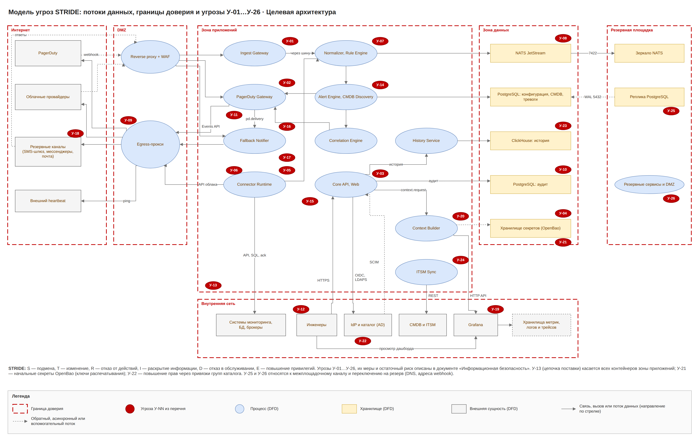

# Umbrella · целевая архитектура · 7. Информационная безопасность

Umbrella хранит учётные данные ко всем источникам и решает, дойдёт ли алерт до дежурного, поэтому главные цели защиты — это секреты (только в OpenBao), целостность конвейера и настроек подавления, доверие к резервным каналам, корректность прав доступа из каталога, данные инцидентов в Grafana, история событий за 13 месяцев и межплощадочный канал.

## Требования и меры

| Область | Мера |
| --- | --- |
| Аутентификация | OIDC через корпоративный IdP, MFA на стороне IdP, короткие сессии; сервисные токены API со сроком жизни; Grafana использует тот же IdP |
| Авторизация | RBAC: роль (набор разрешений) + область (бизнес-услуги, ИТ-сервисы, команды, коннекторы и источники) по привязкам групп каталога; проверка на каждом запросе в Core API, фильтр данных по области, в том числе в WebSocket и поиске |
| Синхронизация с каталогом | каталог — источник истины для групп; LDAPS 636 раз в 15 минут под отдельной учётной записью только на чтение или SCIM 2.0 push с токеном; группы из claims OIDC при входе; исключение из группы отзывает роль, сессии и токены не позже 15 минут |
| Разделение обязанностей | привязки групп меняются в два ключа; Администратор ролей не правит коннекторы и правила; никто не выдаёт права сам себе; подавление и окна обслуживания — в два ключа |
| Аварийный доступ | локальный администратор break-glass: учётные данные в OpenBao, MFA, уведомление ИБ и аудит каждого использования |
| Секреты | все секреты без исключений (логины, пароли, токены, ключи API и HMAC, сертификаты, пароль SMTP-релея, токены SMS- и голосового шлюза, ботов мессенджеров, запасной платформы, ITSM, сервисный токен Grafana, учётная запись каталога, ключ подписи ссылок подтверждения) только в OpenBao; в конфигурации, БД, коде, образах, логах и Kubernetes Secrets — только ссылки; поды получают секреты через agent injector; ротация без перепубликации |
| Начальные секреты | auto-unseal OpenBao (transit второго экземпляра OpenBao или KMS) либо ключи Шамира 3 из 5 у назначенных хранителей; способ распечатывания выбирает ИБ; root token отозван после настройки; учётные данные S3 и сертификаты mTLS выдаёт OpenBao (движки секретов и PKI) |
| Минимальные права | IAM-роли облака только на чтение; учётки БД только SELECT и UPDATE флага; API-токены с правами чтения и ack; токен PagerDuty REST только на чтение (расписания, escalation policy, статусы инцидентов); сервисный токен Grafana только на папки Umbrella; учётка ITSM с минимальными правами |
| Шифрование | TLS 1.2+ на всех соединениях, mTLS между сервисами (ingress → сервисы 8443), шифрование дисков PostgreSQL, NATS, ClickHouse и бэкапов; межплощадочный канал только TLS |
| Входящие webhooks | токен или HMAC на коннектор, проверка подписи PagerDuty, облаков, SMS-шлюза и мессенджеров, IP-списки, WAF, лимиты частоты |
| Песочница low-code | CEL и JSONata без сети и файлов, лимиты времени и памяти; RE2 |
| SSRF | HTTP-блоки только через egress-прокси и только к адресам из разрешённого списка; запрет 169.254.0.0/16, loopback, адресов зон приложений и данных (порты 4222, 5432, 8200, API Kubernetes); сетевые политики Kubernetes |
| Данные событий | маскирование ПДн и секретов; в PagerDuty, Grafana (аннотации) и резервные сообщения уходят только поля из разрешённого списка; сырые события 3 дня в PostgreSQL, история без поля raw 13 месяцев в ClickHouse |
| Grafana | дашборды инцидентов в папках команд с правами по группам каталога; аннотации только из разрешённого списка полей; запросы панелей только из белого списка шаблонов с экранированием переменных; учётные данные источников данных Grafana подставляются из OpenBao, а не хранятся в конфигурации открытым текстом |
| Резервное оповещение | ссылка подтверждения одноразовая, подписана HMAC, живёт 1 ч и работает только после входа через IdP; ответы SMS и кнопки мессенджеров принимаются через reverse proxy + WAF с проверкой подписи провайдера, одноразового токена и отправителя по кешу дежурных; лимиты и бюджет на канал и получателя; контакты хранятся ссылками |
| История | ClickHouse в зоне данных, прямого доступа пользователей нет; маскирование полей по правам в History Service; аудит запросов; TTL 13 месяцев |
| ITSM | импорт проходит ревью конфликтов; изменения маршрутизации из ITSM без ревью не применяются |
| Аудит | все изменения конфигурации, привязок и ролей, действия с инцидентами, синхронизации каталога и резервные отправки — в неизменяемый журнал PostgreSQL с выгрузкой в SIEM (syslog TLS 6514) |
| Сеть | исходящий трафик только через egress-прокси по списку (кроме внутреннего релея и мессенджера); сетевые политики Kubernetes; межплощадочный канал только для репликации |
| Разработка и поставка | SAST, проверка зависимостей и образов, SBOM, подписанные образы, фиксированные версии |

## Модель угроз

Метод STRIDE по контейнерам C4-2 и потокам П-01…П-12. Границы доверия: интернет и DMZ; DMZ и зона приложений; зона приложений и внутренняя сеть (IdP, каталог, CMDB и ITSM, SIEM, Grafana); зона приложений и зона данных; основная и резервная площадка (межплощадочный канал).

| Актив | Чем ценен | Свойство |
| --- | --- | --- |
| Все секреты и начальные секреты OpenBao | доступ ко всем системам мониторинга, их БД, облакам и каналам оповещения | конфиденциальность, доступность |
| Поток событий, тревог и инцидентов | от него зависит оповещение дежурных | целостность, доступность |
| Конфигурация: коннекторы, шаблоны, подавление, маршрутизация, правила корреляции, «Связи контекста» | её изменение может скрыть аварию или раскрыть данные | целостность |
| Привязки групп, роли и области | определяют, кто что видит и делает | целостность |
| Карта CMDB и РСМ | полная карта инфраструктуры полезна атакующему | конфиденциальность |
| Дашборды инцидентов в Grafana | показывают метрики, логи и трейсы связанных КЕ | конфиденциальность |
| routing keys PagerDuty | позволяют создавать ложные инциденты | конфиденциальность |
| Кеш дежурств и резервные контакты | персональные данные сотрудников | конфиденциальность |
| История событий и тревог (13 месяцев) | большой объём сведений об инфраструктуре и авариях | конфиденциальность |
| Журнал аудита | нужен для расследований | целостность |

Нарушители: внешний (подделка webhooks, ответов SMS и кнопок), внутренний с ролью инженера (злоупотребление low-code, подавлением и «Связями контекста»), внутренний с доступом к каталогу (изменение групп), скомпрометированный источник (вредный payload), скомпрометированная зависимость или образ, посторонний получатель резервного сообщения, нарушитель в сети между площадками.

## Перечень угроз

| № | Угроза (STRIDE) | Где | Мера | Остаточный риск |
| --- | --- | --- | --- | --- |
| У-01 | S: поддельный webhook источника или облака создаёт ложные тревоги | Ingest Gateway, reverse proxy | токен или HMAC на коннектор, IP-списки, WAF | низкий |
| У-02 | S: поддельный webhook PagerDuty закрывает инцидент | PagerDuty Gateway | проверка подписи Webhooks v3, сверка статуса по REST API | низкий |
| У-03 | T: изменение коннектора, шаблона, подавления или правила корреляции, чтобы скрыть алерты | Core API | RBAC, подавление в два ключа, версии и аудит, отчёт «что подавлено», ручное разделение инцидента | средний |
| У-04 | I: утечка секретов | OpenBao, PostgreSQL, логи | все секреты только в OpenBao, agent injector, шифрование, маскирование, ротация | средний |
| У-05 | E: SSRF через HTTP-блок | Connector Runtime | разрешённый список; запрет 169.254.0.0/16, loopback и адресов зон приложений и данных (4222, 5432, 8200, API Kubernetes); HTTP только через egress-прокси; сетевые политики | низкий |
| У-06 | D: вредный payload | парсеры | лимиты размера и времени, RE2 | низкий |
| У-07 | E: внедрение кода через выражения low-code | Normalizer, Rule Engine, Connector Runtime | песочница CEL и JSONata | низкий |
| У-08 | D: шторм событий от одного источника | вся цепочка | лимиты на коннектор, обратное давление JetStream, приоритет critical | средний |
| У-09 | D: недоступность PagerDuty или egress | PagerDuty Gateway | outbox и повторы, резервные каналы через 2 мин, резервный маршрут SMS, внешний heartbeat | низкий |
| У-10 | R: отказ от изменения настроек или действия с инцидентом | Core API, PostgreSQL: аудит | неизменяемый аудит с выгрузкой в SIEM | низкий |
| У-11 | I: ПДн или секреты из события уходят в PagerDuty, Grafana или резервное сообщение | шаблон события, Context Builder | маскирование, разрешённый список полей | средний |
| У-12 | E: компрометация учётной записи пользователя | веб-интерфейс | MFA в IdP, короткие сессии, области по группам | средний |
| У-13 | T: вредная зависимость или образ | сборка и поставка | SBOM, сканирование, подпись образов | средний |
| У-14 | T: подмена облачного ID или тега | Identity Resolver | проверка ID через API облака, тег вместе с аккаунтом | низкий |
| У-15 | I: просмотр карты CMDB посторонними | Core API | RBAC и области | низкий |
| У-16 | S: ложное подтверждение тревоги через резервный канал (пересланная ссылка, подделанный ответ SMS или кнопки) | Fallback Notifier (Ack Handler), Core API | одноразовый подписанный токен; ссылка только после входа через IdP; проверка подписи провайдера и отправителя по кешу дежурных; аудит | низкий |
| У-17 | I: утечка контактов дежурных из кеша или резервного сообщения | PostgreSQL, Fallback Notifier | контакты ссылками, доступ по ролям, в сообщении нет чужих контактов | низкий |
| У-18 | D: шторм или злоупотребление резервными каналами (спам дежурным, расход бюджета SMS и звонков) | Fallback Notifier, egress | только error и critical, сводка при шторме, лимиты и бюджет на канал, ежедневная проверка | средний |
| У-19 | I: утечка данных инцидента через дашборды Grafana | Grafana, Context Builder | папки команд с правами по группам каталога, вход в Grafana через IdP, аннотации из разрешённого списка полей, удаление дашбордов через 30 дней после закрытия | средний |
| У-20 | T/E: инъекция в запросы панелей Grafana и злоупотребление токеном Grafana | Context Builder, Grafana | белый список шаблонов, экранирование переменных под язык запроса, свободный текст из событий в запросы не попадает; сервисный токен из OpenBao только на папки Umbrella, ротация; права context.edit и dry-run | низкий |
| У-21 | I/D: компрометация или потеря начальных секретов (ключи распечатывания OpenBao) | OpenBao | auto-unseal либо Шамир 3 из 5 у разных хранителей; root token отозван; регламент хранения и проверка восстановления на DR-учениях | средний |
| У-22 | E: повышение прав через изменение привязок групп или каталога | Core API (Directory Sync, RBAC Policy Engine), каталог | привязки в два ключа, запрет выдачи прав себе, группы только из заданной OU или с префиксом, отчёт об изменениях состава групп, аудит в SIEM | средний |
| У-23 | I: выгрузка истории событий посторонними | History Service, ClickHouse | RBAC и маскирование в History Service, прямого доступа к ClickHouse нет, аудит запросов | низкий |
| У-24 | T: подмена данных при импорте из ITSM (ложные владельцы или бизнес-услуги меняют маршрутизацию или области) | ITSM Sync | сервисная учётка, ревью конфликтов и изменений маршрутизации, версии карты | средний |
| У-25 | T/I: перехват или подмена данных в межплощадочном канале | П-12: PostgreSQL, NATS, снапшоты OpenBao | TLS с взаимной аутентификацией, отдельный сегмент только для репликации, шифрование снапшотов, контроль отставания и целостности | низкий |
| У-26 | S: подмена DNS или адресов webhook при переключении на резервную площадку | DNS, reverse proxy, настройки PagerDuty и провайдеров | заранее зарегистрированные адреса резервной площадки, подписанные зоны DNS, проверка подписи входящих webhooks на резерве, регламент переключения с двумя исполнителями | низкий |

Модель угроз пересматривается при каждом новом типе блока, канале оповещения или интеграции и не реже раза в полгода.
